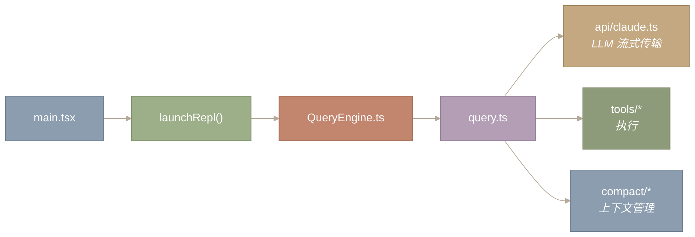
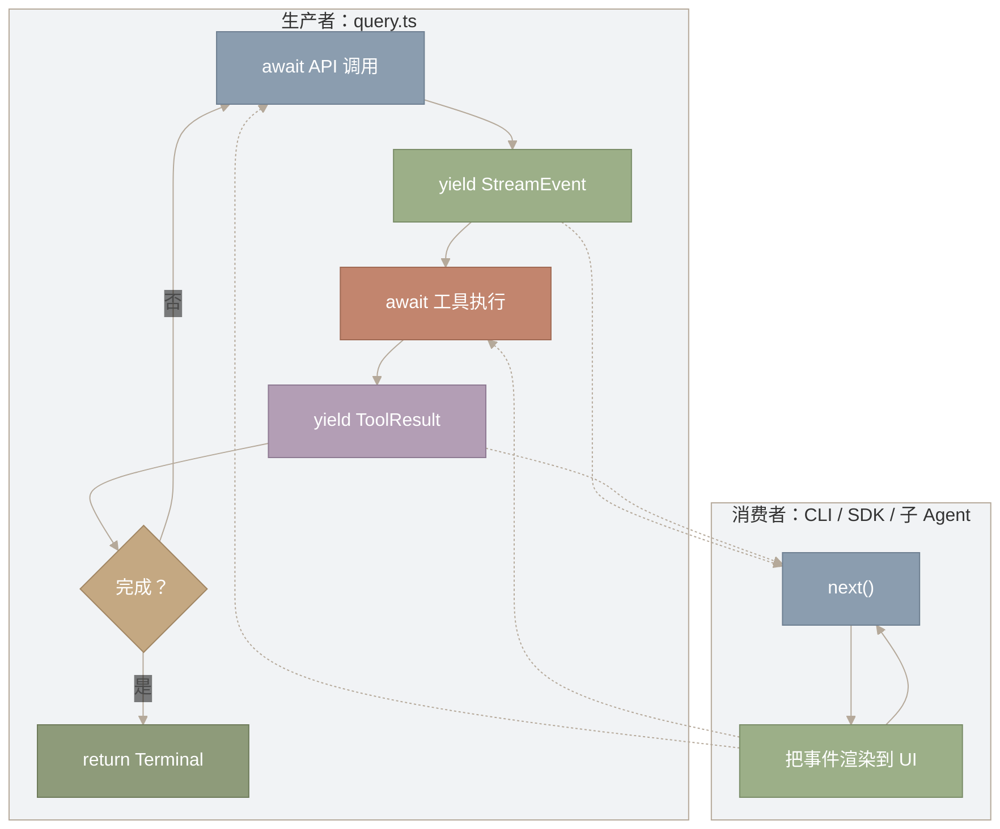
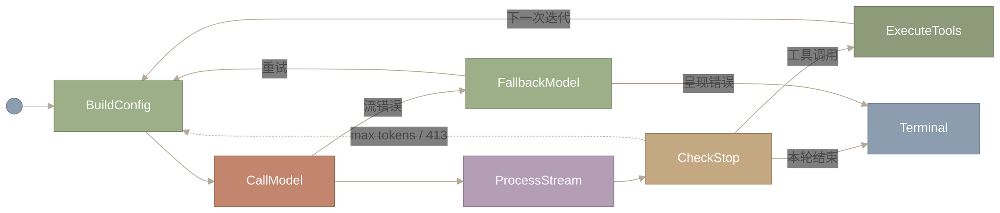
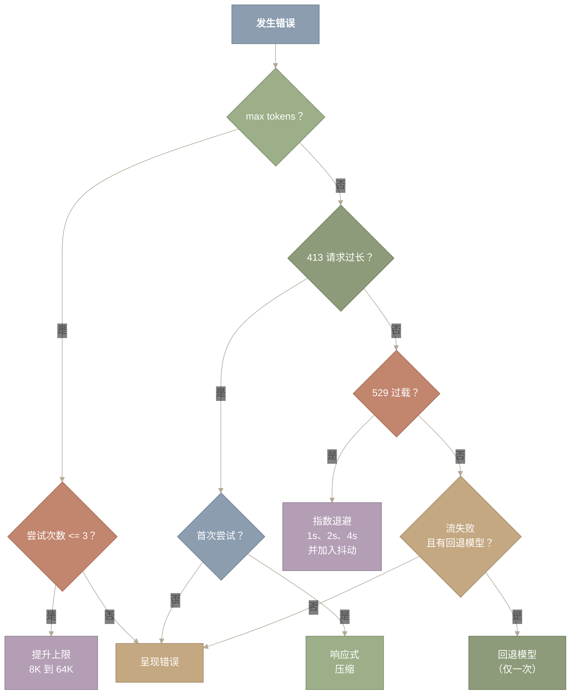
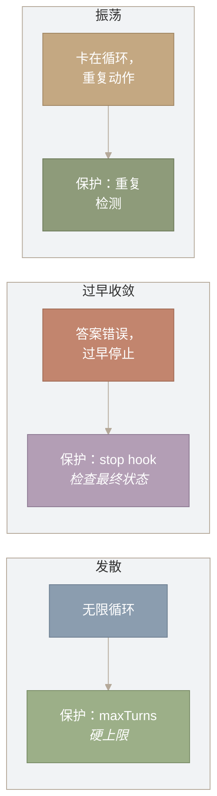
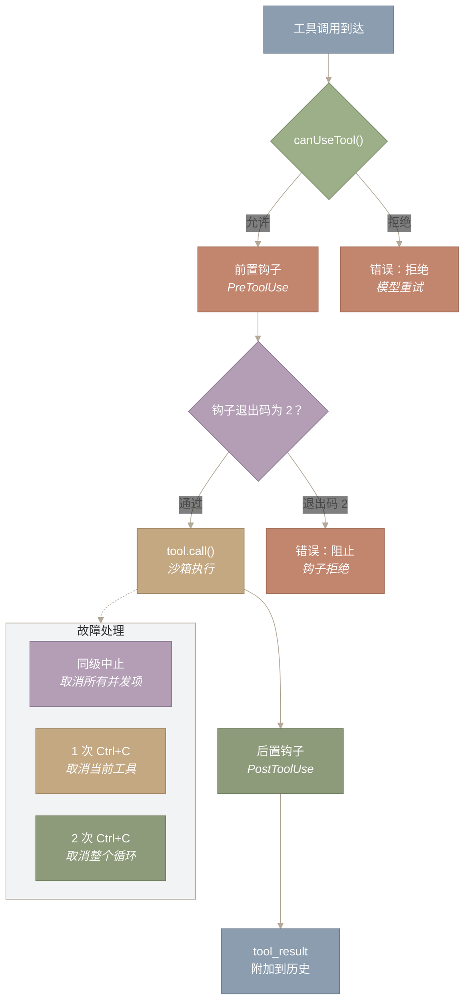

# Agent 循环与 QueryEngine

> **原文 URL：** https://y-agent.github.io/inside-claude-code/02-agent-loop-query-engine.html  
> **原文标题：** *The Agent Loop & QueryEngine*  
> **原文副标题：** *What if the most important architectural decision in a 512K-line codebase came down to a single keyword – yield?*（如果一个 51.2 万行代码库中最重要的架构决策，归根结底只是一个关键字——`yield`，会怎样？）  
> **翻译日期：** 2026-07-26

标签：`agent-loop` · `async` · `generators`

## 1. 引言：一个循环，一种抽象

**Claude Code 的整个 Agent 循环——流式传输、工具执行、错误恢复、上下文管理——都实现为单个异步生成器。本篇将分析为何选择这种设计、生成器抽象如何塑造架构，以及为何大部分代码处理的都是故障恢复而非正常路径。**

与 Claude Code 的每一次交互——交互式终端、无头 SDK、后台子 Agent——都会流经 `query.ts` 中的 `query()`：这是一个长达 1,729 行的异步生成器，负责 API 流式传输、工具执行、上下文压缩、token 上限提升、模型回退和循环发散检测。异步生成器是一种协程：它向调用者产出流式事件，然后挂起，直到调用者准备好接收更多内容。这一个语言级选择同时提供了无需缓冲的流式传输、无需手动流量控制的背压，以及无需协调回调的组合能力。

循环状态机的七个状态中，有四个纯粹为处理故障而存在。要理解原因，必须考察完整架构：生成器抽象、它实现的状态机、错误恢复级联，以及并发模型。下图展示了 `query.ts` 所处的位置：



**图 1：`query.ts` 在 Claude Code 调用链中的位置。** 主入口经由 REPL 和 QueryEngine（会话生命周期）进入 `query.ts`（ReAct 循环），后者再分派到三个子系统：LLM 流式客户端、工具执行器和上下文压缩。QueryEngine 决定何时调用循环；`query.ts` 决定在循环内部做什么。

**如何阅读此图。** 沿箭头从左向右看调用链。入口点 `main.tsx` 经由 `launchRepl()` 和 `QueryEngine.ts` 流向中心节点 `query.ts`。从 `query.ts` 分出三条支路，通往它所编排的子系统：LLM 流式传输（`api/claude.ts`）、工具执行（`tools/*`）和上下文管理（`compact/*`）。关键区别在于：`QueryEngine.ts` 决定**何时**调用循环，而 `query.ts` 决定循环内部**做什么**。

`QueryEngine.ts` 管理会话生命周期——历史记录、系统提示词组装，以及何时调用循环。`query.ts` 则是 Agent **思考**的地方。我们先从生成器抽象（第 2 节）讲起，再讨论它实现的状态机（第 3 节），追踪策略注入机制（第 4 节），考察错误恢复（第 5～6 节），最后以并发和综合分析（第 7～8 节）收尾。

**本文涉及的源文件：**

| 文件 | 用途 | 大小 |
|---|---|---:|
| `src/main.tsx` | CLI 入口；路由到 REPL 和 QueryEngine | 约 800 LOC |
| `src/query.ts` | 核心 Agent 循环——实现 ReAct 状态机的异步生成器 | 约 1,729 LOC |
| `src/QueryEngine.ts` | 会话生命周期、历史管理、系统提示词组装 | 约 500 LOC |
| `src/services/api/claude.ts` | LLM 流式客户端（messages API、重试、限流） | 约 1,200 LOC |
| `src/services/tools/` | 工具执行编排（分派、权限、钩子） | 约 6 个文件 |

---

## 2. 为什么是 AsyncGenerator？Agent 循环的设计空间

**Agent 循环有三项要求：（1）中间结果一到达便流式呈现给 UI，让用户不必盯着空白屏幕；（2）由消费者控制节奏，避免一波工具结果压垮渲染器；（3）用一套循环实现支持多个消费者（CLI、SDK、子 Agent）。** Claude Code 用 `AsyncGenerator` 同时满足了这三项要求。

普通 `async function` 无法流式传输——调用者必须等待完整的多轮交互结束后才能看到任何内容。EventEmitter 可以流式发送，但生产者按自己的节奏运行；如果工具结果抵达速度快于 UI 渲染速度，事件就会在内存中堆积。AsyncGenerator 用拉取式协议解决了这两个问题：消费者调用 `next()` 请求下一个事件，生产者则**挂起**，直到该调用到来。生成器不可能跑在消费者前面，因为在被请求之前，它实际上无法产生下一个值。

实际函数签名如下：

```typescript
export async function* query(
  params: QueryParams,
): AsyncGenerator<
  StreamEvent | Message | ToolUseSummaryMessage,
  Terminal // <-- 返回类型：最终结果
>
```

`function*` 和 `yield*` 是 TypeScript 中生成器与生成器委托的语法；如果不熟悉，可以暂时把它们理解为 `function` 和 `yield`。核心思想是：循环内部的代码 `await` API 调用，把流式 token `yield` 给消费者，再 `await` 工具执行，`yield` 工具结果，然后重复。每遇到一次 `yield`，生成器就冻结整个栈帧——局部变量、循环计数器、当前状态——并把控制权交给消费者。消费者调用 `next()` 时，生成器从刚才离开的确切位置恢复。代码读起来像普通顺序循环，却能生成事件流。

产出的类型（`StreamEvent | Message | ...`）是 UI 实时渲染的中间事件。返回类型 `Terminal` 携带最终结果——循环为何结束，以及最后处于什么状态。消费者通过 `for await...of` 处理抵达的事件：

```typescript
const gen = query(params);
for await (const event of gen) {
  renderToUI(event); // 每个事件立即渲染
}
// gen.return 包含 Terminal：循环为何结束
```

**为什么采用生产者—消费者？** Agent 循环只有一个生产者（调用 API 并执行工具的 `query()` 生成器），却有多个需要同一事件流的消费者：交互式 CLI 把 token 渲染到终端，无头 SDK 以编程方式收集结果，子 Agent 则把事件转发给父 Agent。生产者—消费者分离意味着循环逻辑只写一次，每个消费者按自己的节奏拉取事件。生成器会在两次拉取之间挂起，因此较慢的消费者（例如进行高成本渲染的 CLI）会自然地拖慢生产者，而不需要任何显式同步。



**图 2：AsyncGenerator 的生产者—消费者架构。** 从上到下阅读左侧子图（生产者）：`query.ts` 等待 API 调用，产出流式 token，等待工具执行，产出工具结果，再检查任务是否完成；未完成就回到 API 调用。右侧子图（消费者）是另一个独立循环：消费者调用 `next()` 拉取事件，把它渲染到 UI，再次调用 `next()`。虚线表示交接：生产者的每次 `yield` 都把事件交给消费者，消费者每次调用 `next()` 都会恢复生产者。在消费者拉取之前，生产者实际上无法越过 `yield`——背压正是这样工作的。

**如何阅读此图。** 把每个子图（生产者和消费者）当作独立循环，从上向下阅读。生产者依次经历等待 API、产出 `StreamEvent`、等待工具执行、产出 `ToolResult`，再进行“完成？”检查：要么循环回去，要么返回 `Terminal`。消费者在紧凑循环中调用 `next()` 并渲染事件。子图间的虚线表示交接：每次 `yield` 都向消费者交付一个事件，每次 `next()` 都恢复生产者。消费者不拉取，生产者就无法越过 `yield`；无需显式协调代码即可实现背压。

此图的关键是两个子图之间的虚线。每条虚线箭头都代表一次**交接**：生产者产出值时挂起，事件流向消费者；消费者渲染完并调用 `next()` 后，控制权回到生产者，生产者从离开处精确恢复。这种来回切换让架构成为拉取式——节奏由消费者而非生产者决定。CLI 若需 50ms 渲染复杂 diff，生产者就等待；SDK 若瞬间处理完事件，生产者就全速运行。同一个循环，不同节奏，零协调代码。

生成器委托还带来了组合能力：外层 `query()` 委托给 `queryLoop()`，日志包装器可以拦截每一个产出事件，而无需修改任何一个函数。一个循环，多个消费者，零代码重复。

---

## 3. ReAct 状态机：七个状态，只有三个正常状态

**生成器是机制；ReAct 状态机是它执行的逻辑。这个状态机有七个状态，但只有三个构成正常路径——其余四个完全为错误恢复而存在。**

经典 ReAct 循环——LLM 在推理下一步做什么与调用工具执行动作之间交替——听起来很简单：思考、行动、观察、重复。教科书里只有三个状态。生产环境中却必须处理响应截断、上下文溢出、工具崩溃、API 过载，以及 Agent 陷入循环等问题。每一种故障模式都会增加一个状态。

以下是 `query.ts` 中完整的状态机：



**图 3：包含七个状态的完整 ReAct 循环状态机。** 正常路径从左向右流经 `BuildConfig`、`CallModel`、`ProcessStream`、`CheckStop`、`ExecuteTools`，然后回到 `BuildConfig`。恢复路径会在流错误时分支到 `FallbackModel`，或在 max-tokens/413 错误时循环返回。七个状态中只有三个处在正常路径上；其余四个负责错误恢复。

**如何阅读此图。** 从左侧黑点开始，沿实线箭头向右走，这是正常路径：`BuildConfig` 组装请求，`CallModel` 流式获取 API 响应，`ProcessStream` 收集响应，`CheckStop` 检查 `stop_reason`。模型若要使用工具（工具调用），流程向上进入 `ExecuteTools`，再回到 `BuildConfig` 开始下一轮；模型若发出完成信号（本轮结束），流程向右退出至 `Terminal`。虚线是恢复路径：`CallModel` 的流错误下落到 `FallbackModel`，后者可以重试或呈现错误；`CheckStop` 遇到 `max_tokens` 或 413 错误则回到 `BuildConfig`，以调整后的参数重试。只有三个状态（`BuildConfig → CallModel → ProcessStream`）每轮必经，其余状态仅在出现问题时激活。

逐条追踪这些路径：

**BUILD CONFIG** 把当前环境——模型选择、thinking 配置、工具 schema、beta header——快照为冻结的 `QueryConfig`。这样可以保证循环中途发生的变化（用户切换 plan 模式、功能标志更新）直到下一个轮次边界才生效。这与图形学中的双缓冲原则相同：正在运行的一帧永远不会看到只更新了一半的状态。

**CALL MODEL** 通过 `createMessage()` 向 Anthropic API 发起流式请求。响应以服务器发送事件（SSE）序列到达——`message_start`、`content_block_delta`、`message_stop`——每个事件都产出给调用者，以供 UI 实时渲染。AsyncGenerator 的拉取模型在此发挥价值：每个 SSE 事件到达即产出，而生成器会挂起，直到消费者准备好接收下一个事件。

**PROCESS STREAM** 把流式事件收集成完整消息，再交给决策点。

**CHECK STOP REASON** 是关键分支节点。API 的 `stop_reason` 字段决定下一状态：

- `end_turn`：模型认为任务已经完成。运行 stop hook（检查是否过早终止的生命周期回调）。如果钩子指出“你忘记运行测试”，循环就恢复。
- `tool_use`：模型要调用工具。执行工具（详见第 7 节），把结果附加到对话，再继续。
- `max_tokens`：响应被截断。提高输出上限并重试。
- `error`（413、529、流故障）：路由到相应恢复路径。

**FALLBACK MODEL** 在主模型的流失败时到达。若配置了回退模型，循环切换到该模型并重试；若回退模型也失败，则把错误呈现给用户。

**TERMINAL** 是吸收态。它携带循环结束的原因和最终消息。

关键洞见——也是后两节的出发点——是：七个状态中有四个属于恢复状态。正常路径只不过是 BUILD CONFIG、CALL MODEL、PROCESS STREAM、CHECK STOP、EXECUTE TOOLS，再回到 BUILD CONFIG。状态机的其余部分之所以存在，是因为生产系统花在故障恢复上的精力比执行正常路径更多。这是系统设计的冰山原则：可见逻辑只是尖端；错误处理才是水面之下的主体。

> **权衡**
>
> 恢复状态越多，需要测试的代码路径和可能的状态转换就越多。Claude Code 接受这种复杂度，因为一个遇到 413 错误就崩溃的 Agent 毫无用处。另一种选择——更简单但直接失败的循环——会把恢复负担转嫁给用户。`query.ts` 的 1,729 行代码，正是“不让用户看到无法恢复的崩溃”所付出的代价。

不过，状态机的行为并非固定不变。不同执行上下文（交互式 CLI、无头 SDK、plan 模式）需要不同策略。下一节讨论让这一点成为可能的注入机制。

---

## 4. QueryParams 契约：将策略与机制分离

**状态机的行为随上下文而变化——交互式与无头、宽松与受限、主模型与回退模型。Claude Code 没有在循环里散布 `if` 语句，而是通过单一参数对象注入所有策略变化。**

`QueryParams` 类型携带循环开始执行所需的一切。这里不列出全部 13 个字段，而挑出最能体现设计原则的五个：

```typescript
export type QueryParams = {
  messages: Message[]        // 对话历史（可压缩）
  tools: ToolUseContext      // 可用能力（随模式动态变化）
  canUseTool: CanUseToolFn   // 权限策略（注入，而非硬编码）
  maxTurns?: number          // 迭代预算（防止失控）
  fallbackModel?: string     // 韧性策略（失败时切换）
  // ... 另外 8 个用于流式传输、缓存、预算、钩子的字段
}
```

请注意，`canUseTool` 是**函数**而非数据。它接收工具名，返回是否允许使用该工具。这种“函数作为参数”的设计让权限策略与循环彻底解耦。Plan 模式注入一个阻止所有写工具的 `canUseTool`；自动接受模式注入一个全部允许的版本；自定义配置则注入自己的版本。循环既不知道、也不关心自己执行的是哪种策略。

这是策略模式在 Agent 编排中的应用。循环是上下文；注入的函数是可互换策略。同一个循环在交互式 CLI、无头 SDK 和后台会话中以完全相同的方式运行，因为变化的行为存在于注入参数中，而不在循环本身。

类似地，`querySource` 标识查询由**谁**发起：`user`、`compact`、`session_memory` 或 `subagent`。循环借此防止递归行为——压缩查询不应再次触发压缩。这是控制流的依赖注入：调用者告诉循环自己是什么，循环无需围绕模式标志分支就能调整行为。

它与状态机直接相连：状态机中每一个依赖上下文的转换——是否尝试压缩、是否允许某个工具、失败时是否重试——都读取 `QueryParams`，而不是读取环境状态。生成器机制保持纯粹；策略通过注入获得。正是这种分离，让同一个 1,729 行函数可以服务所有执行模式，而不会陷入条件分支泛滥。

> **发现的模式：策略模式**
>
> 定义一族算法（权限策略），分别封装（为函数），并使它们可以互换。GoF 1994 年的著作通过类描述这一模式；现代 TypeScript 用高阶函数实现。洞见相同，语法更轻。

### 深入：完整 QueryParams 与循环状态

完整的 `QueryParams` 类型还包括系统提示词（`SystemPrompt`，一种不透明品牌类型）、用户/系统上下文字典、查询来源标识、输出 token 覆盖、任务预算和缓存控制标志等字段。

循环内部把这些字段解构为可变状态：

```typescript
type State = {
  messages: Message[]
  toolUseContext: ToolUseContext
  autoCompactTracking: AutoCompactTrackingState | undefined
  maxOutputTokensRecoveryCount: number       // 防止无限提升上限
  hasAttemptedReactiveCompact: boolean       // 防止压缩循环
  turnCount: number                          // 迭代计数器
  transition: Continue | undefined           // 上一轮为何继续？
  stopHookActive: boolean | undefined        // 防止 stop hook 重入
  pendingToolUseSummary: Promise<...> | undefined
}
```

`transition` 字段尤其巧妙。它记录上一次迭代**为什么**选择继续——因为工具调用？max-tokens 恢复？stop hook 注入？这使当前迭代能够依据上一轮结果调整行为，而无需带命名状态的显式有限状态机。它是嵌在单个字段中的隐式状态机。

机制（AsyncGenerator）、逻辑（状态机）和配置（QueryParams）都明确之后，现在可以转向占据循环绝大多数代码的问题：出错时会发生什么？

---

## 5. 以优雅降级实现错误恢复

**状态机七个状态中有四个是恢复状态。本节考察每个状态为何存在、它们如何交互，并揭示一种借鉴自分布式系统的级联恢复策略。**

想想分布式系统中的错误恢复。Web 服务器过载时，不会简单拒绝所有请求；它会削减负载、退避重试、回退到缓存响应，最后才返回降级响应。Claude Code 把同样的理念应用于 Agent 循环——五条恢复路径按成本由低到高排列。



**图 4：按成本排序、包含五条恢复路径的错误恢复决策树。** Max-tokens 错误触发输出上限提升（8K 到 64K，最多尝试 3 次）；HTTP 413 触发一次响应式压缩；HTTP 529 触发带抖动的指数退避；流失败触发一次模型回退。每条路径都有显式的防重试循环保护；恢复失败后全部终止于“呈现错误”。

**如何阅读此图。** 从顶部“发生错误”节点开始，沿决策树向下。每个菱形按优先级检查一种错误：max tokens、413 请求过长、529 过载，最后是流失败。每个决策的“是”分支通往有界恢复动作（提升、压缩、退避或回退），“否”分支则进入下一项检查。每条恢复路径都有明确保护（尝试次数或布尔标志），重试耗尽便路由到“呈现错误”。结论是：任何恢复路径都不能无限循环。

**Max-tokens 恢复**处理响应被截断的情况。模型生成的长代码块超过默认 8,192-token 输出上限时，循环把上限提升到 64,000 token 并重试。计数器将尝试限制在三次。多数截断第一次重试便能解决——默认上限只是对该响应过于保守。计数器不可或缺：没有它，一个持续生成最大长度输出的模型会无限提升上限。

**响应式压缩（HTTP 413）**处理上下文溢出。413 意味着整个请求超过 API 上下文窗口。常见原因是工具意外返回巨大输出——例如 `cat` 二进制文件或读取庞大日志。循环尝试压缩对话历史（完整压缩机制参见[第三部分第 1 篇](https://y-agent.github.io/inside-claude-code/04-context-compaction.html)）。布尔标志 `hasAttemptedReactiveCompact` 只允许一次尝试。单次保护很关键：压缩本身也消耗 token；如果压缩结果仍然过大，反复压缩将永远循环。

**退避重试（HTTP 529）**处理 API 过载。指数退避从约 1 秒开始，增长到约 30 秒，并加入抖动以防惊群效应。

**模型回退**处理持续的流失败。如果主模型在生成途中流失败，且配置了回退模型，循环就切换模型。关键的安全代码是：

```typescript
yield* queryModelWithStreaming({
  ...options,
  model: params.fallbackModel,
  fallbackModel: undefined,  // <-- 防止无限回退链
})
```

递归调用时把 `fallbackModel` 设为 `undefined`，就是断路器。否则，失败的回退模型会触发又一次回退，形成无限级联。这里也使用了 `yield*`：组合后的生成器把工作委托给回退调用，无论实际由哪个模型生成，消费者看到的都是无缝事件流。这正是 AsyncGenerator 的可组合性。

每条恢复路径都遵循同一元模式：**尝试一次（或有界次数），防止循环；如果全部失败，就向用户呈现错误。** 这与微服务架构中的断路器完全相同（Netflix 的 Hystrix 推广了这一模式）。断路器监视故障，达到阈值后跳闸，防止系统反复冲击已经损坏的依赖。上述路径处理的是瞬态故障——可通过重试、压缩或切换模型解决。但还有一种更隐蔽的故障：Agent 从不报错，却也永不结束。下一节处理这一问题。

---

## 6. 死循环检测器：停机问题的工程化应用

**即便错误恢复很健壮，循环仍可能发散——不崩溃地无尽循环、重复相同行为，或拒绝停止。** Claude Code 使用三种启发式方法，每一种针对不同故障模式：



**图 5：迭代计算的三种故障模式及对应保护。** 发散（无限循环）由 `maxTurns` 硬上限捕获；过早收敛（错误答案、提前停止）由检查最终状态的 stop hook 捕获；振荡（卡住的周期）由重复检测捕获。每项保护自身也有明确上限，以防发生元发散。

**如何阅读此图。** 三个子图分别把一种故障模式（左节点）与相应保护（右节点）配对。每个子图从左向右读：发散由 `maxTurns` 捕获，过早收敛由 stop hook 捕获，振荡由重复检测捕获。三个子图彼此独立又相互补充，共同覆盖迭代计算无法产出正确结果的三种方式。

**启发式 1：轮次计数（发散保护）。** `maxTurns` 参数为循环迭代设置硬上限。这是一种看门狗计时器——最简单、最可靠的终止保证。默认值很宽裕（数十轮），但无论原因是什么，它都能捕获任何失控执行。简单正是其优势：不管 Agent 怎样失常，计数器最终都会触发。

**启发式 2：Stop hook（收敛保护）。** 模型说“我完成了”（`end_turn`）时，Claude Code 运行生命周期回调检查最终状态。Stop hook 可能检查：“你修改了测试文件，却从未运行测试吗？”若检测到过早停止，它会注入错误消息，循环随即恢复。计数器会防止 stop hook 无限触发——没有保护的话，一个总是拒绝的 stop hook 会制造自己的无限循环。这是第 5 节有界重试原则的元应用：每个恢复机制，包括检查过早终止的机制，都有明确上限。

**启发式 3：重复检测（振荡保护）。** 如果 Agent 多次以相同参数重复同一工具调用，它很可能陷入周期。循环追踪近期工具调用，并可注入“你似乎在重复自己”的提示来打破周期。这是最隐蔽的故障：Agent 看似在推进——它在调用工具、生成响应——实际上却在同一组状态间循环。

三种启发式相互补充。轮次计数不论原因都能捕获发散；stop hook 捕获轮次计数发现不了的过早收敛（Agent“成功”停止，但答案错误）；重复检测捕获前两者都不会标记的振荡（Agent 既不发散，也不收敛，只是在循环）。它们共同近似构成一个适用于工具型 Agent 这一特定领域的停机预言机。

> **关键洞见**
>
> Alan Turing 于 1936 年证明，不存在能判断任意程序是否会停机的算法。围绕工具调用循环的 AI Agent 就是这样的程序——一般情况下无法保证终止。但可以通过工程手段规避。轮次限制处理发散（无限循环）；stop hook 处理收敛到错误答案（过早终止）；重复检测处理振荡（卡在周期中）。三者共同覆盖迭代计算的三种故障模式，而且每一种自身都有明确上限，以免它本身成为问题。

死循环检测器解决的是循环是否终止这一宏观问题。下一节转向微观问题：一次迭代内部，工具如何分派和执行？

---

## 7. 流式传输与工具执行：只在安全之处并发

**在每次循环迭代中，模型可能请求多个工具调用。StreamingToolExecutor 将工具执行与模型生成重叠，采用读者—写者并发模型：并行读取，串行写入。**

StreamingToolExecutor 是一项关键优化。模型的流式响应包含多个工具调用时，执行器不会等待整个响应结束。只要某个工具调用的输入 JSON 完整（`content_block_stop`），执行就立即开始——即便后续工具调用仍在流式到达。

```mermaid
%%{init: {'theme': 'neutral', 'flowchart': {'useMaxWidth': false, 'htmlLabels': true, 'padding': 20, 'nodeSpacing': 30, 'rankSpacing': 40}, 'themeVariables': {'primaryColor': '#8B9DAF', 'primaryTextColor': '#ffffff', 'primaryBorderColor': '#6E7F91', 'secondaryColor': '#9CAF88', 'secondaryTextColor': '#ffffff', 'secondaryBorderColor': '#7A8D68', 'tertiaryColor': '#C2856E', 'tertiaryTextColor': '#ffffff', 'tertiaryBorderColor': '#A06A54', 'lineColor': '#B5A99A', 'textColor': '#4A4A4A', 'mainBkg': '#8B9DAF', 'nodeBorder': '#6E7F91', 'clusterBkg': 'rgba(139,157,175,0.12)', 'clusterBorder': '#B5A99A', 'edgeLabelBackground': 'transparent'}}}%%
gantt
  title 流式工具执行时间线
  dateFormat X
  axisFormat %s s

  section 模型流
    工具 1 JSON         :a1, 0, 3
    工具 2 JSON         :a2, 3, 5
    工具 3 JSON         :a3, 5, 8

  section 并行读取
    Read(a.ts)          :b1, 3, 6
    Grep(*.ts)          :b2, 4, 7
    Glob(src/)          :b3, 5, 7

  section 串行写入
    Edit(b.ts)          :crit, c1, 8, 11
    Bash(test)          :crit, c2, 11, 15
```



**图 6：展示三个并发阶段的流式工具执行时间线。** 模型流（顶部）增量发出工具调用 JSON；只读工具（Read、Grep、Glob）在各自 JSON 完整后立即开始并行执行；有副作用的工具（Edit、Bash）在并行批次之后串行执行，每个都等待前一个完成。与顺序执行相比，这种重叠可节省 30%～50% 的墙钟时间。

**如何阅读此图。** 时间从左向右流经三条泳道。顶部“模型流”表示工具调用 JSON 被增量发出；中间“并行读取”表示三个只读工具在 JSON 完成后立即启动，并发运行且时间重叠；底部“串行写入”表示有副作用的工具依次运行（红色关键任务），后一个等待前一个结束。关键收益是：读取彼此重叠，也与流式生成重叠；写入保持串行——这就是读者—写者并发模型。

并发规则简单而保守：

- **只读工具**（Read、Grep、Glob、WebFetch）共享并行池。三个文件读取会同时启动。
- **有副作用的工具**（Write、Edit、Bash）获取独占访问权。文件编辑之后运行测试，必须保持顺序。

这就是并发编程中的读者—写者问题：多个读者可以同时访问资源，写者则需要独占访问。Claude Code 用并发信号量解决：读者共享锁，写者独占锁。

这里与 AsyncGenerator 抽象的联系很重要。每个工具结果完成后都会产出给消费者。因为生成器是拉取式的，消费者可以按自己的节奏处理结果——快速终端可随到随渲染，较慢的消费者（网络中继、测试框架）会自然施加背压。生成器无需知道自己服务的是哪种消费者。

任何工具执行前都要经过权限流水线：先调用 `canUseTool()`（第 4 节注入的策略函数），再运行工具前钩子（可检查或修改输入的生命周期回调），然后实际执行，最后运行工具后钩子。即便在并行池中，这条流水线也会逐工具运行，因此一个只读工具权限被拒，不会阻塞其他工具。



**图 7：逐工具权限流水线与故障处理。** 每个工具调用依次通过四个阶段：`canUseTool`（策略检查）、前置钩子（生命周期回调）、`tool.call`（在沙箱中实际执行）和后置钩子（观察/日志）。`canUseTool` 拒绝或前置钩子阻止时，会短路成错误结果而不执行工具。并发工具运行期间若一个失败，同级中止会取消所有并发项。用户中断遵循工具的 `interruptBehavior` 标志：`cancel` 工具立即中止，`block` 工具先完成。

**如何阅读此图。** 沿正常路径从上到下：工具调用抵达，通过 `canUseTool()`（注入策略），经过前置钩子，在沙箱中执行，再经过后置钩子，产出 `tool_result`。两条短路路径向左分支：`canUseTool()` 拒绝，或前置钩子以退出码 2 阻止，都会跳过执行并向模型返回错误。从 `tool.call()` 指向“故障处理”子图的虚线说明执行途中出错时会怎样：同级中止取消并发伙伴；一次 Ctrl+C 只取消当前工具；快速按两次 Ctrl+C 则取消整个 Agent 循环。

多个工具并发执行且其中一个失败时，Claude Code 实施同级中止：所有并发工具收到取消信号，结果被替换为错误消息。用户中断（Ctrl+C）行为类似——一次中断取消当前工具并让 Agent 继续；快速两次中断则取消整个循环。

典型的一轮若包含三次文件读取和一次编辑，流式执行比完全顺序执行节省 30%～50% 的墙钟时间。读取彼此重叠，也与模型继续生成的过程重叠；只有写操作串行。

> **权衡**
>
> 并行只读工具之所以安全，是因为它们没有副作用。但那些**看似**只读、实际存在隐性依赖的工具怎么办——比如读取某个文件，而另一并发工具正准备编辑它？Claude Code 通过在工具级而非调用级进行分类来规避：一个工具要么始终可安全并行，要么始终串行。做法保守但正确，也远比逐调用分析容易推理。

---

## 8. 综合：AsyncGenerator 这一选择如何让一切成为可能

**前述各节不是彼此独立的功能，而是单一架构决策的结果。AsyncGenerator 抽象使状态机成为可能，简化了错误恢复，支持策略注入，并让并发工具执行可以组合。本节最后梳理这些联系。**

选择 AsyncGenerator 作为循环的结构原语，不只是便利的实现细节，而是支撑其余架构的承重决策：

**状态机存在于生成器的控制流中。** ReAct 机器的七个状态（第 3 节）并没有编码成带转换表的显式状态枚举，而是隐含在生成器的线性控制流中：`while (true) { buildConfig(); callModel(); processStream(); checkStop(); }`。流程中的每个 `yield` 点都对应一个状态边界。生成器在两次产出之间保存栈帧，因此状态机上下文（局部变量、标志、计数器）会自然持久存在，无需外部存储。基于 EventEmitter 的循环必须在事件之间序列化这些状态；生成器则免费携带它们。

**错误恢复通过 `yield*` 组合。** 模型回退机制（第 5 节）通过 `yield*` 委托给新的生成器调用。无论事件由主模型还是回退模型产生，消费者看到的都是无缝事件流。恢复路径对消费者不可见；回调或 EventEmitter 架构则需要显式转发事件才能做到这一点。

**策略注入之所以有效，是因为生成器是闭包。** 调用 `query()` 时，`QueryParams` 契约（第 4 节）被捕获到生成器闭包中。生成器内后续每一次 `yield` 和 `await` 都能访问相同参数。这比沿事件链传递配置或把配置存进共享可变状态更简单，也更不易出错。

**并发工具执行增量产出结果。** 流式工具执行器（第 7 节）在每个工具结果完成时立即产出。生成器是拉取式的，因此消费者按自己的节奏处理结果，背压自动生效。推送式架构则需要显式缓冲，避免并发工具集中完成时压垮较慢的消费者。

**死循环检测器在产出边界运行。** 每次生成器产出并恢复时（第 6 节），循环都可检查终止条件：轮次计数、重复历史、stop hook 状态。`yield` 点天然适合这些检查，因为它正是一次迭代与下一次迭代之间的边界——生成器在代码结构中明确呈现了这个边界。

总而言之，`query.ts` 的 1,729 行代码实现了一个生产级 Agent 循环：七个状态、五条恢复路径、三种终止启发式方法，以及一个并发工具执行器——全部由单个异步生成器统一。生成器不只是提供流式传输；它提供了让循环复杂度保持可管理的结构骨架：用线性控制流表达状态机，用闭包承载策略注入，用 `yield*` 组合恢复路径，用拉取式背压保障并发安全。正常路径可能只有 200 行。其余 1,500 行恢复逻辑才是真正的产品，而生成器抽象让它们依然可读。

---

*系列下一篇：[第三部分第 1 篇：提示词组装流水线](https://y-agent.github.io/inside-claude-code/03-prompt-assembly.html)，将分析 Claude Code 如何从 250 多个片段构建系统提示词——也就是在循环开始前对模型进行编程的上下文工程。随后，[第二部分第 3 篇：多 Agent 编排](https://y-agent.github.io/inside-claude-code/07-multi-agent-orchestration.html)将介绍循环如何生成子 Agent——从低成本只读探索者到持久化队友，共五种类型。*
