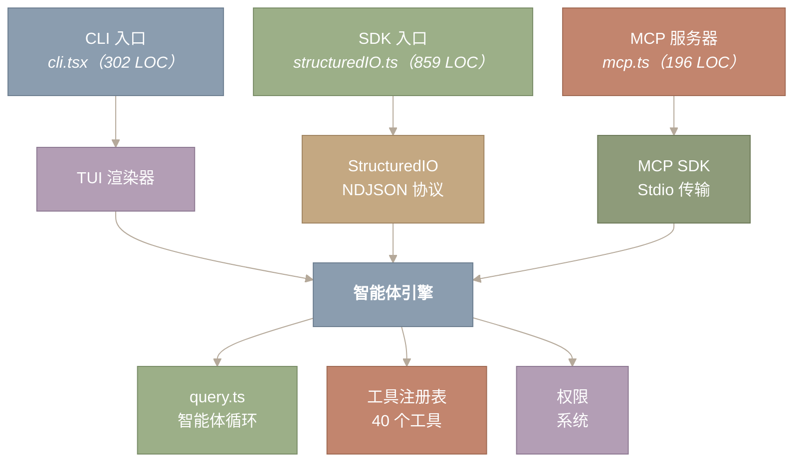
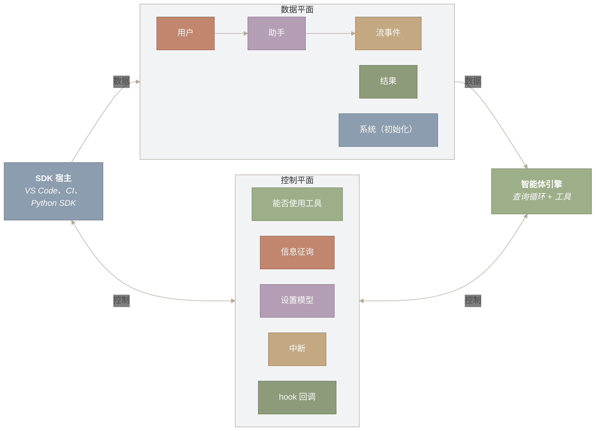

# Claude Agent SDK 与结构化 I/O

> **原文网址：** https://y-agent.github.io/inside-claude-code/15-agent-sdk-structured-io.html  
> **原文标题：** Agent SDK & Structured I/O  
> **原文副标题：** How a single agent engine serves three entry modes – CLI, SDK, and MCP – through a data-plane / control-plane message protocol  
> **翻译日期：** 2026-07-26

单一智能体引擎如何通过数据平面／控制平面消息协议，为 CLI、SDK 和 MCP 三种入口模式提供服务

## 1. 引言：一个引擎，三扇大门

**Claude Code 不只是一款终端应用。它是一个可编程的智能体运行时，只是恰好随附了终端前端。同一个智能体引擎——AsyncGenerator 循环、工具注册表、权限系统、上下文压缩器——可以通过三种不同的入口模式访问：交互式 CLI、无头 SDK 和 MCP 服务器。本文考察的正是让这种汇聚成为可能的协议层。**

大多数对编程智能体的分析都聚焦于模型循环或工具系统。但“外部消费者如何调用和观察智能体”同样是一项影响深远的架构决策。终端 REPL、CI/CD 流水线和 VS Code 扩展对输入交付、输出消费和治理交互的要求截然不同。Claude Code 通过一套结构化消息协议解决了这个问题：协议由 `coreSchemas.ts`（1,889 LOC）和 `controlSchemas.ts`（663 LOC）中的 Zod schema 定义，将对话数据与治理事件分离，并为每一种入口模式提供机器可读的 I/O。

下图展示了三种入口模式如何汇聚到共享引擎：



**图 1：三种入口模式汇聚到一个共享的智能体引擎。** CLI 通过 TUI 框架渲染；SDK 通过 stdio 使用结构化 NDJSON；MCP 服务器通过模型上下文协议公开工具。三者共享同一个查询循环、工具注册表和权限系统。

**如何阅读此图。** 从顶部代表三种入口模式的节点开始：CLI、SDK 和 MCP 服务器。它们各自经过专属的协议适配器（TUI 渲染器、StructuredIO NDJSON 或 MCP Stdio 传输），随后汇聚到中央共享的“智能体引擎”节点。引擎下方的三个共享子系统——查询循环、工具注册表和权限系统——以完全相同的方式供三种入口模式使用。关键结论是：所有路径都通向同一个引擎；入口模式只决定 I/O 的格式。

本文与“智能体支架”部分中的智能体循环分析（第二部分第 1 篇）和多智能体编排（第二部分第 3 篇）并列。第二部分第 1 篇剖析的是“循环做什么”，而本文考察的是“如何访问循环”。我们先介绍三种入口模式（第 2 节），然后讲解 SDK 消息 schema（第 3 节），考察控制协议（第 4 节），分析 StructuredIO 适配器（第 5 节），刻画数据平面／控制平面的划分（第 6 节），最后介绍用于远程消费的 SDK 消息适配器（第 7 节）。

**本文涉及的源文件：**

| 文件 | 用途 | 大小 |
|---|---|---:|
| `src/schemas/coreSchemas.ts` | 核心 SDK 消息 schema（23 种消息类型，Zod v4） | ~1,889 LOC |
| `src/schemas/controlSchemas.ts` | 控制协议 schema（权限、配置） | ~663 LOC |
| `src/cli.tsx` | CLI 入口点（REPL 与 SDK 模式路由） | ~302 LOC |
| `src/remote/sdkMessageAdapter.ts` | 供远程消费使用的 SDK 到 REPL 消息适配器 | ~302 LOC |
| `src/entrypoints/` | 公共 SDK 入口点与类型导出 | ~5 个文件 |
| `src/services/mcp/SdkControlTransport.ts` | 基于 SDK 控制通道的 MCP 传输 | ~200 LOC |

---

## 2. 三种入口模式：CLI、SDK、MCP

**三种入口模式的表层协议不同，但最终汇聚到同一个智能体引擎。理解它们之间的差异，有助于说明结构化消息协议为何存在。**

### 2.1 CLI 入口：React/Ink REPL

CLI 入口（`cli.tsx`，302 LOC）是一个引导分派器：它检查 `process.argv`，并将执行路由到相应的处理程序。它大量使用动态导入——`--version` 快速路径除入口文件本身外，无需加载任何模块。只有在没有命中任何快速路径时，才会加载完整的 React / Ink REPL：

```
// Fast-path for --version/-v: zero module loading needed
if (args.length === 1 && (args[0] === '--version' || args[0] === '-v')) {
  console.log(`${MACRO.VERSION} (Claude Code)`)
  return
}
// ... other fast paths: --dump-system-prompt, daemon, bridge, bg sessions ...

// No special flags detected, load and run the full CLI
const { main: cliMain } = await import('../main.js')
await cliMain()
```

在进入交互式 REPL 之前，CLI 入口会处理数量惊人的子模式：守护进程 worker、桥接／远程控制、后台会话（`ps`、`logs`、`attach`、`kill`）、模板作业、环境运行器、自托管运行器，以及 worktree/tmux 编排。每一种都由 `feature()` 门控，以便在构建时消除死代码。大多数用户所体验的交互式 REPL，其实是**后备**路径。

### 2.2 SDK 入口：无头结构化 I/O

当外部进程（Python SDK、VS Code 扩展或 CI 流水线）使用 `--output-format stream-json` 启动 Claude Code 进程时，就会进入 SDK 模式。在这种模式下没有 Ink 渲染器；智能体改为从 stdin 读取 NDJSON 消息，并向 stdout 写入 NDJSON 消息。`StructuredIO` 类（`structuredIO.ts`，859 LOC）负责调解这套协议。

SDK 模式支持以编程方式控制智能体：在 stdin 上以 JSON 对象发送用户消息，在 stdout 上以 JSON 对象接收助手消息、工具执行、流事件和结果摘要。治理交互（权限请求、信息征询）与控制协议消息经同一通道传输，并通过各自的 `type` 字段加以区分。

### 2.3 MCP 服务器入口：公开工具

MCP 入口（`mcp.ts`，196 LOC）把 Claude Code 作为 MCP（Model Context Protocol，模型上下文协议）服务器运行，将其工具注册表公开给外部 MCP 客户端。这颠倒了通常的关系：Claude Code 不再像连接外部工具时那样**调用** MCP 服务器，而是自己**成为** MCP 服务器，让其他智能体可以使用其 40 个内置工具。

```
const server = new Server(
  { name: 'claude/tengu', version: MACRO.VERSION },
  { capabilities: { tools: {} } },
)
```

MCP 服务器注册了两个处理程序：`ListToolsRequestSchema`（返回所有工具及其由 Zod 转换为 JSON Schema 的输入 schema）和 `CallToolRequestSchema`（在非交互式上下文中执行工具）。值得注意的是，MCP 模式会创建一个最小化的 `ToolUseContext`，其中 `isNonInteractiveSession: true` 且禁用思考——它是无头工具执行器，而不是对话式智能体。

---

## 3. SDK 核心 Schema：消息协议

**SDK 消息协议由 `coreSchemas.ts`（1,889 LOC）定义——这是一个集中存放 Zod v4 schema 的文件，充当所有 SDK 数据类型的唯一事实来源。TypeScript 类型由这些 schema 生成，而不是反过来。**

schema 文件分为多个领域，每个领域定义一类 SDK 消息的线路格式。

### 3.1 消息类型分类体系

`SDKMessageSchema` 是由 23 种不同消息类型组成的联合。按功能可分为：

**表 1：SDK 消息类型分类体系。** 这 23 种类型涵盖对话数据、系统生命周期、治理和可观测性。

| 类别 | 消息类型 | 用途 |
|---|---|---|
| 对话 | `user`、`assistant`、`stream_event` | 数据平面——提示、响应、流式增量 |
| 结果 | `result`（success / error 变体） | 回合完成，包含成本、用量和耗时指标 |
| 系统 | `init`、`status`、`compact_boundary`、`api_retry`、`local_command_output` | 会话生命周期与基础设施事件 |
| Hook | `hook_started`、`hook_progress`、`hook_response` | 生命周期 hook 的执行进度 |
| 任务 | `task_started`、`task_progress`、`task_notification` | 后台任务状态 |
| 进度 | `tool_progress`、`tool_use_summary` | 工具执行可观测性 |
| 认证 | `auth_status` | 认证状态变化 |
| 速率限制 | `rate_limit_event` | 订阅速率限制信息 |
| 会话 | `session_state_changed`、`files_persisted` | 会话状态转换 |
| 建议 | `prompt_suggestion` | 预测的下一条用户提示 |

### 3.2 SDKSystemMessage：会话初始化

`SDKSystemMessage`（子类型 `init`）是每次会话发出的第一条消息。它携带完整的会话配置：可用工具、MCP 服务器状态、模型标识、权限模式、斜杠命令、技能、插件、API 密钥来源、beta 功能和输出样式。这一条消息就能为 SDK 消费者提供渲染会话 UI 或配置编程客户端所需的一切：

```
export const SDKSystemMessageSchema = lazySchema(() =>
  z.object({
    type: z.literal('system'),
    subtype: z.literal('init'),
    tools: z.array(z.string()),
    model: z.string(),
    permissionMode: PermissionModeSchema(),
    mcp_servers: z.array(z.object({ name: z.string(), status: z.string() })),
    slash_commands: z.array(z.string()),
    skills: z.array(z.string()),
    plugins: z.array(z.object({ name: z.string(), path: z.string(), ... })),
    // ... apiKeySource, betas, output_style, fast_mode_state
    uuid: UUIDPlaceholder(),
    session_id: z.string(),
  }),
)
```

### 3.3 结果 Schema：结构化回合摘要

回合结束时会生成一条 `SDKResultMessage`——可能是成功，也可能是错误。成功变体携带 `duration_ms`、`duration_api_ms`、`num_turns`、`total_cost_usd`、按模型拆分的用量，以及智能体最终的文本结果。错误变体额外包含一个 `subtype` 判别字段（`error_during_execution`、`error_max_turns`、`error_max_budget_usd`、`error_max_structured_output_retries`）和一个 `errors` 数组。这种结构化格式让 CI 流水线无需抓取文本即可解析智能体运行结果。

### 3.4 Schema 驱动的设计

一个反复出现的模式，是用 `lazySchema()` 包装每一个 schema 定义。这样会把 Zod schema 的构建推迟到首次访问时，从而避免循环引用问题并降低启动成本。schema 是规范定义——TypeScript 类型通过 `scripts/generate-sdk-types.ts` **由其生成**，从而确保运行时验证和静态类型永远不会发生偏离。

---
## 4. 控制协议：带外治理

**控制协议（`controlSchemas.ts`，663 LOC）定义了一套与对话数据流并行运行的请求—响应机制。它处理需要智能体引擎与宿主双向通信的治理事件——权限请求、信息征询、会话配置变更。**

### 4.1 请求—响应模式

每次控制交互都遵循同一种信封格式：

```
// Outbound: agent -> host
export const SDKControlRequestSchema = lazySchema(() =>
  z.object({
    type: z.literal('control_request'),
    request_id: z.string(),       // correlation ID
    request: SDKControlRequestInnerSchema(),
  }),
)

// Inbound: host -> agent
export const SDKControlResponseSchema = lazySchema(() =>
  z.object({
    type: z.literal('control_response'),
    response: z.union([
      ControlResponseSchema(),       // { subtype: 'success', ... }
      ControlErrorResponseSchema(),  // { subtype: 'error', ... }
    ]),
  }),
)
```

`request_id` 是把响应与发起它的请求关联起来的关联 ID。这一点至关重要，因为多个控制请求可能同时处于进行中——例如，两个并发的工具执行可能各自都需要权限。

### 4.2 控制请求分类体系

`SDKControlRequestInnerSchema` 是由 20 种请求子类型组成的联合：

**表 2：控制协议请求子类型。** 该协议负责管理权限、配置、MCP 管理和会话生命周期。

| 子类型 | 方向 | 用途 |
|---|---|---|
| `initialize` | 宿主 → 智能体 | 会话设置：hook、MCP 服务器、智能体、JSON schema |
| `can_use_tool` | 智能体 → 宿主 | 权限请求：工具名称、输入、建议 |
| `interrupt` | 宿主 → 智能体 | 取消当前对话回合 |
| `set_permission_mode` | 宿主 → 智能体 | 更改权限执行模式 |
| `set_model` | 宿主 → 智能体 | 在会话中途切换模型 |
| `mcp_status` | 宿主 → 智能体 | 查询 MCP 服务器连接状态 |
| `get_context_usage` | 宿主 → 智能体 | 上下文窗口用量明细 |
| `hook_callback` | 智能体 → 宿主 | 携带输入数据传递 hook 回调 |
| `elicitation` | 智能体 → 宿主 | MCP 服务器请求用户输入 |
| `rewind_files` | 宿主 → 智能体 | 将文件变更还原到某个消息边界 |
| `mcp_message` | 宿主 → 智能体 | 将 JSON-RPC 转发到 MCP 服务器 |
| `mcp_set_servers` | 宿主 → 智能体 | 替换动态管理的 MCP 服务器 |
| `apply_flag_settings` | 宿主 → 智能体 | 将设置合并到 flag 层 |
| `get_settings` | 宿主 → 智能体 | 获取最终生效的合并设置 |
| `cancel_async_message` | 宿主 → 智能体 | 丢弃一条排队中的异步用户消息 |

### 4.3 权限请求流程

最关键的控制交互是权限提示。当智能体想要执行需要用户批准的工具时，引擎会发出一条 `can_use_tool` 控制请求，其中包含工具名称、输入和可选的 `permission_suggestions`（宿主可以采用的预计算规则）。宿主把请求呈现给用户（或交给自动化策略），随后返回一条 `control_response`，其中 `behavior: 'allow'` 或 `behavior: 'deny'`。

`PermissionResultSchema` 对该决定进行编码，并提供可选的 `updatedInput`（宿主可在允许之前修改工具参数）、`updatedPermissions`（需要持久化的新规则），以及用于遥测的 `decisionClassification`（`user_temporary`、`user_permanent`、`user_reject`）。

### 4.4 Stdin 与 Stdout 聚合 Schema

协议定义了两个聚合 schema，枚举每个通道上的所有有效消息：

- **`StdoutMessageSchema`**：`SDKMessage | SDKControlResponse | SDKControlRequest | SDKControlCancelRequest | SDKKeepAliveMessage`——智能体可以写出的所有内容。
- **`StdinMessageSchema`**：`SDKUserMessage | SDKControlRequest | SDKControlResponse | SDKKeepAliveMessage | SDKUpdateEnvironmentVariablesMessage`——宿主可以写入的所有内容。

注意，`SDKControlRequest` 和 `SDKControlResponse` 在**两个**方向上都会出现。控制请求可以由任意一方发起：智能体向宿主请求权限；宿主向智能体请求配置变更。

---

## 5. StructuredIO：协议适配器

**`StructuredIO`（`structuredIO.ts`，859 LOC）是原始 NDJSON 流与智能体引擎类型化接口之间的桥梁。它把文本行流转换为类型化消息，通过关联 ID 管理待处理的控制请求，并处理权限决定竞速所带来的并发问题。**

### 5.1 架构

`StructuredIO` 类维护三种关键数据结构：

1. **`structuredInput`**：一个 AsyncGenerator，从原始 stdin 行流中产出解析后的 `StdinMessage | SDKMessage` 对象。
2. **`pendingRequests`**：一个 `Map<string, PendingRequest<T>>`，按 `request_id` 跟踪未完成的控制请求。每个条目都保存一个 Promise 的 resolve/reject 回调，以及一个用于响应验证的可选 Zod schema。
3. **`resolvedToolUseIds`**：一个 `Set<string>`，跟踪权限流程已经完成的工具使用 ID，防止重复的 `control_response` 消息破坏对话。

```
export class StructuredIO {
  readonly structuredInput: AsyncGenerator<StdinMessage | SDKMessage>
  private readonly pendingRequests = new Map<string, PendingRequest<unknown>>()
  private readonly resolvedToolUseIds = new Set<string>()
  // ...
}
```

### 5.2 读取循环：面向行的 NDJSON 解析

`read()` 方法是一个私有 AsyncGenerator，它消费原始输入流，将其拆分为行，并通过 `processLine()` 分派每一行。该实现能够处理不完整的行（跨 `for await` 块缓冲）、前置插入的合成用户消息，以及流关闭：

```
private async *read() {
  let content = ''
  const splitAndProcess = async function* (this: StructuredIO) {
    for (;;) {
      if (this.prependedLines.length > 0) {
        content = this.prependedLines.join('') + content
        this.prependedLines = []
      }
      const newline = content.indexOf('\n')
      if (newline === -1) break
      const line = content.slice(0, newline)
      content = content.slice(newline + 1)
      const message = await this.processLine(line)
      if (message) yield message
    }
  }.bind(this)
  // ...
}
```

`prependUserMessage()` 方法允许注入合成的用户回合，并让它们在下一条真实 stdin 消息**之前**产出。需要以编程方式向对话注入消息的子系统会使用这一能力。

### 5.3 控制请求解析

当 `processLine()` 遇到 `control_response` 时，它会根据 `request_id` 查找匹配的 `PendingRequest`，使用保存的 Zod schema 验证响应载荷，然后 resolve 或 reject 对应的 Promise：

```
if (message.type === 'control_response') {
  const request = this.pendingRequests.get(message.response.request_id)
  if (!request) {
    // Check resolvedToolUseIds to ignore duplicates
    // ...
    return undefined
  }
  this.trackResolvedToolUseId(request.request)
  this.pendingRequests.delete(message.response.request_id)
  if (message.response.subtype === 'error') {
    request.reject(new Error(message.response.error))
  } else {
    request.resolve(request.schema.parse(result))
  }
}
```

### 5.4 防止重复

`resolvedToolUseIds` 集合的上限是 1,000 个条目（常量 `MAX_RESOLVED_TOOL_USE_IDS`），并采用 FIFO 淘汰。这样既避免了长会话中的内存无界增长，又保留了足够多的历史记录，用于捕获 `control_response` 的重复投递——远程场景中的 WebSocket 重连可能导致这种情况。没有这项防护，重复响应会把重复的助手消息推入 `mutableMessages`，从而引发 API 400 错误（“tool_use ids must be unique”）。

### 5.5 权限竞速：Hook 与 SDK 宿主

`createCanUseTool()` 方法在 PermissionRequest hook 与 SDK 宿主的权限提示之间实现了一种竞速模式。两者同时启动：

```
const hookPromise = executePermissionRequestHooksForSDK(...)
  .then(decision => ({ source: 'hook', decision }))
const sdkPromise = this.sendRequest<PermissionToolOutput>(...)
  .then(result => ({ source: 'sdk', result }))
const winner = await Promise.race([hookPromise, sdkPromise])
```

如果 hook 先作出决定（允许或拒绝），它就通过 `AbortController` 中止待处理的 SDK 请求。如果 SDK 宿主先响应，则忽略 hook 的结果。这种设计确保自动化策略（hook）和交互式提示（SDK 宿主）能够共存，而不会彼此阻塞。

---

## 6. 数据平面与控制平面

**该协议清晰地区分了数据平面消息（对话内容）与控制平面消息（治理事件）。这种划分呼应了网络架构中的模式：隔离数据路径与管理路径，避免彼此干扰。**



**图 2：数据平面与控制平面的消息流。** 对话消息（用户、助手、流事件、结果）在数据平面上传输。治理消息（权限请求、信息征询、配置变更）在控制平面上传输。二者共享同一条物理 NDJSON 流，但在逻辑上通过消息类型分离。

**如何阅读此图。** SDK 宿主（左）和智能体引擎（右）通过两个逻辑上分离、但共享同一条 NDJSON 流的通道进行通信。上方的“数据平面”组展示从用户到助手再到流事件的单向对话消息流，此外还包含结果和系统初始化消息。下方的“控制平面”组展示双向治理消息——权限请求、信息征询、模型变更、中断和 hook 回调——用双向箭头表示。这种分离说明，对话内容和治理事件在一条流上复用，却永远不会相互干扰。

### 6.1 数据平面的特征

数据平面消息是单向且发送后即不再关心的。宿主发送 `user` 消息；智能体以 `assistant`、`stream_event` 和 `result` 消息响应。不需要确认。对话只可追加：消息不断累积到会话转录中，任何参与者都可以根据消息序列重建对话状态。

数据平面消息携带 `uuid` 和 `session_id` 字段，用于全局标识。`SDKUserMessage` 包含 `parent_tool_use_id`（用于路由工具结果）、`isSynthetic`（用于以编程方式注入的消息）、`priority`（`now`、`next`、`later`，用于消息队列排序），以及一个用于跨进程时钟校准的可选 `timestamp`。

### 6.2 控制平面的特征

控制平面消息是双向的请求—响应消息。它们携带用于关联的 `request_id`。它们是**瞬态的**——会影响智能体的行为，但不属于对话转录。权限决定一经作出，就会修改权限上下文；恢复会话时不会重放该决定本身。

控制平面通过 `SDKControlCancelRequestSchema` 支持取消：

```
export const SDKControlCancelRequestSchema = lazySchema(() =>
  z.object({
    type: z.literal('control_cancel_request'),
    request_id: z.string(),
  }),
)
```

这支持如下场景：桥接层（claude.ai 转发）先于 SDK 宿主解决权限请求——桥接层会注入一条 `control_response`，同时发送一条 `control_cancel_request`，以中止 SDK 宿主待处理的回调。

### 6.3 为什么只用一条流？

两个平面共享一条 NDJSON 流（出站使用 stdout，入站使用 stdin），而不是使用独立通道。这是一项务实选择：子进程 stdio 在各种平台和运行时上普遍可用；在单条流上复用，可以避免管理多个文件描述符或套接字的复杂性。每个 JSON 对象上的 `type` 字段（`user`、`assistant`、`control_request`、`control_response`、`keep_alive`）足以完成判别。

---
## 7. SDK 消息适配器：远程消费

**`sdkMessageAdapter.ts`（302 LOC）弥合了 SDK 消息格式与 REPL 内部 `Message` 类型之间的差距。它使远程客户端——尤其是 Claude Code Remote（CCR）后端——能够使用与本地 CLI 相同的 React 组件渲染智能体输出。**

### 7.1 转换函数

核心函数 `convertSDKMessage()` 接收一条 `SDKMessage`，并返回一个判别联合：

```
export type ConvertedMessage =
  | { type: 'message'; message: Message }
  | { type: 'stream_event'; event: StreamEvent }
  | { type: 'ignored' }
```

`ignored` 分支意义重大。许多 SDK 消息类型（`auth_status`、`tool_use_summary`、`rate_limit_event`）是 SDK 专用事件，在 REPL 渲染中没有对应项。适配器明确把它们归类为可忽略，而不是因未知类型而失败；随着新消息类型的加入，这为向前兼容提供了保障。

### 7.2 消息类型映射

适配器把 SDK 类型映射为 REPL 类型：

- **`assistant`** 映射到 `AssistantMessage`（直接进行结构转换）。
- **`stream_event`** 映射到 `StreamEvent`（提取 `event` 字段）。
- **`result`** 仅在错误结果时映射到 `SystemMessage`；成功结果归类为 `ignored`，因为 UI 使用 `isLoading=false` 作为成功信号。
- **`system`（init）** 映射到带有模型名称的 `SystemMessage`。
- **`system`（status）** 针对压缩事件映射到 `SystemMessage`。
- **`system`（compact_boundary）** 映射到包含压缩元数据的 `SystemMessage`，用于恢复会话时的拼接。
- **`tool_progress`** 映射到包含已用时间信息的 `SystemMessage`。
- **`user`** 消息取决于上下文：当 `convertToolResults` 为 true 时（直连模式），转换工具结果；当 `convertUserTextMessages` 为 true 时（历史重放），转换用户文本消息。在实时 WebSocket 模式下，二者均为 `ignored`，因为 REPL 会在本地添加它们。

### 7.3 优雅降级

适配器的 `default` 分支通过 `logForDebugging` 记录未知消息类型，并返回 `ignored`：

```
default: {
  logForDebugging(
    `[sdkMessageAdapter] Unknown message type: ${(msg as { type: string }).type}`,
  )
  return { type: 'ignored' }
}
```

这种模式对于向前兼容至关重要。后端可能会在客户端更新之前添加新的消息类型。适配器不会崩溃或丢失会话，而是优雅降级——在客户端加入显式支持之前，静默忽略新消息类型。

---

## 8. 综合：协议即架构

结构化 I/O 层揭示了一项关键架构原则：**智能体引擎是由协议定义的服务，而不是一个应用程序**。CLI、SDK 和 MCP 模式并非三个不同的程序——它们只是同一个引擎之上的三种协议适配器。

这种设计带来若干后果：

1. **可测试性**：SDK 模式支持对完整智能体栈进行无头测试。测试支架可以发送 JSON 消息并断言 JSON 响应，无需渲染终端。
2. **可组合性**：MCP 服务器模式让其他智能体可以使用 Claude Code 的工具。编排智能体可以通过标准 MCP 协议调用 `BashTool`、`ReadTool` 或 `EditTool`，无需知道这些工具属于 Claude Code。
3. **边界处的治理**：控制平面的请求—响应模式意味着，**每一个**权限决定都是显式且可审计的。CI 流水线可以实现 `dontAsk` 模式（未预先批准则拒绝）；VS Code 扩展可以渲染丰富的权限对话框；两者使用的都是同一套 `can_use_tool` 协议。
4. **向前兼容**：schema 驱动的方法（以 Zod schema 作为规范定义，并生成类型）意味着，添加新消息类型只需加入一个 schema 变体并扩展联合。未处理新类型的现有消费者会默认返回 `ignored`。

25 种数据平面消息类型和 21 种控制平面请求子类型看起来可能过多。但它们反映的是以服务形式运行 AI 智能体时真实存在的复杂性：会话初始化、流式传输、工具进度、hook 生命周期、任务管理、速率限制、认证和配置——每一项都需要自己的线路格式。另一种选择是使用载荷不透明的更简单协议，但那会把解析复杂性推给每一个消费者。通过让协议显式化并使用 schema 验证，Claude Code 确保同一个智能体引擎能以同等保真度服务于终端用户、Python 脚本和 MCP 客户端。

---

## 附录 A：SDK 消息类型完整列表

所有数据平面消息都定义在 `src/schemas/coreSchemas.ts` 中。除非另有注明，消息均从智能体流向宿主（stdout）。

| # | Schema 名称 | 类型／子类型 | 方向 | 用途 |
|---:|---|---|---|---|
| 1 | `SDKUserMessage` | `user` | stdin | 用户提示或工具结果 |
| 2 | `SDKAssistantMessage` | `assistant` | stdout | 包含文本和工具调用的模型响应 |
| 3 | `SDKPartialAssistantMessage` | `stream_event` | stdout | 来自 API 的流式增量 |
| 4 | `SDKResultMessage` | `result` / `success` | stdout | 回合成功完成（成本、用量、耗时） |
| 5 |  | `result` / `error_during_execution` | stdout | 执行对话期间发生错误 |
| 6 |  | `result` / `error_max_turns` | stdout | 达到最大回合限制 |
| 7 |  | `result` / `error_max_budget_usd` | stdout | 达到成本预算限制 |
| 8 | `SDKSystemMessage` | `system` / `init` | stdout | 会话初始化（工具、模型、MCP、权限） |
| 9 | `SDKStatusMessage` | `system` / `status` | stdout | 状态更新（例如“compacting”） |
| 10 | `SDKCompactBoundaryMessage` | `system` / `compact_boundary` | stdout | 包含 token 计数的压缩边界 |
| 11 | `SDKAPIRetryMessage` | `system` / `api_retry` | stdout | API 请求失败，延迟后重试 |
| 12 | `SDKLocalCommandOutputMessage` | `system` / `local_command_output` | stdout | 斜杠命令输出（例如 `/cost`） |
| 13 | `SDKPostTurnSummaryMessage` | `system` / `post_turn_summary` | stdout | 回合结果的后台摘要 |
| 14 | `SDKHookStartedMessage` | `system` / `hook_started` | stdout | hook 开始执行 |
| 15 | `SDKHookProgressMessage` | `system` / `hook_progress` | stdout | hook 的 stdout/stderr 输出 |
| 16 | `SDKHookResponseMessage` | `system` / `hook_response` | stdout | hook 完成并返回退出码 |
| 17 | `SDKTaskStartedMessage` | `system` / `task_started` | stdout | 启动后台任务 |
| 18 | `SDKTaskProgressMessage` | `system` / `task_progress` | stdout | 后台任务进度（token、摘要） |
| 19 | `SDKTaskNotificationMessage` | `system` / `task_notification` | stdout | 后台任务完成／失败 |
| 20 | `SDKSessionStateChangedMessage` | `system` / `session_state_changed` | stdout | 会话状态转换（idle/running/requires_action） |
| 21 | `SDKFilesPersistedEventSchema` | `system` / `files_persisted` | stdout | 文件已持久化并附带 ID |
| 22 | `SDKToolProgressMessage` | `tool_progress` | stdout | 工具正在执行（已用时间） |
| 23 | `SDKToolUseSummaryMessage` | `tool_use_summary` | stdout | 累计工具调用摘要 |
| 24 | `SDKAuthStatusMessage` | `auth_status` | stdout | 认证状态变化 |
| 25 | `SDKRateLimitEventMessage` | `rate_limit_event` | stdout | 速率限制状态变化 |
| 26 | `SDKElicitationCompleteMessage` | `system` / `elicitation_complete` | stdout | MCP 信息征询已确认 |
| 27 | `SDKPromptSuggestionMessage` | `prompt_suggestion` | stdout | 预测的下一条用户提示 |

线路级包装类型（双向）：`SDKControlRequest`、`SDKControlResponse`、`SDKControlCancelRequest`、`SDKKeepAliveMessage`、`SDKUpdateEnvironmentVariablesMessage`。

---

## 附录 B：控制请求子类型完整列表

所有控制平面请求子类型都定义在 `src/schemas/controlSchemas.ts` 中。请求可以由任意一方发起；响应沿相反方向传输。

| # | 子类型 | 方向 | 有响应？ | 用途 |
|---:|---|---|---|---|
| 1 | `initialize` | 宿主→智能体 | 是 | 初始化会话（hook、MCP、智能体、系统提示） |
| 2 | `interrupt` | 宿主→智能体 | 否 | 中断当前对话回合 |
| 3 | `can_use_tool` | 智能体→宿主 | 是 | 请求使用工具的权限 |
| 4 | `set_permission_mode` | 宿主→智能体 | 否 | 设置权限模式（default/acceptEdits/bypassPermissions/plan/dontAsk） |
| 5 | `set_model` | 宿主→智能体 | 否 | 为后续回合切换模型 |
| 6 | `set_max_thinking_tokens` | 宿主→智能体 | 否 | 设置扩展思考 token 预算 |
| 7 | `mcp_status` | 宿主→智能体 | 是 | 查询 MCP 服务器连接状态 |
| 8 | `get_context_usage` | 宿主→智能体 | 是 | 查询上下文窗口 token 明细 |
| 9 | `hook_callback` | 宿主→智能体 | 否 | 携带事件数据传递 hook 回调 |
| 10 | `mcp_message` | 宿主→智能体 | 否 | 向 MCP 服务器发送 JSON-RPC 消息 |
| 11 | `mcp_set_servers` | 宿主→智能体 | 是 | 替换动态管理的 MCP 服务器 |
| 12 | `mcp_reconnect` | 宿主→智能体 | 否 | 重新连接断开的 MCP 服务器 |
| 13 | `mcp_toggle` | 宿主→智能体 | 否 | 启用或禁用 MCP 服务器 |
| 14 | `rewind_files` | 宿主→智能体 | 是 | 回退自某条特定消息以来的文件变更 |
| 15 | `cancel_async_message` | 宿主→智能体 | 是 | 按 UUID 丢弃待处理的异步用户消息 |
| 16 | `seed_read_state` | 宿主→智能体 | 否 | 使用路径 + mtime 初始化文件读取缓存 |
| 17 | `reload_plugins` | 宿主→智能体 | 是 | 重新加载插件，返回刷新的会话 |
| 18 | `stop_task` | 宿主→智能体 | 否 | 按 ID 停止正在运行的后台任务 |
| 19 | `apply_flag_settings` | 宿主→智能体 | 否 | 将设置合并到 flag 设置层 |
| 20 | `get_settings` | 宿主→智能体 | 是 | 返回最终生效的合并设置 |
| 21 | `elicitation` | 智能体→宿主 | 是 | 请求 SDK 消费者处理 MCP 信息征询 |

注意，`can_use_tool`（#3）和 `elicitation`（#21）的方向是智能体→宿主——智能体向宿主请求决定。所有其他请求的方向都是宿主→智能体。

---

_系列：Inside Claude Code | 第二部分第 2 篇_
