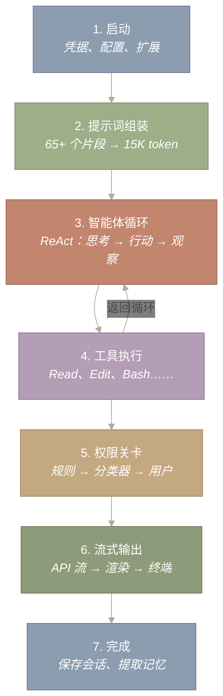
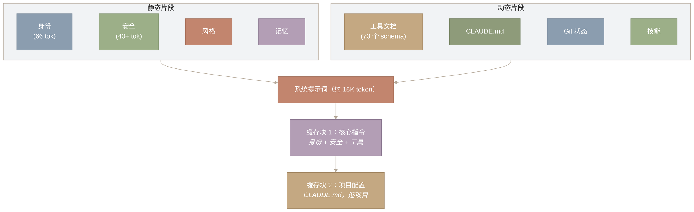
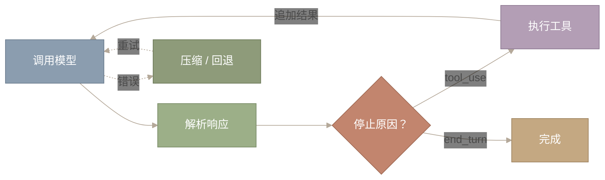
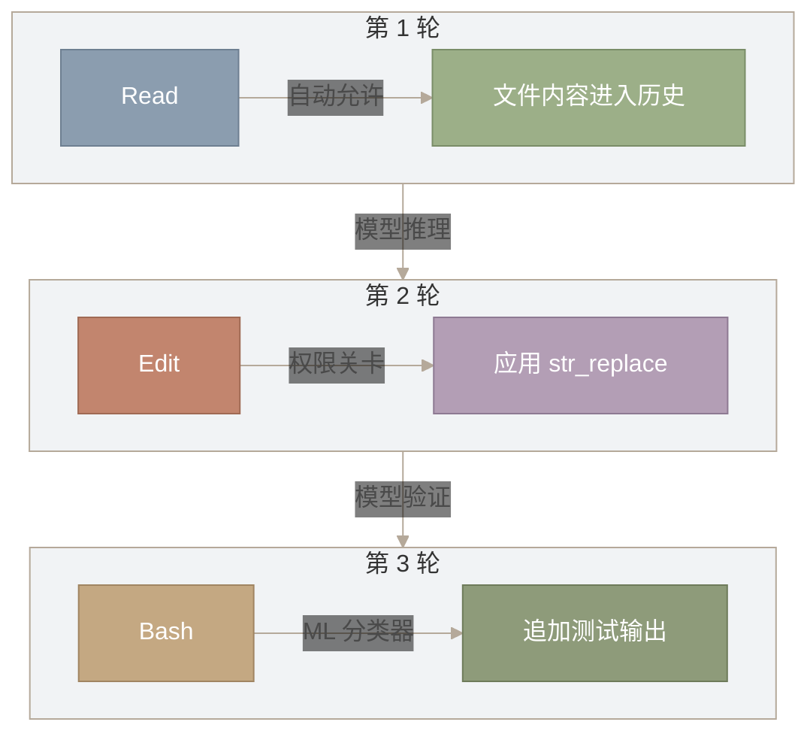
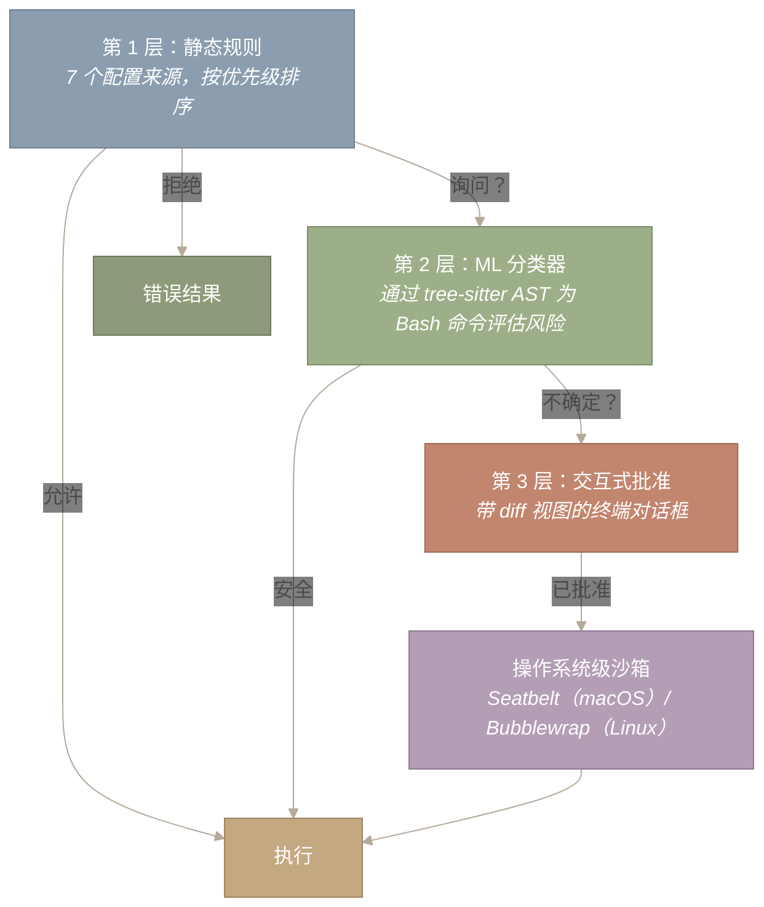

# 端到端工作流

> **原文网址：** https://y-agent.github.io/inside-claude-code/01-end-to-end-workflow.html  
> **原文标题：** End-to-End Workflow  
> **原文副标题：** Tracing a single query from terminal keystroke to final output through seven architectural stages  
> **翻译日期：** 2026-07-26

*通过七个架构阶段，追踪一次查询从终端按键到最终输出的全过程。*

## 引言：一次查询，七个阶段

你输入 `Fix the bug in auth.ts` 并按下回车。十二秒后，Claude Code 已读取文件、找出问题、应用修改并打印摘要。这段旅程会经过七个阶段：(1) **启动（Startup）**加载凭据、配置和扩展；(2) **提示词组装（Prompt Assembly）**将 65 个以上的片段合并成约 15K token 的系统提示词；(3) **智能体循环（Agent Loop）**执行“思考 → 行动 → 观察”的 ReAct 循环；(4) **工具执行（Tool Execution）**分派 Read、Edit、Bash 等工具；(5) **权限关卡（Permission Gate）**在每个工具启动前实施安全规则；(6) **流式输出（Streaming Output）**在终端中逐 token 渲染 API 响应；(7) **完成（Completion）**持久化会话并提取记忆。第 3、4 阶段构成一个循环，任务解决前可能往复数十次。



*图 1：一次查询穿越 Claude Code 的七个阶段。第 3、4 阶段形成循环：模型推理、调用工具、观察结果，再重复这一过程，直到任务完成或某个终止保护机制触发。*

**如何阅读此图。** 从第 1 阶段（顶部）开始，沿箭头向下依次经过七个编号阶段。关键之处是第 4 阶段（工具执行）与第 3 阶段（智能体循环）之间的回环箭头——该循环会不断重复，直到模型完成任务。循环下方的阶段（第 5 至第 7 阶段）在退出序列中执行一次。

七个阶段可以自然地划分为三个时期。本地阶段（第 1–2 阶段）完全在你的机器上运行，用时不到 200 毫秒：解析输入、加载配置并组装系统提示词。循环阶段（第 3–6 阶段）在 Anthropic API 与本地工具执行之间往返，可能循环数十次。退出阶段（第 7 阶段）持久化状态并渲染结果。下面依次追踪各阶段。

---

## 第 1 阶段：启动与输入

**Claude Code 在处理你的查询前，需要验证你的身份、加载项目专属设置，并发现有哪些工具可用。所有这些操作都在 400 毫秒内完成。**

运行 `claude "Fix the bug in auth.ts"` 时，系统会并行执行三项初始化任务：

1. **加载凭据**——从操作系统的安全存储中取回 API 密钥。
2. **读取配置**——从多个来源（环境变量、项目文件、用户偏好）收集设置，其中更具体的设置会覆盖更通用的设置。
3. **发现扩展**——查找项目配置的所有 MCP 服务器（外部工具提供方）。

并行而非串行执行这些任务，会让启动时间大致减半（从约 800ms 降至约 400ms）。系统还会加载[第一部分 1](https://y-agent.github.io/inside-claude-code/00-birds-eye-architecture.html)中介绍的功能标志——88 个编译时标志和 50 多个运行时关卡，它们决定启用哪些能力。

初始化完成后，系统确定执行模式。我们的命令行查询会直接进入智能体引擎；像 `/help` 或 `/clear` 这样的交互命令则会在本地处理，API 成本为零。但我们的自然语言提示需要模型，因此输入字符串 `"Fix the bug in auth.ts"` 会被封装为一条用户消息，并转发至第 2 阶段。

完整启动序列见[第五部分 1](https://y-agent.github.io/inside-claude-code/08-cli-commands-ui.html)，配置和功能标志系统见[第五部分 2](https://y-agent.github.io/inside-claude-code/09-auth-providers-flags.html)。

---

## 第 2 阶段：系统提示词组装

**在模型看到你查询中的任何一个 token 之前，一条流水线会把 65 个以上的片段组装成一个系统提示词——这些指令告诉模型它是谁、能做什么以及应当如何行事。该提示词会占用 200,000-token 上下文窗口中的约 15,000 个 token，因此，每个花在指令上的 token 都意味着少一个可供推理的 token。**

系统提示词类似于研究论文的前言：在正文开始前建立上下文、约束和约定。模型会在每次 API 调用前读取系统提示词，所以其内容会直接塑造模型行为。组装流水线按优先级顺序逐层加入各部分，首先是固定的身份前缀：

```
You are Claude Code, Anthropic's official CLI for Claude.
```

随后追加关于安全规则、输出风格、工具使用约定和记忆指令的部分——这些是各轮之间很少变化的**静态片段**。之后是随每次请求变化的**动态片段**：通过沿目录树向上查找而发现的 `CLAUDE.md` 内容、40 个可用工具的工具 schema、活跃技能定义、git 仓库状态、操作系统平台信息以及智能体专属指令。



*图 2：系统提示词组装。静态片段（身份、安全、风格、记忆）与动态片段（工具 schema、`CLAUDE.md`、git 状态、技能）合并成约 15K-token 的单一系统提示词。提示词被拆成两个缓存块：块 1 保存各轮完全一致的核心指令；块 2 保存仅在用户编辑 `CLAUDE.md` 时才会变化的逐项目配置。*

**如何阅读此图。** 顶部两个子图代表提示内容的两类来源：静态片段（身份、安全、风格、记忆）和动态片段（工具文档、`CLAUDE.md`、git 状态、技能）。二者都向下汇入合并后的“系统提示词”节点，随后又拆成两个缓存块。子图边界将各轮相同的内容（静态）与每次请求会变化的内容（动态）分开。关键结论是：最终提示词为缓存而分层——块 1（核心指令）很少变化，块 2（项目配置）仅在编辑 `CLAUDE.md` 时变化。

图中顶行的**静态片段**在一个会话的各轮之间保持固定：模型身份、安全规则、输出风格和记忆指令。底行的**动态片段**随请求而变化：描述约 40 个可用工具的工具 schema（共 73 份 schema 文档）、通过沿目录树向上查找发现的 `CLAUDE.md` 项目专属指令、当前 git 仓库状态，以及任何活跃的技能定义。

顺序会影响成本。Anthropic API 支持提示词缓存：如果提示词最前面的 \(N\) 个 token 与近期请求逐字节相同，服务器会复用已缓存的内部表示，而不是重新处理。Claude Code 将组装后的提示词拆成两个缓存块来利用这一点：

- **缓存块 1**（核心指令）：身份、安全规则、工具 schema——仅在 Claude Code 版本变化时才变化的内容。该块在一个会话的所有轮次中都完全相同。
- **缓存块 2**（项目配置）：`CLAUDE.md` 内容，仅在用户编辑项目指令时才变化。

每个块都标记为 `cache_control: { type: 'ephemeral' }`，服务端生存时间（TTL）为 5 分钟。在一个 20 轮会话中，第一轮会处理全部约 15K token；其余 19 轮命中缓存，可将系统提示词成本降低约 85%。

完整的片段分类和组装流水线见[第三部分 1：提示词组装](https://y-agent.github.io/inside-claude-code/03-prompt-assembly.html)。

---

## 第 3 阶段：智能体循环

**组装好的提示词、对话历史和用户消息进入 ReAct 循环——这是一个不断推理并行动的周期，直到模型发出完成信号或保护机制触发终止。**

Claude Code 的核心是 `query.ts`：一个长 1,729 行、实现 ReAct（Reason + Act，推理 + 行动）模式的异步生成器。对我们的查询而言，循环首先构造 API 请求：第 2 阶段生成的系统提示词，加上包含用户消息 `"Fix the bug in auth.ts"` 的消息数组，再加上所有可用工具的 schema。



*图 3：ReAct 循环。每次迭代都会调用模型、解析响应，并选择执行工具（返回循环）或终止。错误恢复机制负责处理上下文溢出和 API 故障。*

**如何阅读此图。** 沿实线箭头从左向右阅读正常路径：调用模型、解析响应，然后到“停止原因”判断菱形。如果停止原因是 `tool_use`，流程会经过“执行工具”回到“调用模型”，开始下一次迭代。如果停止原因是 `end_turn`，循环退出至“完成”。虚线箭头表示错误路径：API 调用期间的故障会转到“压缩/回退”，然后重试模型调用。

循环的每次迭代都会把完整对话（系统提示词 + 历史 + 用户消息）发送给 Claude API，并以流式方式接收响应。响应被解析成三类块：

- **文本块**——模型的自然语言推理，渲染到终端。
- **思考块**——扩展的思维链推理，显示在可折叠区域中。
- **`tool_use` 块**——请求特定工具调用的结构化 JSON（例如“读取文件 X”或“编辑第 Y 行”）。

对我们的查询，模型第一次响应可能是：“让我读取 `auth.ts`，以便了解这个缺陷”，随后是一个 `tool_use` 块，请求以 `file_path: "auth.ts"` 调用 `Read` 工具。此时 `stop_reason` 为 `tool_use`，所以循环继续进入第 4 阶段。工具结果（文件内容）被追加到对话历史中，循环再次调用模型——此时上下文中已经有文件内容。

**处理较长的工具响应。** 工具结果可能很大：`Read` 一个 500 行文件会产生约 4K token；在单体仓库中执行一次 `Grep` 可能返回 30K token。如果工具结果超过截断阈值，系统会将其截断，并附上一条说明，告知模型输出已被裁剪。模型随后可以发起更有针对性的查询（例如读取特定行范围，而不是整个文件）。这可防止一次工具调用消耗过多上下文预算。完整截断机制见[第四部分 1：工具结果截断](https://y-agent.github.io/inside-claude-code/05-tool-system.html#tool-result-truncation----protecting-the-context-budget)。

**三种终止保护机制**可防止循环无限运行：

1. **轮次计数器**（发散保护）。可配置参数 `maxTurns` 为循环迭代设置硬上限。这是最简单的终止保证——无论智能体如何失常，计数器最终都会触发。默认上限很宽松（数十轮），但并非无限。
2. **停止钩子**（收敛保护）。当模型发出完成信号（`end_turn`）时，生命周期回调会在循环真正退出前检查最终状态。停止钩子可能会检查：“你是否修改了测试文件，却从未运行测试？”如果检查失败，钩子会注入一条错误消息并恢复循环，让模型有机会纠正疏漏。另有计数器防止停止钩子无限触发，从而避免“终止保护机制本身发散”的元问题。实现细节见[第三部分 4：停止钩子深入解析](https://y-agent.github.io/inside-claude-code/11-hooks-lifecycle.html#stop-hooks----convergence-guards-for-the-agent-loop)。
3. **重复检测**（振荡保护）。系统跟踪近期工具调用并检测循环——例如智能体反复请求读取同一文件或执行同一编辑，却没有取得进展。检测到重复时，循环会注入一条警告消息以打破循环。

**上下文预算管理。** 每次 API 调用前，系统都会检查累积的对话历史是否正在逼近 200K-token 上下文窗口上限。如果 `|system_prompt| + |history| + |tools|` 超过窗口的约 75%，就会触发自动压缩：在保留最近上下文的同时总结较早的对话轮次，以回收空间。这类似于垃圾回收：由内存压力触发，并随着预算收紧采用愈发激进的策略。完整压缩级联见[第三部分 2](https://y-agent.github.io/inside-claude-code/04-context-compaction.html)。

完整智能体循环架构见[第二部分 1](https://y-agent.github.io/inside-claude-code/02-agent-loop-query-engine.html)。

---

## 第 4 阶段：工具执行

**模型已经决定行动。它的 `tool_use` 块会被分派给 40 个工具之一；每个工具都实现统一契约：名称、输入 schema 和 `execute` 函数。为保证确定性，工具按顺序运行，但有一项关键优化——只读工具可通过流式执行相互重叠。**

Claude Code 中的每个工具都实现同一接口：

```typescript
type Tool = {
  name: string
  inputSchema: ToolInputJSONSchema
  execute(ctx: ToolUseContext): Promise<ToolResult>
}
```

在查询的第一次迭代中，模型以 `{ file_path: "auth.ts" }` 调用 `Read`。工具执行器依据 JSON Schema 验证输入、运行工具，并将结果（文件内容）作为 `tool_result` 消息追加到对话历史。循环回到第 3 阶段：模型的上下文中已有文件内容，可以对缺陷进行推理。

在第二次迭代中，模型找出问题并调用 `Edit`，通过一次 `str_replace` 操作指定旧代码和新代码。该工具执行前必须通过权限关卡（第 5 阶段）。第三次迭代时，模型可能调用 `Bash` 运行 `npm test`，验证修复。



*图 4：典型缺陷修复查询的工具执行流程。每轮调用一个工具，并走不同的权限路径：`Read` 自动获准（只读），`Edit` 触发权限关卡（文件变更），`Bash` 则由 ML 分类器评分（任意 shell 命令）。工具结果会被追加到对话历史中，为模型下一步推理提供新的观察。*

**如何阅读此图。** 每个子图（第 1、2、3 轮）代表智能体循环的一次迭代。每轮内部，左侧的工具名称沿其权限路径（标在箭头上）流向右侧结果。各轮之间的箭头表示模型在迭代之间进行推理。请注意三种不同的权限路径：`Read` 自动获准（不经过关卡），`Edit` 触发完整权限关卡，`Bash` 由 ML 分类器评分——这说明不同工具会受到不同程度的安全审查。

工具在一轮之内**顺序执行**——这是有意的设计选择。当模型编辑文件后再读回该文件时，读取必须能看到编辑结果。并行执行会引入竞态条件，继而造成 token 浪费并破坏信任。唯一例外是 `StreamingToolExecutor`：它会让只读工具（`Read`、`Grep`、`Glob`）并行重叠，同时仍将有副作用的工具（`Edit`、`Write`、`Bash`）串行化。这就是并发编程中的读者—写者问题：共享读、独占写。

完整工具注册表和执行流水线见[第四部分 1：工具系统](https://y-agent.github.io/inside-claude-code/05-tool-system.html)。

---

## 第 5 阶段：权限与安全

**任何有副作用的工具在执行前，都要经过三层权限关卡。静态规则最先检查，ML 分类器随后评估风险，交互式用户批准充当最终裁决者。无论权限系统做出什么决定，操作系统级沙箱都会限制影响范围。**

当本次查询的 `Edit` 工具调用抵达权限关卡时，三个检查会按顺序进行：



*图 5：以操作系统级沙箱作为遏制后盾的三层权限关卡。第 1 层检查静态配置规则；第 2 层对 shell 命令运行 ML 分类器；第 3 层提示用户进行交互式批准。在每一层，确定的判定（允许、拒绝、安全）都会让剩余检查短路。无论权限结果如何，操作系统级沙箱都会限制影响范围。*

**如何阅读此图。** 从第 1 层（顶部）开始，沿决策箭头向下。在每一层，确定的判定都会让其余检查短路：“允许”直接进入“执行”，“拒绝”进入“错误结果”，ML 分类器判定“安全”也会进入“执行”。只有不确定的结果才流向下一层。第 3 层的最终路径先经过“操作系统级沙箱”，再到“执行”——沙箱是一道遏制后盾，不受工具获批方式影响。

**第 1 层：静态规则。** 系统按优先级检查七个配置来源（环境变量、本地设置、项目设置、用户设置等）。每个来源都可将工具标记为 `allow`、`deny` 或 `ask`。对本次 `Edit` 工具调用而言，典型配置会把文件编辑标为 `ask`——继续进入第 2 层。

**第 2 层：ML 分类器。** 对 `Bash` 工具调用，机器学习分类器使用广泛用于语法高亮和代码分析的解析器生成器 tree-sitter，将 shell 命令解析成抽象语法树（AST）。分类器随后根据解析结构为每条命令评估风险。`npm test` 之类的命令会被归类为安全；`rm -rf /` 之类的命令会被归类为破坏性。分类器会推测性地启动，与第 1 层检查并行执行，从而用 I/O 掩盖 ML 延迟。对本次 `Edit` 调用，分类器并不适用（其目标是 shell 命令），因此系统继续进入第 3 层。

**第 3 层：交互式批准。** 终端中会渲染一个模态对话框，显示拟议编辑及完整上下文——文件路径、旧文本、新文本和 diff 视图。用户按 `y` 批准或按 `n` 拒绝。获批的工具随后在操作系统级沙箱内执行。

**操作系统级沙箱**是最后一道遏制层。在 macOS 上，Seatbelt 配置文件会把文件系统访问限制在项目目录和少数系统路径中；在 Linux 上，Bubblewrap 提供等效的命名空间隔离。沙箱独立于权限系统运行——即使分类器中的缺陷放过了危险命令，沙箱仍会限制其影响范围。

完整权限流水线和沙箱实现见[第四部分 2：安全与沙箱](https://y-agent.github.io/inside-claude-code/06-safety-sandbox.html)。

---

## 第 6 阶段：流式输出

**模型生成响应时，token 会从 Anthropic API 经过智能体循环的生成器，流向终端渲染器。拉取式生成器设计可确保渲染器永远不会落后于 API 的输出速率。**

流式架构连接三个组件：API 客户端、`AsyncGenerator` 循环和终端渲染器。

API 客户端通过一条长连接 HTTP 接收模型响应的增量数据块流。每个数据块携带一个片段——几个文本 token、工具调用 JSON 的一部分，或一个推理 token。`query()` 生成器会把这些数据块产出给渲染器。

因为生成器是拉取式的（渲染器准备好时才请求下一个数据块），所以背压会自动生效：如果终端正忙于更新显示，生成器只需暂停，直到下一个数据块被请求。这能防止突发输出期间发生内存堆积——生产者无法跑在消费者前面。

终端渲染器使用双缓冲高效更新屏幕：它在离屏缓冲区计算新显示内容，与当前屏幕进行 diff，然后只写入发生变化的字符。对我们的查询，这意味着流式文本会实时出现，代码 diff 抵达时即进行语法高亮，进度指示器则能无闪烁地显示动画。

渲染流水线处理多种内容类型：纯文本直接流向输出；代码块获得语法高亮；工具结果以可折叠的详细视图渲染；权限对话框则显示为支持键盘导航的模态提示框。

完整渲染架构见[第五部分 1：CLI 与终端 UI](https://y-agent.github.io/inside-claude-code/08-cli-commands-ui.html)。

---

## 第 7 阶段：完成

**模型返回 `end_turn`。循环运行停止钩子、持久化会话状态、提取记忆，并渲染最终输出。**

当模型的 `stop_reason` 为 `end_turn` 时，智能体循环不会立即退出。首先，停止钩子会检查最终状态。钩子可能检测到模型编辑了源文件却从未运行测试，于是注入类似“你应该运行测试套件来验证所做的更改”的消息。如果停止钩子触发，循环会从第 3 阶段恢复——模型看到注入的消息并据此行动。

假设所有停止钩子均通过，循环进入退出序列：

1. **会话持久化。** 完整对话历史——系统提示词、用户消息、助手响应、工具结果——会被序列化并存储。以后可用 `claude --resume` 恢复会话。
2. **记忆提取。** 自动记忆系统（`services/autoDream/`）扫描对话，寻找可复用的知识：交互期间发现的项目约定、用户通过反馈表达的偏好，以及未来会话中可能有用的领域事实。提取出的记忆存入 SQLite 数据库，并使用 FTS5 全文搜索索引。
3. **终端渲染。** 助手的最终消息被渲染到终端。对我们的查询，摘要可能是：“已修复 `auth.ts` 第 42 行的空值检查缺陷。问题在于 `user` 对象上缺少可选链运算符。测试已通过。”消息还包括格式化后的修改 diff 和测试输出。

循环阶段（第 3–6 阶段）占据绝大多数实际耗时，其中 API 延迟和工具执行构成主要成本。简单的缺陷修复可能几轮就能完成；复杂的重构任务则可能在数分钟内运行数十轮。相比之下，本地阶段（第 1–2 阶段和第 7 阶段）很快。

---

## 串联起来：完整追踪

检查完所有七个阶段后，现在可以看到完整图景。我们的查询 `"Fix the bug in auth.ts"` 触及了[第一部分 1](https://y-agent.github.io/inside-claude-code/00-birds-eye-architecture.html)所述六层架构中的每一层：

| 阶段 | 层 | 发生了什么 |
| --- | --- | --- |
| 1. 启动 | 第 1 层：入口 | 并行加载凭据、配置和扩展 |
| 2. 组装 | 第 5 层：服务 | 将 65+ 个片段组装成 15K-token 系统提示词 |
| 3. 智能体循环 | 第 2 层：智能体循环 | `AsyncGenerator` 调用 API 并解析流式响应 |
| 4. 工具执行 | 第 3 层：工具 | 顺序分派 `Read`、`Edit`、`Bash` |
| 5. 权限 | 第 4 层：安全 | 静态规则、分类器、用户批准 `Edit` |
| 6. 流式传输 | 第 6 层：终端 UI | token 以流式方式传输并增量渲染 |
| 7. 完成 | 第 5 层：服务 | 保存会话、提取记忆、渲染输出 |

这些阶段并非相互独立——它们共享一个统一约束。上下文窗口预算（\(|system| + |history| + |tools| + |output| \leq 200K\) token）塑造了每项设计决策：为何有条件地包含片段（第 2 阶段）、为何在容量达到 75% 时触发压缩（第 3 阶段）、为何截断工具输出（第 4 阶段），以及为何将系统提示词拆成两个缓存块（第 2 阶段）。上下文窗口是有限的，而整个架构正是对这种有限性的协同回应。

> **关键结论**
>
> 流水线中的每个阶段之所以存在，都可追溯到三项约束之一：**时间**（用户期望启动时间短于一秒）、**token**（200K 上下文窗口是硬上限）或**安全**（自主智能体不得造成不可逆的损害）。该架构并非一组彼此独立的设计决策，而是一个系统；其中每个阶段的设计都由这三项约束以及它之前的阶段所决定。

---

## 系列导航

本文以概览深度追踪了完整旅程。后续每篇文章会深入一个阶段：

| 阶段 | 深入解析 |
| --- | --- |
| 1. 启动 | [第五部分 1——CLI 与 UI](https://y-agent.github.io/inside-claude-code/08-cli-commands-ui.html)、[第五部分 2——认证与提供方](https://y-agent.github.io/inside-claude-code/09-auth-providers-flags.html) |
| 2. 提示词组装 | [第三部分 1——提示词组装](https://y-agent.github.io/inside-claude-code/03-prompt-assembly.html) |
| 3. 智能体循环 | [第二部分 1——智能体循环](https://y-agent.github.io/inside-claude-code/02-agent-loop-query-engine.html) |
| 4. 工具执行 | [第四部分 1——工具系统](https://y-agent.github.io/inside-claude-code/05-tool-system.html) |
| 5. 权限与安全 | [第四部分 2——安全与沙箱](https://y-agent.github.io/inside-claude-code/06-safety-sandbox.html) |
| 6. 流式传输与多智能体 | [第二部分 3——多智能体编排](https://y-agent.github.io/inside-claude-code/07-multi-agent-orchestration.html) |
| 7. 扩展 | [第六部分 1——MCP](https://y-agent.github.io/inside-claude-code/10-model-context-protocol.html)、[第三部分 4——钩子](https://y-agent.github.io/inside-claude-code/11-hooks-lifecycle.html) |

*下一篇：[第二部分 1——智能体循环与查询引擎](https://y-agent.github.io/inside-claude-code/02-agent-loop-query-engine.html)，我们将在其中研究生成器抽象如何使 ReAct 循环可组合、可流式传输且具有韧性。*

---

*本分析基于 Claude Code v2.1.88 source map，该 source map 经提取和研究，仅用于教育目的。所有代码片段均由 source map 重建，可能与实际实现有所不同。Claude Code 是 Anthropic, PBC 的产品。*
