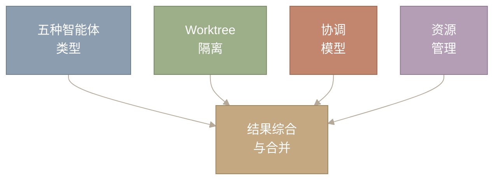
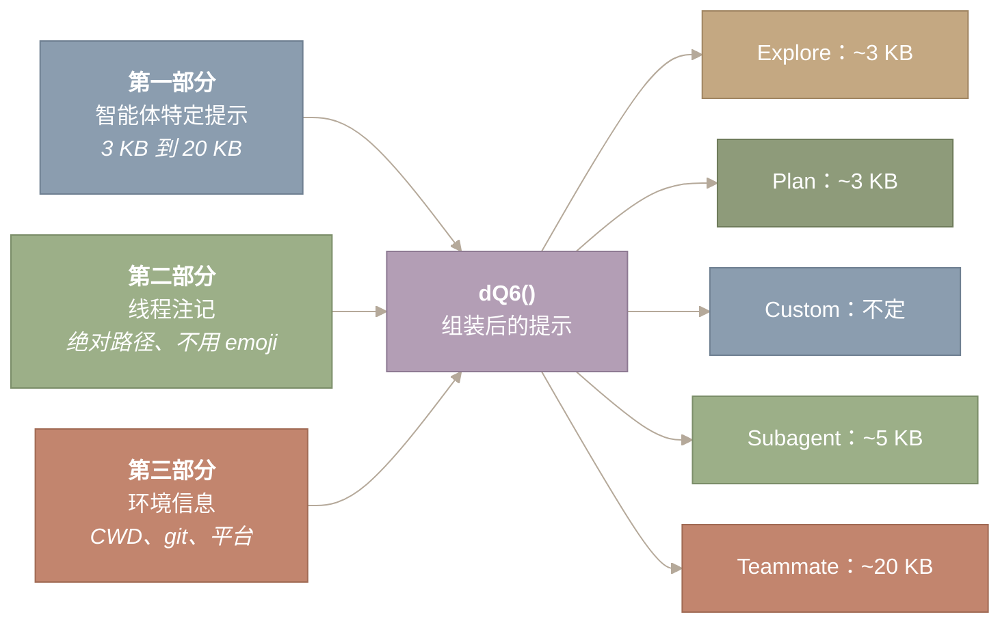
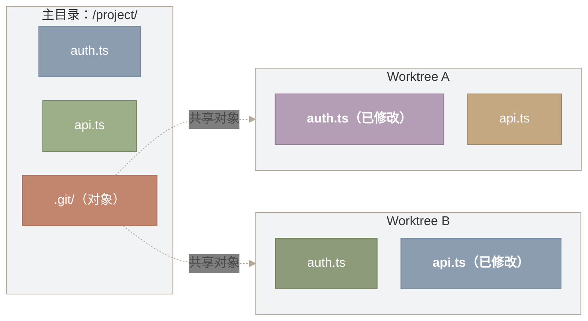
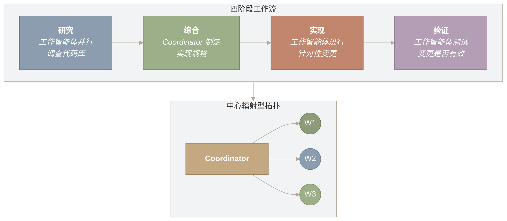
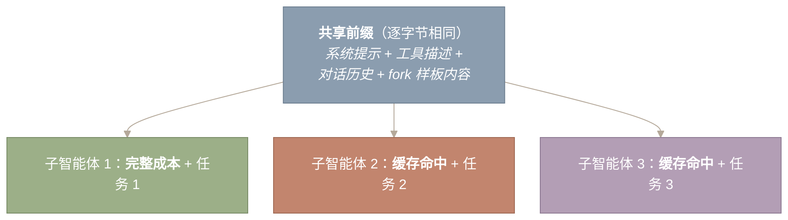

# 多智能体编排

AI 的 fork()——五种智能体类型、worktree 隔离与群体协调

- 原文网址：https://y-agent.github.io/inside-claude-code/07-multi-agent-orchestration.html
- 原文标题：Multi-Agent Orchestration
- 原文副标题：fork() for AI – five agent types, worktree isolation, and swarm coordination
- 翻译日期：2026-07-26

## 为什么需要多智能体？

在 Unix 中，当一个进程需要同时做两件事时，它会调用 `fork()`。内核复制该进程——相同的二进制文件、相同的内存布局、相同的文件描述符——然后子进程独立运行。父进程可以等待结果，也可以继续自己的工作。这是操作系统中并行计算的基础原语：克隆自身、各自分流、再重新汇合。

Claude Code 对 AI 智能体做的正是同一件事。

当任务大到单个上下文窗口无法容纳，或多项工作可以彼此独立推进时，主智能体会生成子智能体——每个子智能体都有自己的上下文、工具和工作目录。子智能体执行任务、回报结果，然后终止；父智能体则综合这些结果。这并非为修辞效果而牵强附会的类比。代码真的把它称为“fork”。功能标志是 `FORK_SUBAGENT`，函数是 `buildForkedMessages`。子智能体的系统提示以这句话开头：*“停下。先读这段。你是一个 fork 出来的工作进程。你不是主智能体。”*

本文介绍 Claude Code 如何把任务分解给多个智能体、用 git worktree 隔离它们的工作、管理各自预算并综合结果——这与系统编程中的 MapReduce、fork-join 并行和 Actor 模型并发采用的是同一种“分解—执行—聚合”模式。每个子智能体运行的智能体循环见[第二部分 1](https://y-agent.github.io/inside-claude-code/02-agent-loop-query-engine.html)；派发智能体所经由的工具系统见[第四部分 1](https://y-agent.github.io/inside-claude-code/05-tool-system.html)；约束其操作的安全层见[第四部分 2](https://y-agent.github.io/inside-claude-code/06-safety-sandbox.html)。



**图 1：** 本文所述多智能体编排的四大支柱——五种智能体类型、git worktree 隔离、协调模型（Coordinator 与 Teammate）以及资源管理（token 预算、模型选择、清理）——最终都汇入结果综合与合并步骤，由父智能体整合子智能体输出。

**如何阅读此图。** 从左侧四个框开始：五种智能体类型、Worktree 隔离、协调模型和资源管理；它们分别代表本文的一个主要部分。四条箭头都汇聚到右侧的“结果综合与合并”，表示这些支柱是相互独立的关注点，最终在父智能体整合子智能体输出时结合起来。

**本文涉及的源文件：**

| 文件 | 用途 | 大小 |
|---|---|---:|
| `src/tools/AgentTool/AgentTool.tsx` | AgentTool 入口与 UI | ~500 LOC |
| `src/tools/AgentTool/runAgent.ts` | 带清理逻辑的智能体执行 | ~400 LOC |
| `src/tools/AgentTool/forkSubagent.ts` | 基于 fork 的异步工作进程 | ~300 LOC |
| `src/tools/AgentTool/loadAgentsDir.ts` | 智能体发现与 YAML frontmatter 解析 | ~756 LOC |
| `src/tools/AgentTool/builtInAgents.ts` | 内置智能体定义（Explore、Plan 等） | ~300 LOC |
| `src/tools/AgentTool/prompt.ts` | 子智能体系统提示组装 | ~200 LOC |
| `src/tools/AgentTool/agentMemory.ts` | 智能体作用域内存管理 | ~150 LOC |
| `src/services/teamMemorySync/` | 团队内存同步协议 | 5 个文件 |
| `src/coordinator/` | 群体协调器模式 | ~3 个文件 |

---

## fork() 类比

子智能体与 Unix 进程之间的联系不是比喻，而是结构上的对应。Unix `fork()` 创建一个拥有父进程内存副本的子进程；Claude Code 的 fork 路径则创建一个拥有父智能体对话历史和系统提示副本的子智能体。Unix 子进程继承文件描述符；fork 子智能体继承父智能体完全相同的工具池。Unix 子进程运行在自己的虚拟地址空间中；fork 子智能体运行在自己的 git worktree 中。隔离边界、通信原语和生命周期管理都能直接对应。

AgentTool 的实现横跨 `tools/AgentTool/` 中 14 个文件、超过 6,000 行 TypeScript，是所有委派操作的唯一入口。Claude Code 中每一个子智能体，无论是廉价的只读探索器，还是持续运行数小时的持久 Teammate，都通过这一个工具生成：

```ts
interface AgentInput {
  prompt: string;             // Full task description
  description: string;        // 3-5 word summary (for task lists)
  subagent_type?: string;     // "Explore" | "Plan" | "subagent" | "teammate" | "custom"
  model?: "sonnet" | "opus" | "haiku";  // Per-agent model override
  run_in_background?: boolean;  // Async execution (returns task_id)
  name?: string;              // Makes agent addressable via SendMessage
  isolation?: "worktree";     // Git worktree isolation
}
```

每个字段都是编排智能体可以拨动的杠杆。`model` 字段支持按智能体优化成本：执行简单搜索的 Explore 智能体使用 `haiku`（最便宜），而实现复杂逻辑的 Subagent 使用 `opus`（能力最强）。`run_in_background` 标志决定父智能体是阻塞等待（同步委派），还是继续工作（异步执行）。`name` 则让智能体可通过 `SendMessage` 接收后续消息，从而支持多轮协作。

关键细节在于省略 `subagent_type` 时会发生什么。当 `FORK_SUBAGENT` 功能标志启用时，省略类型会触发隐式 fork——子智能体继承父智能体完整的对话上下文和系统提示。该标志关闭时，系统默认使用 `general-purpose` 智能体类型。这个条件分支区分了两种截然不同的生成策略：从零开始的委派与继承上下文的 fork。

### 两种生成路径——Fork 与全新智能体

代码库实现了两条不同的生成路径，两种路径中子智能体获得的上下文差异巨大。

**路径 A：Fork。** 当模型调用 Agent 工具而*不*指定 `subagent_type` 时触发。子智能体会收到父智能体的**完整对话历史**、**完全相同的系统提示**和**完全相同的工具池**（逐字节一致，以共享提示缓存）。函数 `buildForkedMessages()` 精确构造两条消息，追加到父智能体对话之后：

1. 父智能体最后一条 assistant 消息的克隆（包含全部 `tool_use` 块、thinking 块和文本块）。
2. 一条 user 消息，其中包含占位的 `tool_result` 块（所有 fork 的文本完全一致，同样是为了共享缓存）以及该子智能体特有的任务指令。指令规定了 10 条不可协商的规则：不得再次委派、不得交谈、不得发表评论、直接使用工具、严守范围、报告不超过 500 词、以“Scope:”开头、报告结构化事实，然后停止。

由于父智能体和所有 fork 子智能体的系统提示、工具及对话前缀逐字节一致，LLM API 的提示缓存会把除第一个子智能体之外的所有子智能体视为缓存命中。每个子智能体只有最后一条指令消息不同。

**路径 B：全新智能体。** 当模型*指定* `subagent_type`（Explore、Plan、subagent、teammate 或 custom）时触发。子智能体启动时拥有**零对话上下文**，只收到一条包含任务提示的 user 消息。它拥有根据智能体类型定义组装的独立系统提示、重新组装的工具池和全新的文件状态缓存。它不知道父智能体讨论过什么、读取过哪些文件或做过哪些决定。

五种具名智能体类型全部使用路径 B。Fork 路径（路径 A）是一个独立机制，仅在省略类型时触发。

这就是最根本的上下文权衡：fork 子智能体知道父智能体所知道的一切（昂贵、高上下文），而类型化智能体只看到任务描述（便宜、聚焦）。Fork 路径适用于需要父智能体累积理解的任务；类型化智能体路径则适用于“干净起点和专门角色”比共享历史更有价值的任务。

> **重要洞见**
>
> Agent 工具不只是一个工具——它是创建新智能体的元工具。从父智能体的角度看，它是一次返回结果的函数调用；从子智能体的角度看，它是完整智能体生命周期的开端。这种“从上看是工具、从内看是智能体”的双重性，让系统具备递归能力。它如何融入更广泛的工具派发管线，见[第四部分 1](https://y-agent.github.io/inside-claude-code/05-tool-system.html)。

---
## 五种智能体类型——成本与能力的光谱

Claude Code 不只有一种子智能体，而是有五种，它们分布在从“廉价且受限”到“昂贵且强大”的光谱上。为任务选择正确类型，就像在多智能体世界里选择正确的数据结构：能满足要求的最便宜选项就是赢家。

可以把它想成项目招聘。你不会付钱请资深架构师做 grep 搜索，也不会让实习生设计系统架构。每种角色都有自己的成本、能力集合和适当的工作范围。


**图 2：** 沿成本—能力光谱排列的五种智能体类型。Explore 智能体只读，使用最便宜的 Haiku 模型，并采用即发即弃语义。Plan 智能体同样只读，但产出结构化实现策略。Custom 智能体由 YAML 定义，可配置工具子集。Subagent 为自包含任务获得完整工具访问权。Teammate 是持久、具名的智能体，可通过 `SendMessage` 双向通信。成本与能力从左向右递增。

**如何阅读此图。** 沿成本—能力光谱从左向右阅读。最左侧的 Explore 最便宜、限制最多——只读、Haiku 模型、即发即弃。每向右一步都会增加能力与成本，直到最右侧拥有全部工具、持久性和对等消息能力的 Teammate。箭头代表投入不断增加：选择能满足任务要求的最左侧类型。

### Explore

Explore 智能体是最便宜的选择。它的系统提示以一段不可能忽略的粗体文字开头：

> *“=== 关键：只读模式 ===”*

这不是客气的建议。提示中有醒目的 **READ-ONLY MODE** 块，明确禁止一切文件写入、创建、删除、移动和重定向。工具在注册表层被限制为 `Read`、`Glob`、`Grep`、`WebFetch`，以及会拒绝任何写命令的 `Bash`。即使模型尝试调用 `Write`，调用也会在执行前被拒绝。模型设为 `haiku`——可用模型中最便宜的一个——因为搜索不需要前沿级推理能力。

一个重要的成本优化是：Explore 智能体设置了 `omitClaudeMd: true`，会从上下文中剥离 CLAUDE.md 指令层级。关键的是，git status 也会省略——这是另一项在规模化运行时叠加生效的 token 节省措施。代码注释称，这会*“在 34M+ 次 Explore 生成中每周节省 ~5-15 Gtok”*（原文指标：`~5-15 Gtok/week across 34M+ Explore spawns`）。这是一个惊人的数字——每周 3,400 万个 Explore 智能体——也解释了为什么每次生成哪怕只省几百个 token，在集群规模上都至关重要。Explore 智能体即发即弃：生成、搜索、返回发现、终止。

### Plan

Plan 智能体与 Explore 共享只读工具限制，但用途根本不同：它们产出结构化实现计划。规划与执行被刻意分开。规划需要宽广的上下文（读取许多文件以理解架构），但只需很少的能力（无需写入）；执行需要深度能力，但上下文更窄（一次处理一个文件）。拆开二者，可以避免在单个智能体中同时完成两者所造成的上下文窗口压力。

Plan 智能体的提示强制执行四阶段结构化推理流程，并明确命名各阶段：(i) **理解需求**、(ii) **彻底探索**、(iii) **设计方案**、(iv) **详述计划**。要求的输出包含 **“实现所需的关键文件”** 一节，列出 3 到 5 个对计划变更至关重要的文件。这样的结构化输出确保计划可执行，而不是停留在抽象层面。

Plan 智能体同样设置 `omitClaudeMd: true` 并省略 git status，与 Explore 采用相同的成本优化——需要时可以直接读取 CLAUDE.md，但每次生成都把它带入上下文只会浪费 token。

### Custom

Custom 智能体由 `.claude/agents/` 中的 Markdown 文件定义，其 YAML frontmatter 可指定名称、描述、工具允许列表/拒绝列表、模型、权限模式、hooks、MCP 服务器、skills、内存作用域和隔离模式。`loadAgentsDir.ts`（756 LOC）负责发现并解析这些定义，支持五种来源：内置、插件、用户设置、项目设置和托管策略设置。来源冲突时，后面的来源覆盖前面的来源——项目覆盖用户，托管策略覆盖项目。“security-reviewer” 智能体可以被限制为只读工具，而 “api-doc-writer” 可获得 `Write` 权限但不能使用 `Bash`。这种细粒度能力控制是团队工作流的扩展点。

### Subagent

Subagent（也称 “general-purpose” 类型）拥有完整工具访问权（`tools: ['*']`），并以即发即弃方式运行。父智能体用一个自包含任务（“实现 `UserService` 类”）生成 Subagent，后者执行后返回。它的系统提示很简洁：

> *“完整完成任务——不要画蛇添足，但也不要半途而废。”*

不同于 Explore 和 Plan，general-purpose Subagent 的上下文**包含完整的 CLAUDE.md 指令层级和 git status**。这是刻意的权衡：Subagent 会执行写操作，需要项目约定、编码标准和仓库状态才能产出正确结果。额外的提示成本是合理的，因为 Subagent 的生成频率远低于 Explore，而且其任务需要更丰富的上下文。

任务定义清晰、需要完整能力但不需要后续交互时，适合使用 Subagent。

### Teammate

Teammate 是最复杂的类型。不同于其他所有类型，它们是持久且具名的。返回结果后不会终止，而是进入空闲状态、消耗零计算资源，等待通过 `SendMessage` 收到新消息。Teammate 获得完整工具集外加协调工具（`TaskCreate`、`TaskGet`、`TaskList`、`TaskUpdate`、`SendMessage`）。其系统提示成本最高：完整的主智能体提示、自定义指令和团队内存。

空闲—唤醒循环是 Teammate 经济性的关键。新消息抵达时，Teammate 带着此前工作的完整上下文醒来，处理消息，然后响应或再次进入空闲。这是把协程模式应用于智能体：在 yield 点挂起，恢复时状态完好保留。

---

## 子智能体提示组装——每种类型会收到什么

**每种智能体类型获得的系统提示有根本差异，由专用函数 `dQ6()` 组装。该函数组合三部分：智能体特定提示、线程注记和环境信息。不同类型的成本差异不只来自模型选择，也来自提示大小。**

主智能体系统提示（`DX()`）横跨 17 节，约 20 KB。子智能体得到的提示则小得多——Explore 智能体的提示约 3 KB，缩小了 7 倍。这种大小差异是直接的成本优化：每周生成 3,400 万个 Explore 智能体时，每一 KB 都很重要。

`dQ6()` 组装函数用三部分构造每个子智能体提示：



**图 3：** 通过 `dQ6()` 函数组装子智能体提示。三部分组合成类型特定的系统提示：第一部分是智能体特定提示（从 Explore 的 3 KB 到 Teammate 的 20 KB 不等）；第二部分包含带行为约束的线程注记（绝对路径、不用 emoji）；第三部分提供运行时环境信息（CWD、git status、平台）。Explore 与 Teammate 提示之间 7 倍（`7x`）的大小差，是集群规模成本控制的主要杠杆。

**如何阅读此图。** 从左侧三个输入框开始（第一部分：智能体特定提示；第二部分：线程注记；第三部分：环境信息），它们都汇入中央的 `dQ6()` 组装函数。然后沿箭头向右查看五种输出变体，每种都标出了大致提示大小。关键结论是 Explore（~3 KB）与 Teammate（~20 KB）之间 7 倍（`7x`）的大小差，这是集群规模成本控制的主要杠杆。

**第一部分 2：智能体特定提示。** 类型从这里开始分化。每种类型都会收到针对其角色调优的提示：

| 类型 | 开场语 | 关键指令 |
|---|---|---|
| **Explore** | *“你是 Claude Code 的文件搜索专家”* | `=== CRITICAL: READ-ONLY MODE ===`；仅限 Glob、Grep、Read、WebFetch、Bash（只读） |
| **Plan** | *“你是软件架构师和规划专家”* | 只读；四阶段：理解、探索、设计、详述 |
| **General-purpose** | *“你是 Claude Code 的智能体。收到用户消息后，使用工具完成任务”* | 完整工具访问；无限制 |
| **Custom** | 用户在 `.claude/agents/*.md` 中定义 | YAML frontmatter 指定工具允许/拒绝列表、模型、权限 |
| **Teammate** | 完整主智能体 `DX()` 提示 + 自定义指令 + 团队内存 | 全部工具 + `SendMessage` + `TaskCreate/Get/List/Update`；持久、具名 |

Explore 和 Plan 提示共享一项关键优化：`omitClaudeMd: true`。这会从子智能体上下文中剥离 CLAUDE.md 指令层级——其中可能包含 5–15 KB 项目特定指令。代码注释称，这会*“在 34M+ 次 Explore 生成中每周节省 ~5-15 Gtok”*（原文指标：`~5-15 Gtok/week across 34M+ Explore spawns`）。子智能体需要时始终可以直接 `Read` CLAUDE.md 文件，但在每次生成的系统提示中携带它，会在集群规模上浪费 token。

**第二部分 1：线程注记。** 这是所有子智能体类型共享的一组行为约束。所有类型都会在提示末尾附加四条具体线程注记：(1) 使用绝对文件路径（因为子智能体的工作目录会在两次 Bash 调用之间重置）；(2) 不用 emoji；(3) 工具调用前不用冒号；(4) 仅当精确文本具有关键作用时才包含代码片段（例如发现的 bug、用户要求的函数签名）。这些“内部规矩”能防止子智能体产出让父智能体困惑的输出。

**第三部分 1：环境信息。** 注入每个子智能体的运行时上下文：当前工作目录、git status 快照、平台（darwin/linux）、shell 类型、OS 版本、模型 ID 和知识截止日期。这确保每个子智能体无需通过工具调用自行探查，就能知道自己身处何处、运行在什么环境。

Teammate 类型值得特别关注。其第一部分 2 包含*完整的*主智能体提示（`DX()`）——全部 17 节、全部行为规则——外加自定义智能体指令和同步后的团队内存。因此 Teammate 成本最高：仅提示本身的成本就与主智能体相当。合理性在于 Teammate 持久且长时间运行；它们会把启动成本摊到多次交互中，不像一次性类型那样只支付一次便终止。

> **重要洞见**
>
> 提示大小光谱——Explore 为 3 KB，Teammate 为 20 KB——并非偶然。在每周生成数百万子智能体的系统里，它是控制成本的主要杠杆。子智能体提示中的每个片段都是有意取舍：它提供的能力是否值得所占 token，还是应剥离以节省预算。这与[提示组装管线](https://y-agent.github.io/inside-claude-code/03-prompt-assembly.html)的条件包含原则相同，只不过应用层级从片段变成了智能体。

---
## Worktree 隔离——代码变更的进程隔离

两个智能体并行编辑同一文件时，会相互覆盖变更。Git worktree 通过为每个智能体提供独立的仓库工作副本解决这个问题——这是应用到文件系统的进程隔离，也是多智能体系统中在运维层面最重要的功能。

在 Agent 工具输入中设置 `isolation: "worktree"`，会为子智能体创建单独的 git worktree。Git worktree 是一个链接到同一 `.git` 对象数据库的独立工作目录。每个 worktree 可以位于不同分支，包含不同的未提交更改，互不干扰。



**图 4：** 并行智能体工作的 Git worktree 隔离。主仓库和两个 worktree（A 与 B）共享同一个 `.git` 对象数据库，但各自维护独立工作目录。智能体 A 修改 `auth.ts`，智能体 B 修改 `api.ts`，彼此不受干扰——类似写时复制虚拟内存，页面在写入前保持共享。冲突解决被推迟到合并时，和人类开发者使用分支的方式一致。

**如何阅读此图。** 中央子图（主目录）包含共享的 `.git` 对象数据库，两侧的 Worktree A 和 Worktree B 是独立工作目录。从 `.git` 指向各 worktree 的虚线箭头表示共享对象。注意，Worktree A 中的 `auth.ts` 以粗体标示为已修改，而 Worktree B 中的 `api.ts` 以粗体标示为已修改——每个智能体在自己的副本中编辑不同文件，互不干扰，冲突推迟到合并时处理。

它与进程隔离的类比十分精确。在 OS 中，每个进程都有自己的虚拟地址空间。在进程 A 中写入地址 `0x1000`，不会影响进程 B 中的地址 `0x1000`。同理，编辑 Worktree A 中的 `auth.ts`，不会影响 Worktree B 或主目录中的 `auth.ts`。冲突在合并时而非写入时解决——就像 IPC 相对于共享内存一样。

当 fork 子智能体在 worktree 中运行时，会通过 `buildWorktreeNotice()` 收到一条特别通知：

> *“你从位于 \[parentCwd\] 的父智能体继承了上面的对话上下文。你正在 \[worktreeCwd\] 的隔离 git worktree 中操作——同一仓库、相同的相对文件结构、独立的工作副本。继承上下文中的路径指向父智能体的工作目录；请将它们转换到你的 worktree 根目录。”*

生命周期受到审慎管理。`createAgentWorktree` 工具函数创建 worktree。如果智能体完成时没有变更（由 `hasWorktreeChanges` 检查），`removeAgentWorktree` 会自动清理 worktree。如果仍有变更，智能体结果会返回 worktree 路径和分支，供父智能体审查、合并或丢弃。这与人类开发者的工作方式相似：建分支、做变更、开 PR、合并或关闭。不会积累陈旧目录。

---

## Teammate 协议——持久的对等协作

其他所有智能体类型都是即发即弃，而 Teammate 系统引入了持久性、命名和双向消息传递。Teammate 与其他类型有三项根本区别。

第一，它们**持久且具名**——返回结果后不会终止，而是进入空闲状态、消耗零计算资源，等待通过 `SendMessage` 收到新消息。第二，它们进行**双向通信**——任一 Teammate 都能直接向其他任何 Teammate 发送消息，形成网状而非星型拓扑。第三，它们共享**团队内存**——这是跨会话持久存在的同步知识库，团队之外的智能体不可见。

`SendMessage` 工具支持点对点通信。当 Teammate `backend-dev` 需要告知 `frontend-dev` API 契约发生变化时，它调用 `SendMessage({ to: "frontend-dev", message: "..." })`。消息以 user 角色消息进入目标的对话，必要时将其从空闲状态唤醒。这让涌现式协调成为可能：后端开发者可以与前端开发者协商 API 契约，而无需让每条消息都经过主智能体；测试编写者可以向后端开发者询问边界情况。主智能体不必成为所有智能体间通信的瓶颈。

进程内 Teammate（通过 `isInProcessTeammate()` 检查）与父智能体共享终端，因此可以显示权限提示；远程和后台 Teammate 则不能。系统通过 `canShowPermissionPrompts` 参数跟踪这一区别，该参数决定智能体的权限模式应自动拒绝提示，还是把提示上浮给用户。

团队内存通过 `services/teamMemorySync/` 同步；该目录实现了一套与 Anthropic 后端服务器交互的完整同步协议。数据模型是扁平键值存储：键是相对于团队内存目录的文件路径（如 `MEMORY.md`、`patterns.md`），值是 UTF-8 字符串内容。同步协议通过版本号和 ETag 处理冲突，并使用逐键 checksum 高效检测差异。秘密扫描器（`secretScanner.ts`）和 `teamMemSecretGuard.ts` 防止凭据意外泄漏到团队内存。

---

## 群体协调——Coordinator 模式

Coordinator Mode 用中心辐射式委派模型替换常规智能体循环。此模式受 `COORDINATOR_MODE` 功能标志控制，通过 `CLAUDE_CODE_COORDINATOR_MODE` 环境变量启用，并且与基于 fork 的生成互斥。Coordinator 负责规划和委派；工作智能体负责执行和回报。工作智能体彼此不可见，也不能直接通信。

Coordinator 的系统提示长达 369 行，定义了完整的编排协议，组织为四个阶段：



**图 5：** Coordinator Mode 的四阶段工作流（研究、综合、实现、验证）及其中心辐射型拓扑。研究阶段，工作智能体并行调查代码库；Coordinator 将发现综合为实现规格；工作智能体进行针对性变更；随后再由工作智能体验证变更能否编译并通过测试。工作智能体彼此不可见——所有通信都经由中央 Coordinator 路由，这是一种 MapReduce 风格的编排模式。

**如何阅读此图。** 上方子图从左向右展示四阶段工作流：研究、综合、实现、验证。下方“中心辐射型拓扑”子图显示 Coordinator 位于中心，箭头向外连接三个工作智能体（W1、W2、W3）。工作智能体无法查看彼此或互发消息——所有通信都经由 Coordinator，使之成为一种集中式 MapReduce 风格的编排模式，其中 Coordinator 既是规划者，也是瓶颈。

Coordinator 提示明确禁止两种引人注目的反模式：

> *“绝不要写‘根据你的发现修复 bug’或‘根据研究结果实现它’。这些措辞把综合工作推给了智能体，而不是由你亲自完成。”*

这迫使 Coordinator 在委派实现之前真正理解研究结果。

> *“启动智能体后，简短告知用户你启动了什么，然后结束响应。绝不要以任何形式捏造或预测智能体结果。”*

这可防止 Coordinator 幻觉出尚未收到的结果。

工作智能体结果以 user 角色消息中的 `<task-notification>` XML 到达。Coordinator 解析通知、提取结果并决定下一步：继续使用该工作智能体（通过带智能体 ID 的 `SendMessage`）、生成一个全新智能体，或向用户报告。继续还是新建，由上下文重叠度决定：

> *“重叠度高——继续。重叠度低——新建。”*

### Coordinator 与 Teammate

这两种编排模型体现了经典的系统权衡：

| 维度 | Coordinator Mode | Teammate 系统 |
|---|---|---|
| **拓扑** | 中心辐射型（星型） | 网状（点对点） |
| **工作智能体生命周期** | 即发即弃、无状态 | 持久、具名、空闲/唤醒 |
| **通信** | 单向委派 | 双向消息传递 |
| **状态管理** | 所有状态集中于 Coordinator | 分布式 + 共享团队内存 |
| **工作智能体间可见性** | 彼此不可见 | Teammate 可私信对等方 |
| **最适合** | 并行批处理 | 协作式、相互依赖的工作 |

---
## 资源管理——Token 预算、模型与清理

子智能体需要资源限制，原因与 OS 进程相同：若没有限制，一个失控的智能体就会耗尽全部预算。Claude Code 在多个层级实施了若干约束。

**最大轮数。** 每个智能体默认最多 200 轮，可通过 frontmatter 配置。这相当于 `ulimit -t`——一种硬性的 CPU 时间限制，用于防止无限循环。达到限制时，智能体会收到 `max_turns_reached` 附件消息并停止。

**按智能体选择模型。** Agent 工具输入中的 `model` 字段控制每轮成本。使用 haiku 的 Explore 成本只是使用 opus 的 Subagent 的一小部分。`getAgentModel()` 函数通过级联规则解析有效模型：工具输入中的显式设置覆盖智能体定义，智能体定义覆盖父模型，父模型覆盖默认值。Custom 智能体可以指定 `model: 'inherit'` 以匹配父智能体。

**权限上浮。** Fork 智能体使用 `permissionMode: 'bubble'`——权限提示会上浮到父智能体终端，而不是被静默拒绝或独立处理。这可以防止 10 个并发智能体同时向用户发出提示。

**缓存感知 fork。** Fork 路径不只是另一种生成策略——它还是一种缓存优化，把多智能体工作的成本从线性降至近乎常数。函数 `buildForkedMessages` 确保所有 fork 子智能体以逐字节相同的提示前缀开始。LLM API 会缓存提示前缀；两个请求共享相同前缀时，第二个请求会命中缓存。通过让 fork 子智能体直到 fork 点都逐字节一致，Claude Code 只需支付一次完整提示成本，后续所有子智能体都能命中缓存。



**图 6：** 缓存感知 fork 利用 LLM 提示缓存。所有 fork 子智能体都以逐字节相同的前缀开始（系统提示 + 工具描述 + 对话历史 + fork 样板内容）。子智能体 1 支付完整提示成本；子智能体 2 到 N 在共享前缀上命中缓存，只需为各自独有的任务指令付费。这把多智能体成本从 `O(N x M)` 转换为约 `O(M + N x delta)`，在规模化运行时可降低 `70-85%` 的成本。

**如何阅读此图。** 从顶部“共享前缀”框开始，它代表所有子智能体共有的逐字节相同部分（系统提示、工具描述、对话历史、fork 样板内容）。沿三条箭头向下看：子智能体 1 因首次处理此前缀而支付完整成本；子智能体 2 和 3 在共享前缀上命中缓存，只需为各自独有的任务指令付费。这使多智能体成本从线性降至近乎常数。

成本节省非常可观。对于 5 个 fork 智能体，第一个子智能体为共享前缀支付完整成本；子智能体 2 到 5 在此前缀上命中缓存，只需为各自独有的指令付费。不使用 fork 时，5 个智能体各有 \\(M\\) 个提示 token，总成本为 \\(5M\\) 个 token。使用 fork 后，成本约为 \\(M + 4\\delta\\)——降低约 70%。

**状态访问边界**通过三种不同模式强制隔离：

| 函数 | 行为 | 用途 |
|---|---|---|
| `setAppState` | 对异步智能体为 no-op | 防止父智能体状态发生竞态条件 |
| `setAppStateForTasks` | 始终抵达根智能体 | 任务进度必须全局可见 |
| `getAppState` | 返回根智能体状态（只读） | 在无变更风险下提供一致视图 |

**清理。** 智能体终止时，`runAgent` 会在其 `finally` 块中清理八类不同资源：智能体特定的 MCP 服务器、会话 hooks、提示缓存跟踪状态、克隆的文件状态缓存、fork 上下文消息、Perfetto trace 条目、transcript 子目录映射、孤立的 todo 条目，以及后台 bash 任务。在每周生成 3,400 万个 Explore 智能体的系统中，哪怕每个智能体只有极小的泄漏，规模化后也会成为灾难。这相当于智能体版的 RAII 析构器：智能体启动期间获取的每一项资源，都必须在关闭时释放。

---

## 内存层级——哪些共享，哪些私有

多智能体内存模型有四种作用域，其排列方式类似 CPU 缓存层级：每升一级，容量更大、更新更慢、共享范围更广。

智能体内存是最内层作用域——它是智能体终止时一并消失的私有工作状态，是智能体的草稿区：中间搜索结果、部分分析、计划草稿。其他智能体都看不到它。这就是 L1 缓存：最快、最私有、最易失。

团队内存通过 `services/teamMemorySync/` 在团队所有 Teammate 之间同步。同步协议使用带 ETag 的版本化条目检测冲突。团队外的智能体看不到团队内存。这就是 L2 缓存：组内共享，并带有一致性协议。

**会话内存**能在上下文压缩后继续存在——上下文压缩是把较旧消息总结出来以释放上下文空间的过程（见[第三部分 1](https://y-agent.github.io/inside-claude-code/03-prompt-assembly.html)）。会话内存条目会跨压缩保留，并重新注入上下文。这就是 L3 缓存：经得住本地淘汰，在容量事件后重新填充。

**MEMORY.md** 是最外层作用域——持久化到磁盘的全局项目内存，可由所有会话中的所有智能体读取。它位于项目根目录的 `.claude/` 中，包含三个子作用域：用户级、项目级和本地级（不签入版本控制）。这就是主内存：持久、全局可访问，是权威记录。

这种分层方法可以避免“吵闹邻居”问题。一个智能体的中间发现不会污染另一个智能体的上下文窗口。全局决策向下流动（所有智能体都读取 MEMORY.md）；团队决策留在团队内部；工作状态保持私有。这与 CPU 缓存层级发挥作用的原理相同：数据局部性决定其放置位置。

---

## 何时生成——智能体选择决策

并非每项任务都需要多智能体协调。只有当任务超出单个上下文窗口的处理能力，或中间输出不值得保留在父智能体上下文中时，生成、管理并综合多个智能体的开销才是合理的。

一个关键架构点是：生成决策**完全由模型驱动**。不存在强制创建子智能体的程序化启发式。模型在工具菜单中看到 Agent 工具，与 Read、Bash、Edit 和其他所有工具并列，然后自主决定是否调用。Agent 工具的描述包含何时适合委派的指引、有效子智能体提示的示例，以及可用智能体类型的说明。从模型角度看，生成子智能体只是一次返回文本结果的普通工具调用。系统没有“任务复杂度超过阈值 X 就生成子智能体”之类的规则。模型读取上下文、评估自身能力，然后作出决定。

Fork 提示直接概括了这一决策标准：

> *“当中间工具输出不值得保留在你的上下文中时，fork 你自己。判断标准是定性的——‘我之后还会需要这个输出吗’——而不是任务大小。”*

提示还警告两种失败模式：

> *“不要偷看”*：不要在 fork 执行期间读取其输出文件——这样会把工具噪声拉入父智能体上下文，违背 fork 的目的。
>
> *“不要抢跑”*：通知抵达前，不得捏造或预测结果。

原则很简单：能完成任务的最便宜智能体类型就是正确选择。用 Teammate 处理本可交给 Subagent 的任务，会把 token 浪费在空闲管理开销上；用 Subagent 处理只需搜索的任务，会把 token 浪费在系统提示中不必要的工具能力上；用 Explore 处理需要编辑文件的任务，则会让智能体把时间浪费在被拒绝的工具调用上。

---

## 总结

Claude Code 的多智能体架构体现了若干可推广到该系统之外的设计原则。

**子智能体就是 AI 的 fork()。** 相同的二进制，不同的上下文，隔离的工作目录。OS 进程管理中的心智模型——fork、exec、wait、collect——可以直接迁移。协调复杂度也相同：共享状态危险，消息传递安全，每个子进程都需要资源限制。代码并不掩饰这种联系，而是通过 `buildForkedMessages`、`isInForkChild` 和 `FORK_SUBAGENT` 等函数名与标识符主动拥抱它。

**之所以存在五种智能体类型，是因为不同任务有不同要求。** 光谱一端的 Explore 便宜而受限；另一端的 Teammate 昂贵且能力最大化。实现会选择满足任务要求的最便宜类型——这与选择正确数据结构背后的推理相同。

**Git worktree 是代码变更的进程隔离。** 就像虚拟内存防止进程破坏彼此状态一样，worktree 防止智能体覆盖彼此文件。冲突在合并时解决，就像不同分支上的人类开发者。其他方案——文件锁、操作变换，或限制智能体只能处理不重叠的文件——都有更差的权衡。

**缓存感知 fork 把线性成本转化为近乎常数的成本。** 通过确保各子智能体的提示前缀逐字节一致，系统支付一次，之后 N-1 次都使用缓存。以每周 3,400 万次 Explore 生成的规模计算，整个集群节省的是数十亿 token。这让 COW fork 类比变得具体：共享一切，只复制发生分歧的部分。

**集中式与去中心化编排是经典的系统权衡。** Coordinator Mode（MapReduce 风格，Coordinator 是瓶颈）对比 Teammate（Actor 模型，更复杂但吞吐更高）。二者都不是普遍更优——选择取决于任务结构。相互独立的并行任务适合 Coordinator；相互依赖的协作任务适合 Teammate。

**瓶颈是上下文，而不是计算。** 子智能体系统中的每个设计决策，都可追溯到稀缺的上下文窗口。Fork 子智能体让中间输出留在父智能体上下文之外；Explore 智能体剥离 CLAUDE.md 以节省 token；一次性智能体跳过 SendMessage 尾部内容；Fork 报告限制为 500 词。一切都是 token 经济学——这也是[第三部分 1](https://y-agent.github.io/inside-claude-code/03-prompt-assembly.html)所述提示组装管线和[第一部分 1](https://y-agent.github.io/inside-claude-code/00-birds-eye-architecture.html)所述架构概览背后的同一约束。

---

*关于用户与多智能体会话交互所经由的 CLI 界面，见[第五部分 1——CLI、命令与 UI](https://y-agent.github.io/inside-claude-code/08-cli-commands-ui.html)。关于把智能体循环、工具和编排串联起来的端到端工作流，见[第一部分 2——端到端工作流](https://y-agent.github.io/inside-claude-code/01-end-to-end-workflow.html)。*
