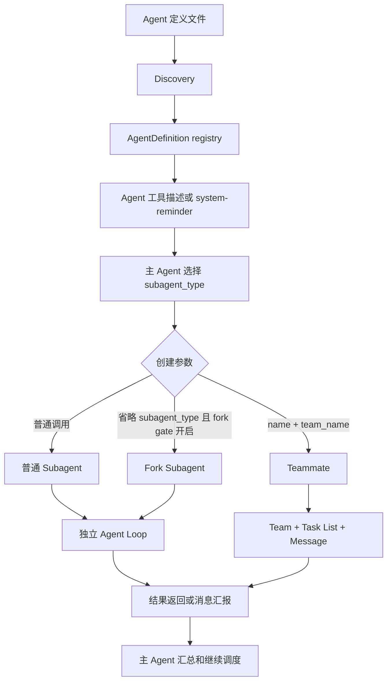

# Claude Code 多智能体系统实现

- 源码仓库：https://github.com/anthropics/claude-code
- 相关源码目录：`src/tools/AgentTool/`
- 研究范围：Agent discovery、Custom Agent、普通 Subagent、Fork、Teammate 与 Team 协作
- 整理日期：2026-07-27

> 本文是基于 Claude Code 源码的机制整理。具体字段、feature gate 和 UI 行为可能随版本变化；源码路径和函数名用于定位实现，而不是对所有版本的永久 API 承诺。

## 1. 先给结论

Claude Code 的多智能体系统不是一个单独的固定 DAG 工作流引擎，而是一组暴露给主 Agent 的编排原语：

```text
主 Agent
  ├── 选择 Agent 类型
  ├── 决定串行、并行或后台执行
  ├── 创建普通 Subagent 或 Teammate
  ├── 使用任务列表和消息协调
  ├── 汇总结果
  └── 决定下一步
```

系统负责：

- 发现并解析 Agent 定义；
- 把 Agent metadata 暴露给主 Agent；
- 根据 `subagent_type` 找到 AgentDefinition；
- 创建新的 Agent Loop；
- 注入对应的 system prompt、工具、模型和权限；
- 在有团队参数时创建 Teammate；
- 提供任务列表、消息、worktree 和生命周期管理。

主 Agent 负责：

- 判断是否需要委派；
- 选择哪个 Agent；
- 设计任务 prompt；
- 决定执行顺序和并发关系；
- 检查结果并继续调度。

因此，准确的描述是：

> Claude Code 提供了多 Agent 的执行和协调原语；默认调度通常由主 Agent 在 Agent Loop 中动态决定，而不是由一个预先固定的工作流编排器自动执行。

## 2. 整体架构



核心实现位置：

| 源文件 | 作用 |
|---|---|
| `src/tools/AgentTool/AgentTool.tsx` | Agent 工具入口、参数解析、Agent 选择和创建路由 |
| `src/tools/AgentTool/loadAgentsDir.ts` | Agent discovery、frontmatter 解析、定义合并 |
| `src/tools/AgentTool/prompt.ts` | Agent 工具说明和可用 Agent 列表生成 |
| `src/tools/AgentTool/runAgent.ts` | 普通 Agent 的执行、上下文、清理和恢复 |
| `src/tools/AgentTool/forkSubagent.ts` | Fork 子 Agent 的定义和路由 |
| `src/tools/AgentTool/builtInAgents.ts` | Explore、Plan、general-purpose 等内置 Agent |
| `src/tools/AgentTool/agentMemory.ts` | Agent memory 作用域和提示注入 |
| `src/tools/AgentTool/loadAgentsDir.ts` | `getAgentDefinitionsWithOverrides()` 和 `parseAgentFromMarkdown()` |
| Team/Task/Message 相关工具目录 | 团队创建、任务分派、消息协作和关闭 |

## 3. Agent 的几种模式

“Agent”在 Claude Code 中不是只有一种执行模式。至少要区分下面几类。

### 3.1 内置 Agent

Claude Code 自带一些 AgentDefinition，例如：

- `Explore`：偏只读探索和代码检索；
- `Plan`：偏分析和计划；
- `general-purpose`：通用任务；
- `claude-code-guide`：回答 Claude Code、SDK 和 API 相关问题；
- 其他版本提供的验证或专用 Agent。

它们在 `src/tools/AgentTool/builtInAgents.ts` 等文件中定义，不需要用户创建 Markdown 文件。

### 3.2 Custom Agent

项目或用户可以通过 Markdown 文件定义 Agent：

```text
.claude/agents/security-reviewer.md
~/.claude/agents/security-reviewer.md
```

Custom Agent 可以配置：

- 角色描述和 system prompt；
- 工具 allowlist 或 denylist；
- 模型；
- 权限模式；
- 最大 turns；
- background 行为；
- worktree 隔离；
- memory 作用域；
- skills、MCP servers 和 hooks 等版本支持的字段。

### 3.3 普通一次性 Subagent

普通 Subagent 的生命周期通常是：

```text
主 Agent 调用 Agent 工具
    ↓
创建子 Agent Loop
    ↓
子 Agent 完成任务
    ↓
结果返回主 Agent
    ↓
子 Agent 结束
```

典型调用：

```json
{
  "subagent_type": "security-reviewer",
  "prompt": "审查 src/auth/ 下的认证和授权逻辑，列出风险和修复建议"
}
```

它适合：

- 一次性搜索；
- 单次代码审查；
- 测试运行；
- 独立研究；
- 一个完成后不需要继续沟通的任务。

### 3.4 Fork Subagent

某些版本和 feature gate 支持省略 `subagent_type` 的隐式 fork：

```text
Agent(prompt="继续调查这个问题")
```

Fork 与从零启动的 Custom Agent 不同：

- fork 可以继承父 Agent 的完整上下文；
- 普通指定 `subagent_type` 的 Agent 通常从一个新的上下文开始；
- fork 更适合中间结果不值得保留在主上下文、但子任务需要当前背景的场景；
- fork 子 Agent 不能无限递归地继续 fork。

当 fork 功能未启用时，省略 `subagent_type` 通常会回退到 `general-purpose`，具体行为由当前版本的 gate 决定。

### 3.5 Teammate

Teammate 是具名、持久、加入 Team 的 Agent。它通常具有：

- `name`；
- `team_name`；
- 共享任务列表；
- 与 Team Lead 或其他成员的消息通道；
- 团队协作上下文；
- 可多轮接收任务；
- 完成当前任务后进入 idle，而不是立即终止。

典型调用：

```json
{
  "subagent_type": "security-reviewer",
  "name": "security-reviewer",
  "team_name": "payment-project",
  "prompt": "审查支付接口的认证逻辑，并向 team lead 汇报"
}
```

源码中的关键路由是：

```ts
if (teamName && name) {
  return spawnTeammate(...)
}
```

也就是说，**同一份 Custom Agent 定义可以作为普通 Subagent，也可以作为 Teammate；身份差异由创建参数和运行时上下文决定。**

## 4. Agent discovery：系统如何发现 Agent

### 4.1 Discovery 入口

主要入口是：

```ts
getAgentDefinitionsWithOverrides(cwd)
```

它位于：

```text
src/tools/AgentTool/loadAgentsDir.ts
```

简化后的流程：

```ts
const markdownFiles =
  await loadMarkdownFilesForSubdir('agents', cwd)

const customAgents = markdownFiles
  .map(file => parseAgentFromMarkdown(...))
  .filter(agent => agent !== null)

const pluginAgents = await loadPluginAgents()
const builtInAgents = getBuiltInAgents()

const allAgentsList = [
  ...builtInAgents,
  ...pluginAgents,
  ...customAgents,
]

const activeAgents =
  getActiveAgentsFromList(allAgentsList)
```

### 4.2 扫描目录

通用函数：

```ts
loadMarkdownFilesForSubdir('agents', cwd)
```

会加载多个来源：

```text
托管策略目录：<managed>/.claude/agents/
用户目录：    ~/.claude/agents/
项目目录：    <project>/.claude/agents/
插件目录：    由 loadPluginAgents() 提供
```

项目目录通过：

```ts
getProjectDirsUpToHome('agents', cwd)
```

从当前工作目录向上遍历，查找各级：

```text
<dir>/.claude/agents/
```

遍历通常在 Git root 处停止，避免父级无关项目的配置泄露到当前仓库。

对于 Git worktree，源码还会处理 worktree 没有检出 `.claude/agents` 的情况，必要时回退到主仓库对应目录；如果 worktree 已经有该目录，则避免重复加载。

### 4.3 找到的不是“路径列表”，而是结构化对象

Markdown loader 读取文件后，返回的数据大致是：

```ts
{
  filePath: '/project/.claude/agents/security-reviewer.md',
  baseDir: '/project/.claude/agents',
  frontmatter: {
    name: 'security-reviewer',
    description: '只读审查代码安全问题',
    tools: ['Read', 'Grep', 'Glob'],
    model: 'sonnet'
  },
  content: '你是一名安全审查专家……',
  source: 'projectSettings'
}
```

### 4.4 discovery 阶段与模型上下文的区别

这里容易混淆两个“加载”：

```text
宿主程序加载：
    可能在 discovery 时已经读取了 Markdown 正文并保存在内存

主 Agent 的模型上下文：
    通常只暴露 Agent 名称、description 和工具信息

子 Agent 的模型上下文：
    被真正选中 spawn 时，才注入完整 Markdown 正文
```

所以不能简单说“所有 Agent prompt 一开始都在聊天历史中”。更准确的是：

> Claude Code 先发现 Agent 并建立 registry；主 Agent 看到的是可用 Agent metadata；真正创建 Agent 时，完整定义正文才作为新 Agent 的 system prompt 使用。

## 5. Agent 定义文件的结构

一个基本的 Custom Agent：

```markdown
---
name: security-reviewer
description: 只读审查代码安全问题
tools:
  - Read
  - Grep
  - Glob
model: sonnet
permissionMode: plan
maxTurns: 40
---

你是一名安全审查专家。

请检查：

- 身份认证和授权；
- 注入漏洞；
- 敏感信息泄露；
- 不安全的文件操作。

只报告问题，不修改代码。
```

### 5.1 必要字段

`parseAgentFromMarkdown()` 首先读取：

```ts
const agentType = frontmatter['name']
let whenToUse = frontmatter['description']
```

通常需要：

```yaml
name: security-reviewer
description: 只读审查代码安全问题
```

缺少 `name` 的 Markdown 会被视为普通参考文档而跳过；缺少 `description` 的 Agent 定义会记录解析问题并跳过。

### 5.2 正文是什么

frontmatter 下面的 Markdown 正文会变成：

```ts
const systemPrompt = content.trim()
```

之后保存为：

```ts
getSystemPrompt: () => systemPrompt
```

因此：

```text
frontmatter.description
    = 主 Agent 看到的“什么时候使用它”

Markdown 正文
    = 子 Agent 的长期角色/system prompt
```

调用时的 `prompt` 则是本次任务说明：

```text
Agent 定义正文：你是谁、长期怎么工作
调用 prompt：这次具体做什么
```

### 5.3 常见字段

根据当前源码版本，frontmatter 可以包含以下类型的字段：

```yaml
name: test-runner
description: 运行测试并分析失败
model: haiku
effort: medium
permissionMode: default
maxTurns: 30
background: true
isolation: worktree
memory: project
```

工具限制：

```yaml
tools:
  - Read
  - Grep
  - Bash

disallowedTools:
  - Edit
  - Write
```

此外，版本支持时还可以配置：

```yaml
skills:
  - testing

mcpServers:
  - name: example-server

hooks:
  # 具体结构遵循当前版本 schema
```

字段不是无条件有效的：源码会验证 `permissionMode`、`isolation`、`effort`、`maxTurns`、工具格式等；非法值会产生日志，定义可能被跳过或部分字段被忽略。

### 5.4 Agent memory

如果配置：

```yaml
memory: project
```

`getSystemPrompt()` 可能在返回正文时追加 Agent memory prompt：

```ts
return systemPrompt + '\n\n' + memoryPrompt
```

这意味着 system prompt 是惰性函数，而不是简单的静态字符串：Agent 启动时可以加入最新的 memory 内容。

## 6. metadata 是如何暴露给主 Agent 的

Agent discovery 完成后，结果进入：

```text
toolUseContext.options.agentDefinitions
```

其中主要有：

```ts
{
  activeAgents: AgentDefinition[],
  allAgents: AgentDefinition[]
}
```

Agent 工具 prompt 位于：

```text
src/tools/AgentTool/prompt.ts
```

源码中的格式化逻辑大致是：

```ts
function formatAgentLine(agent: AgentDefinition): string {
  const toolsDescription = getToolsDescription(agent)
  return `- ${agent.agentType}: ${agent.whenToUse} (Tools: ${toolsDescription})`
}
```

主 Agent 看到的内容可能类似：

```text
Available agent types and the tools they have access to:

- security-reviewer: 只读审查代码安全问题 (Tools: Read, Grep, Glob)
- api-researcher: 研究 API 依赖和调用关系 (Tools: Read, Grep, Glob, Bash)
- test-runner: 运行测试并分析失败 (Tools: Bash, Read)
```

当前版本还支持把 Agent 列表作为内部消息附件注入，而不是放进工具 description：

```text
<system-reminder>
Available agent types:
- security-reviewer: ...
- test-runner: ...
</system-reminder>
```

这由：

```ts
shouldInjectAgentListInMessages()
```

决定。这样做可以让 Agent 列表变化时不必频繁改变整个工具 schema，从而减少 prompt cache 失效。

因此完整链路是：

```text
Agent 文件
    ↓
解析 name/description/tools
    ↓
activeAgents registry
    ↓
Agent 工具描述或 system-reminder
    ↓
主 Agent 知道可用的 subagent_type
```

## 7. 主 Agent 如何选择并创建 Agent

主 Agent 生成的工具输入类似：

```json
{
  "subagent_type": "security-reviewer",
  "description": "审查认证代码",
  "prompt": "审查 src/auth/ 下的认证和授权逻辑，报告风险等级、文件和行号"
}
```

`AgentTool.tsx` 首先根据 `subagent_type` 查找：

```ts
const found = agents.find(
  agent => agent.agentType === effectiveType
)
```

找不到时会报错，并列出可用类型：

```text
Agent type 'xxx' not found.
Available agents: Explore, Plan, general-purpose, security-reviewer, ...
```

找到后，系统会：

1. 调用 `selectedAgent.getSystemPrompt()`；
2. 读取工具限制；
3. 读取模型和 effort；
4. 读取权限模式和 maxTurns；
5. 组合本次任务 prompt；
6. 创建普通子 Agent 或 Teammate；
7. 启动独立的 Agent Loop。

调用方不传文件路径：

```json
{
  "subagent_type": "security-reviewer"
}
```

而不是：

```json
{
  "agent_file": ".claude/agents/security-reviewer.md"
}
```

文件路径由 discovery 机制处理，模型只选择已注册的类型。

## 8. 普通 Subagent 的执行模型

普通 Subagent 可以理解为一次性子进程/子 Agent：

```text
主 Agent
  │
  ├── Agent(subagent_type="api-researcher")
  │       │
  │       ├── 使用 api-researcher system prompt
  │       ├── 使用自己的工具和权限
  │       ├── 执行自己的 Agent Loop
  │       └── 返回结果
  │
  └── 继续主 Agent Loop
```

指定 `subagent_type` 的新 Agent 通常不会自动获得完整的主会话历史。因此主 Agent 应该在 prompt 中提供足够上下文：

```text
不要只写：
“根据你的发现修复 bug。”

更好的写法：
“请检查 src/cache.ts:120-180。当前 readCache() 在 key 不存在时返回 undefined，
而调用方 src/api.ts:42 将它当作对象访问。先确认调用链，再提出最小修复并运行相关测试。”
```

源码中的 Agent 工具 prompt 也强调：新 Agent 像“刚走进房间的聪明同事”，需要主 Agent 提供目标、背景、已有发现、范围和期望输出格式。

### 同步和后台

普通 Agent 可以根据参数同步或后台运行：

```text
同步：
主 Agent 等待子 Agent 返回

后台：
主 Agent 启动子 Agent 后继续工作
完成时通过任务结果/通知返回
```

`run_in_background` 是否可用、是否允许由当前上下文、Agent 定义和 Teammate 模式决定。特别是 in-process Teammate 通常不能再启动后台 Agent。

### Worktree 隔离

Agent 可以使用：

```yaml
isolation: worktree
```

或在支持的调用路径中请求 worktree 隔离。这样并行 Agent 可以在不同 Git worktree 中修改代码，避免直接写入同一个工作目录。

```text
主 worktree
  ├── worktree-agent-a：实现 API
  ├── worktree-agent-b：编写测试
  └── worktree-agent-c：安全修复
```

Worktree 解决的是文件修改冲突，不等于消息协调；仍需要主 Agent 汇总、选择变更和处理合并。

## 9. Teammate 的实现与生命周期

### 9.1 启用条件

Agent Teams 不是所有构建默认都启用。外部构建通常需要类似：

```bash
export CLAUDE_CODE_EXPERIMENTAL_AGENT_TEAMS=1
```

或：

```bash
claude --agent-teams
```

此外还受内部 feature gate / killswitch 控制。未启用时，`TeamCreate` 可能不会出现在工具列表中；提示词写了“请创建团队”也不会凭空产生这个工具。

### 9.2 标准创建流程

```text
TeamCreate
    ↓
创建共享 Team 和 Task List
    ↓
TaskCreate
    ↓
Agent(name=..., team_name=..., subagent_type=...)
    ↓
TaskUpdate 分派任务
    ↓
Teammate 工作并更新状态
    ↓
SendMessage 汇报或继续协调
    ↓
Teammate idle / 接收新任务
    ↓
关闭成员
    ↓
TeamDelete
```

`TeamCreate` 是工具，不是用户在提示词中手写的伪命令。用户通常只需表达意图：

```text
请创建一个 payment-project 团队，包含研究、实现、测试和安全审查角色。
先研究，再实现，最后并行测试和审查。
```

如果工具可用，主 Agent 才会生成结构化调用。

### 9.3 TeamCreate 的参数

核心输入大致是：

```json
{
  "team_name": "payment-project",
  "description": "实现支付功能并完成测试和安全审查"
}
```

`TeamCreate` 负责建立 Team 及其共享任务空间，不负责凭空定义每个 Agent 的角色。角色仍由：

```text
AgentDefinition + Agent 创建参数
```

决定。

### 9.4 创建 Teammate 的参数

```json
{
  "subagent_type": "security-reviewer",
  "name": "security-reviewer",
  "team_name": "payment-project",
  "prompt": "审查支付接口的认证逻辑，并将结果发给 team lead"
}
```

关键判定是：

```text
team_name 存在 && name 存在
    → spawnTeammate()
```

`subagent_type` 仍然负责选择使用哪份 Agent 定义；`name` 是团队内的可寻址身份；`team_name` 决定它加入哪个团队。

### 9.5 Teammate 的附加上下文

Teammate 会在普通 Agent 定义之外获得团队上下文，例如：

- 当前团队名称；
- Team Lead 身份；
- 团队成员列表；
- 共享任务列表位置；
- `TaskList`、`TaskGet`、`TaskUpdate` 的使用方式；
- `SendMessage` 的汇报方式；
- 完成后进入 idle 的生命周期规则；
- 不创建嵌套 Teammate 的限制。

因此同一份 `security-reviewer.md` 在两种模式下可以复用：

```text
普通 Agent：
    长期角色 prompt + 一次性任务 prompt

Teammate：
    长期角色 prompt + 团队协作 prompt + 一次性任务 prompt
```

### 9.6 Teammate 不能无限嵌套

当前实现限制 Teammate 创建嵌套 Teammate：

```text
team-lead
├── teammate-a
├── teammate-b
└── teammate-c
```

不允许：

```text
team-lead
└── teammate-a
    └── teammate-a-1
```

Teammate 可以在适用时创建普通同步 Subagent，但不能继续创建新的 Teammate。这保证 Team roster 扁平，避免团队树、消息路由和生命周期无限递归。

## 10. TeamCreate 是固定工作流还是模型调用

`TeamCreate` 有固定的结构化工具 schema，但它不是一个自动工作流：

```text
固定的是：
    工具名称、输入字段、创建行为

不固定的是：
    何时调用、创建几个成员、如何排序、何时关闭
```

主 Agent 可以在 prompt 中被要求遵守固定流程：

```markdown
对于复杂任务必须严格执行：

1. TeamCreate；
2. TaskCreate 创建 research、implementation、test、review；
3. 创建四个 Teammate；
4. 先完成 research；
5. research 完成后再开始 implementation；
6. implementation 完成后并行运行 test 和 review；
7. 所有检查成功后汇总并关闭团队。
```

这会形成强约束，但仍然是主 Agent 根据提示词执行的流程，不是 Claude Code 内部的不可绕过 DAG。需要严格重试、超时、审批和失败转移时，应使用外部程序或 Agent SDK 作为真正的调度器。

## 11. 模式、权限与继承

### 11.1 主 Agent 模式不会简单等于每个子 Agent 模式

一个常见误解是：

```text
主 Agent 当前是 plan 模式
    ↓
所有 Teammate 自动都是 plan 模式
```

实际要区分：

- Agent 定义的 `permissionMode`；
- Agent 工具调用的 `mode`；
- Team 创建时是否要求 `plan_mode_required`；
- 当前工具权限上下文；
- Teammate 的运行时上下文。

源码路径中，Teammate 创建会传入类似：

```ts
plan_mode_required: spawnMode === 'plan'
```

这表示某次 Teammate 创建可以明确要求 plan mode，而不是简单把主 Agent 的所有状态无条件复制给成员。

### 11.2 如何控制 Teammate 模式

更可靠的方式是显式指定：

```text
请让 researcher 以 plan 模式工作，只分析不修改代码。
请让 implementer 使用 default 模式实现代码。
请让 reviewer 使用 plan 模式做只读审查。
```

同时在 Agent 定义中配置：

```yaml
permissionMode: plan
```

最终行为取决于当前版本对调用参数、定义配置和团队上下文的合并规则；不要假设“主 Agent 模式”自动覆盖所有成员。

### 11.3 工具权限和模式是不同层次

```text
tools / disallowedTools：能调用哪些工具
permissionMode：工具调用遇到权限问题时如何处理
model：使用哪个模型
maxTurns：最多运行多少轮
isolation：是否使用 worktree
```

例如：

```yaml
name: security-reviewer
description: 只读安全审查
tools:
  - Read
  - Grep
  - Glob
permissionMode: plan
```

这是“角色定义上的限制”。Teammate 创建时的 `plan_mode_required` 则是“这次团队运行的模式要求”。两者共同影响运行时行为。

## 12. Agent、Skill 和聊天历史的关系

### Agent

```text
发现 Agent metadata
    ↓
让主 Agent 知道可用的 subagent_type
    ↓
选择并创建新的 Agent Loop
    ↓
把完整 Markdown 正文注入新 Agent 的 system prompt
```

### Skill

```text
发现 Skill 名称/描述
    ↓
主 Agent 判断是否需要
    ↓
加载 SKILL.md
    ↓
把工作方法加入当前 Agent 上下文
```

简化对比：

```text
Skill：扩展当前 Agent 的工作方法
Agent：创建一个拥有独立 system prompt 和 Agent Loop 的新角色
```

两者都可能使用 discovery 和 metadata，但完整内容的用途不同。

需要特别区分：

```text
宿主程序已经读取文件
```

不等于：

```text
文件全文已经进入主 Agent 的模型聊天历史
```

Agent metadata 可能在 Agent 工具描述或内部 `system-reminder` 中暴露给主 Agent；完整 Agent 正文通常在 spawn 时才作为子 Agent system prompt 使用。

## 13. 同名 Agent 和覆盖

源码会合并：

```text
built-in agents
plugin agents
custom agents
```

并通过：

```ts
getActiveAgentsFromList(allAgentsList)
```

生成最终 `activeAgents`。同名 Agent 的后加载定义可以覆盖先加载定义，实际优先级受当前版本的 setting source 和合并顺序影响。常见来源包括：

```text
built-in
plugin
userSettings
projectSettings
flagSettings
policySettings
```

因此不要在多个层级随意定义相同的：

```yaml
name: reviewer
```

如果确实需要覆盖，应明确知道哪个来源具有更高优先级。

`allAgents` 用于保留发现到的全部定义和调试信息；`activeAgents` 用于实际选择可运行的最终定义。

## 14. 缓存与重新发现

`getAgentDefinitionsWithOverrides(cwd)` 使用 memoize 缓存。含义是：

```text
第一次使用某个 cwd：扫描并解析
后续使用同一个 cwd：复用结果
```

如果 Claude Code 运行过程中新建或修改：

```text
.claude/agents/reviewer.md
```

当前进程不一定马上重新读取。源码提供清理缓存的路径：

```ts
clearAgentDefinitionsCache()
```

实际用户通常需要使用当前版本支持的 reload 机制或重启 Claude Code。

这与“Agent 在每次调用时都重新读取文件”不同：发现结果被缓存，而 Agent 正文通过 `getSystemPrompt()` 在创建时取用。

## 15. 一个完整例子

目录：

```text
.claude/
└── agents/
    ├── api-researcher.md
    ├── payment-implementer.md
    ├── test-runner.md
    └── security-reviewer.md
```

`security-reviewer.md`：

```markdown
---
name: security-reviewer
description: 只读审查支付代码的安全问题
tools:
  - Read
  - Grep
  - Glob
model: sonnet
permissionMode: plan
---

你是一名安全审查专家。

只读检查认证、授权、注入、敏感数据和不安全文件操作。
不得修改业务代码。
输出文件、行号、风险等级、影响和修复建议。
```

用户对主 Agent 说：

```text
请使用 Agent Teams 完成支付功能：

1. api-researcher 研究现有接口；
2. payment-implementer 实现功能；
3. test-runner 编写并运行测试；
4. security-reviewer 做只读安全审查。

先研究，再实现；实现完成后并行测试和安全审查。
```

理想的工具调用序列：

```text
TeamCreate(
  team_name="payment-project",
  description="实现支付功能并完成测试和安全审查"
)

TaskCreate("研究现有支付接口")
TaskCreate("实现支付功能")
TaskCreate("运行测试")
TaskCreate("安全审查")

Agent(
  subagent_type="api-researcher",
  name="api-researcher",
  team_name="payment-project",
  prompt="研究支付接口、数据模型和调用链"
)

Agent(
  subagent_type="payment-implementer",
  name="payment-implementer",
  team_name="payment-project",
  prompt="等待研究结果后实现支付功能"
)

Agent(
  subagent_type="test-runner",
  name="test-runner",
  team_name="payment-project",
  prompt="实现完成后运行测试并报告失败原因"
)

Agent(
  subagent_type="security-reviewer",
  name="security-reviewer",
  team_name="payment-project",
  prompt="实现完成后只读审查支付代码，并向 team lead 汇报"
)
```

关键点：

```text
TeamCreate 创建团队
AgentDefinition 定义角色
subagent_type 选择角色
name 赋予团队身份
team_name 加入团队
Task 工具管理工作项
SendMessage 传递协作消息
```

## 16. 常见误解

### 误解一：Agent 文件存在就会自动启动

不对。

```text
.claude/agents/reviewer.md
```

只会被发现并注册。必须由主 Agent 调用 Agent 工具才会创建实例。

### 误解二：需要把文件路径写在 prompt 中

通常不需要：

```text
请读取 .claude/agents/reviewer.md
```

正确思路是：

```text
请使用 reviewer Agent
```

Claude Code 会通过：

```text
subagent_type = reviewer
```

找到对应定义。

### 误解三：完整 Agent prompt 一开始就进入主聊天历史

不准确。通常先暴露 metadata；完整正文在 spawn 时注入子 Agent。

### 误解四：TeamCreate 是提示词中的特殊文本

不对。`TeamCreate` 是结构化工具。用户在 prompt 中表达意图，主 Agent 决定是否生成工具调用。

### 误解五：普通 Subagent 和 Teammate 使用两套定义格式

通常不对。两者可以复用同一份 AgentDefinition：

```text
普通：subagent_type
Teammate：subagent_type + name + team_name
```

### 误解六：主 Agent 会自动使用所有已发现 Agent

不对。Discovery 只让主 Agent 知道哪些 Agent 可用；是否调用、调用几个、何时调用，通常由主 Agent 决定。

### 误解七：创建 Team 就自动创建所有成员

不对。TeamCreate 创建团队和任务空间；成员仍需要通过 Agent 工具逐个创建，除非某个更高层的工作流自行封装了这一步。

### 误解八：Teammate 默认可以继续创建 Teammate

当前实现通常禁止嵌套 Teammate。团队成员关系是扁平的。

## 17. 推荐的设计方式

### 17.1 把稳定规则写进 Agent 定义

```markdown
你是一名只读安全审查员。
不要修改代码。
必须报告文件、行号、风险等级和修复建议。
```

### 17.2 把本次范围写进调用 prompt

```text
请审查 src/payment/ 下本次提交涉及的文件，重点关注退款授权。
```

### 17.3 把流程约束写给主 Agent

```text
研究完成前不得实现；实现完成后必须同时运行测试和安全审查；任一失败都必须修复后重新验证。
```

### 17.4 需要真正确定性时使用外部调度

如果要求：

- 固定 DAG；
- 自动重试；
- 超时终止；
- 审批门禁；
- 失败分支；
- 任务持久化；
- 跨会话恢复；

不要只依赖模型遵守自然语言流程。可以使用 Agent SDK、Node/Python 调度器或 CI workflow 作为外部控制层。

## 18. 总结

Claude Code 多 Agent 系统可以归纳为四层：

```text
第一层：定义
    .claude/agents/*.md
    描述角色、工具、模型、权限和 system prompt

第二层：发现
    loadMarkdownFilesForSubdir()
    parseAgentFromMarkdown()
    getAgentDefinitionsWithOverrides()
    建立 activeAgents registry

第三层：选择和创建
    Agent(subagent_type=...)
    普通 Subagent、Fork 或 Teammate

第四层：协作
    TeamCreate、TaskCreate、TaskUpdate、SendMessage、TeamDelete
    以及 worktree、后台执行和结果汇总
```

最核心的代码级关系是：

```text
.claude/agents/security-reviewer.md
    ↓ discovery
AgentDefinition {
  agentType: 'security-reviewer',
  whenToUse: '只读审查代码安全问题',
  getSystemPrompt: () => '完整 Markdown 正文'
}
    ↓ 主 Agent 选择
subagent_type: 'security-reviewer'
    ↓ 创建参数分流
普通 Subagent：只传 subagent_type
Teammate：再传 name + team_name
```

最终可以用一句话概括：

> Claude Code 先通过 discovery 把 Agent 的 metadata 注册并暴露给主 Agent，再由主 Agent 通过 `subagent_type` 选择角色；完整定义在创建新 Agent 时成为它的 system prompt，而 `name + team_name` 将同一角色提升为可持续协作的 Teammate。Claude Code 提供工具、任务和消息原语，但默认的具体调度仍由主 Agent 动态编排。
