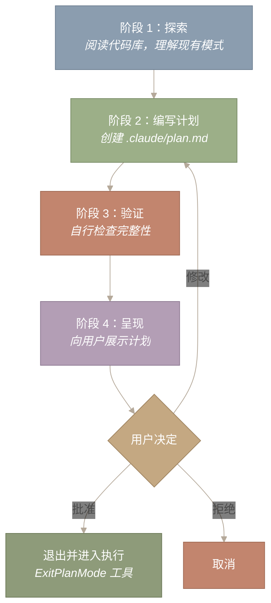
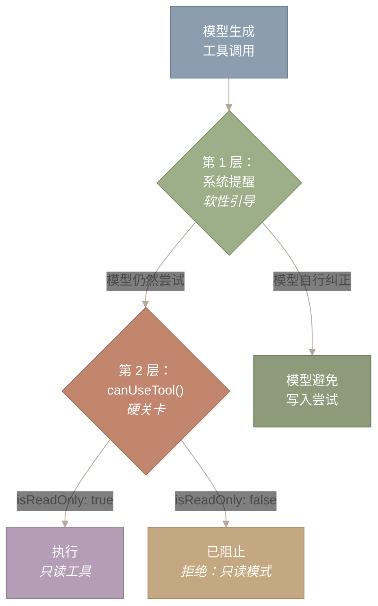
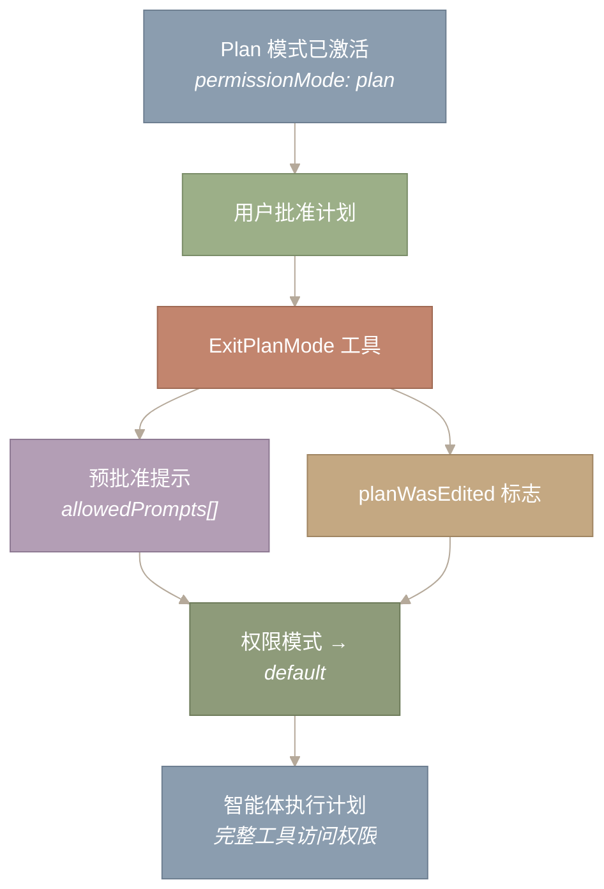

# Plan 模式

只读规划与显式审批关卡

- **原文 URL：** https://y-agent.github.io/inside-claude-code/19-plan-mode.html
- **原文标题：** Plan Mode
- **原文副标题：** Read-only planning with explicit approval gates
- **翻译日期：** 2026-07-26

## 为什么要将规划与执行分开？

一个能够读取、写入并执行 shell 命令的 AI 智能体既强大又危险。用户要求“重构认证模块”时，并不一定希望智能体立刻开始编辑文件。他们或许想先看看计划：哪些文件会发生变化、按什么顺序修改、存在哪些依赖关系。**Plan 模式强制实现这种分离——智能体可以探索和推理，但在用户明确批准之前不能修改任何内容。**

这与执行 `git commit` 前先查看 `git diff --staged`，或使用数据库迁移的 `--dry-run` 标志遵循的是同一原则。规划的成本很低（只需几次只读 API 调用），而错误执行的成本很高（文件损坏、构建中断、在错误方案上浪费 token）。Plan 模式明确体现了这种不对称性。

> **本文涵盖：**
>
> 1. 5 阶段规划工作流及其变体
> 2. 通过权限锁定强制只读
> 3. Plan 智能体——专用的只读子智能体
> 4. 计划文件的持久化与用户审阅
> 5. 审批关卡以及向执行阶段的转换
> 6. 与智能体循环、模式轮换及系统提醒的集成

**本文涉及的源文件：**

| 文件 | 用途 | 大小 |
|---|---|---|
| `src/commands/plan/plan.tsx` | `/plan` 命令处理程序 | ~200 LOC |
| `src/utils/planModeV2.ts` | Plan 模式 V2 智能体配置 | ~150 LOC |
| `src/tools/AgentTool/built-in/planAgent.ts` | Plan 智能体定义（只读约束） | ~100 LOC |
| `src/utils/plans.ts` | 计划文件工具（读写 `.claude/plan.md`） | ~80 LOC |
| `src/tools/EnterPlanModeTool.ts` | 进入 Plan 模式的工具 | ~50 LOC |
| `src/tools/ExitPlanModeTool.ts` | 携带预批准权限退出 Plan 模式的工具 | ~80 LOC |

---

## 5 阶段规划工作流

**Plan 模式遵循结构化的 5 阶段工作流，引导智能体从探索代码库一路走到生成可供审阅的计划文档。**每个阶段都有明确目标和定义清晰的转换条件。



图 1：Plan 模式的 5 阶段工作流。阶段 1 探索代码库（只读）；阶段 2 将结构化计划写入 `.claude/plan.md`；阶段 3 自行验证计划的完整性；阶段 4 向用户呈现计划。随后用户作出决定：批准（退出并进入执行）、修改（重新进入阶段 2）或拒绝（取消）。该模式存在三种变体——5 阶段（默认，占 99% 的流量）、迭代式（更轻量，用于小型任务）和子智能体式（供在 Plan 模式下运行的子智能体使用）。

**如何阅读此图。**沿着各阶段从上到下阅读：智能体先探索（阶段 1），再编写计划（阶段 2）、验证计划（阶段 3），最后呈现计划（阶段 4）。菱形代表用户决策关卡——批准会退出并进入执行，修改会回到阶段 2 进行修订，拒绝则完全取消。关键在于，“修改”返回阶段 2 的回路意味着用户可以反复调整计划，而始终不离开只读模式。

**阶段 1：探索。**智能体读取代码库，以理解现有模式、依赖关系和约束。它只使用只读工具：Read、Glob、Grep，以及只读 Bash 命令（`ls`、`git status`、`git log`、`git diff`、`find`、`cat`）。此阶段先建立智能体的心智模型，再让它确定任何策略。

**阶段 2：编写计划。**智能体在项目目录中将结构化实施计划写入 `.claude/plan.md`。计划包括：要修改哪些文件、按什么顺序修改、具体进行哪些更改，以及各步骤之间存在哪些依赖关系。这是 Plan 模式中唯一的“写入”操作——而且写入的是计划文件，不是源代码。

**阶段 3：验证。**智能体自行检查计划的完整性。计划是否覆盖了用户请求中提到的所有文件？步骤之间是否存在循环依赖？顺序是否可行？此阶段会在用户看到计划之前发现规划错误。

**阶段 4：呈现。**智能体向用户呈现计划以供审阅。用户可以批准、修改或拒绝。

系统会根据上下文选择以下三种 Plan 模式变体：

| 变体 | 使用场景 | 阶段 | 流量占比 |
|---|---|---|---|
| **5 阶段** | 交互式会话的默认模式 | 全部 5 个阶段 | ~99% |
| **迭代式** | 较小的任务、较简单的计划 | 更轻量的 3 阶段 | ~1% |
| **子智能体式** | 在 Plan 模式下生成的子智能体 | 针对非交互场景调整 | 极少 |

---
## 强制只读

**Plan 模式并非建议性约束——它在权限层得到强制执行。**Plan 模式激活时，权限系统会阻止所有非只读工具。智能体实际上无法写入文件、运行破坏性命令，也无法生成具备写入能力的子智能体。

其强制机制使用了与[第二部分第 1 篇：智能体循环](https://y-agent.github.io/inside-claude-code/02-agent-loop-query-engine.html)中所述相同的 `canUseTool()` 注入机制。Plan 模式注入一个策略函数，检查每个工具的 `isReadOnly` 标志：

```
// Plan 模式权限策略（简化版）
canUseTool: (tool) => {
  if (tool.isReadOnly) return 'allowed';
  return 'denied: plan mode is read-only';
}
```

除权限函数外，只要 Plan 模式处于激活状态，每次 API 调用都会注入一条系统提醒：

```
Plan mode is active. The user indicated that they do not want you
to execute yet -- you MUST NOT make any edits... or otherwise make
any changes to the system.
```

这种双重强制——策略函数和系统提醒——构成了纵深防御。策略函数是硬关卡（模型无法绕过）；系统提醒是软性引导（它塑造模型的推理，使模型甚至不会去_尝试_被阻止的操作，从而避免浪费工具调用）。



图 2：对 Plan 模式只读约束的双重强制。第 1 层（系统提醒）塑造模型的推理，使其避免尝试写入；第 2 层（`canUseTool` 策略）阻止任何漏过第一层的写入工具。两层都不可或缺：提醒减少浪费的工具调用，策略防止实际损害。这就是纵深防御——与将防火墙和应用层授权结合使用遵循同一原则。

**如何阅读此图。**从顶部模型生成工具调用的位置开始。第 1 层（系统提醒）是软过滤器——如果模型已经内化了只读约束，它会自行纠正，根本不会尝试写入（左侧分支）。如果模型仍尝试写入，第 2 层（`canUseTool` 策略）就是硬关卡——它检查 `isReadOnly` 标志，并允许执行只读工具，或以错误阻止写入工具。双层设计意味着，即使模型忽略提醒，策略也会拦截它。

---

## Plan 智能体

**Plan 智能体是一种专用子智能体类型，拥有受限工具集和明确的只读系统提示。**它定义于 `src/tools/AgentTool/built-in/planAgent.ts`，可通过 `subagent_type: "Plan"` 生成。

| 属性 | Plan 智能体 | 默认智能体 |
|---|---|---|
| **工具** | Read、Glob、Grep、Bash（只读）、WebFetch | 全部约 40 个工具 |
| **被阻止的工具** | Agent、Edit、Write、NotebookEdit、ExitPlanMode | 默认无 |
| **权限模式** | `plan`（强制只读） | `default` 或继承所得 |
| **系统提示** | 包含 `CRITICAL: READ-ONLY MODE` 标头 | 标准智能体提示 |
| **Bash 限制** | 仅限：`ls`、`git status/log/diff`、`find`、`grep`、`cat`、`head`、`tail` | 完整 shell 访问权限 |
| **输出格式** | 以“Critical Files for Implementation”部分结尾 | 自由格式 |

Plan 智能体的 Bash 限制值得关注。虽然 Bash 可用，但只允许经过筛选的一组只读命令。系统提示会明确阻止 `rm`、`mv`、`cp`、`mkdir`、`git add`、`git commit`、`npm install` 和 `pip install` 等命令。这是一种双保险做法：`canUseTool` 策略阻止非只读工具，而针对 Bash 的限制则阻止这个本身具备写入能力的工具_内部_执行破坏性命令。

Plan 智能体的系统提示以一个醒目的标头开篇：

> _“=== 关键：只读模式——不得修改文件 === 这是一项只读规划任务。严禁你执行以下操作：创建新文件（不得使用 Write、touch，也不得进行任何类型的文件创建）；修改现有文件（不得执行 Edit 操作）；删除文件（不得使用 rm 或执行删除）；移动或复制文件（不得使用 mv 或 cp）；在任何位置创建临时文件，包括 /tmp；使用重定向操作符（>、>>、|）或 heredoc 写入文件；运行任何会改变系统状态的命令。”_

随后，该提示规定了四步流程：(1) 理解需求，(2) 探索代码库，(3) 设计方案，(4) 详述计划。规定的输出格式以“Critical Files for Implementation”部分结尾，其中列出 3–5 个文件——这种结构化输出让用户退出 Plan 模式后能够直接付诸行动。

---

## 计划文件持久化

**计划以 `.claude/plan.md` 的形式持久化在项目目录中**，由 `src/utils/plans.ts` 中的工具管理。该文件具有以下特点：

- **人类可读**——采用 Markdown 格式，可在任何编辑器中查看
- **可编辑**——用户可通过 `/plan open` 修改计划；该命令会在用户配置的编辑器（VS Code、Vim 等）中打开文件
- **跨会话持久存在**——计划在会话重启后仍然保留，从而支持跨多个会话进行规划
- **在系统提醒中被引用**——`plan-file-reference` 系统提醒会告诉智能体当前计划所在的位置

`/plan` 斜杠命令（实现在 `src/commands/plan/plan.tsx` 中）会根据参数承担三种职责：

```
/plan              → 开启/关闭 Plan 模式；若已激活，则显示当前计划
/plan open         → 在外部编辑器中打开 .claude/plan.md
/plan <description> → 启用 Plan 模式，并让智能体根据给定任务开始工作
```

---
## 审批关卡：退出 Plan 模式

**从规划阶段向执行阶段的转换由 `ExitPlanMode` 工具进行协调**；这是一个延迟加载工具（通过 ToolSearch 按需加载），定义于 `src/tools/ExitPlanModeTool.ts`。



图 3：Plan 模式退出流程。`ExitPlanMode` 携带两个字段：`allowedPrompts`（计划中的预批准 Bash 命令）和 `planWasEdited`（用户是否修改了计划）。预批准提示会在执行期间绕过常规权限关卡，减少计划已经明确指定的命令所带来的操作阻力。权限模式从 `plan`（只读）转换为 `default`（标准权限），随后智能体开始执行已批准的计划。

**如何阅读此图。**从顶部的 Plan 模式（只读）开始。用户批准后，`ExitPlanMode` 工具触发，并携带两类数据：预批准 Bash 提示的列表（计划已经指定的命令，例如“运行测试”）以及表示用户是否编辑过计划的标志。二者都会进入从 `plan` 到 `default` 的权限模式转换，之后智能体以完整工具访问权限开始执行。预批准提示会绕过常规权限关卡，减少执行可预见命令时的操作阻力。

`ExitPlanMode` 工具的输入 schema 包含两个值得注意的字段：

```
interface ExitPlanModeInput {
  allowedPrompts?: { tool: "Bash"; prompt: string }[];
  planWasEdited?: boolean;
}
```

**`allowedPrompts`** 是规划与执行之间的桥梁。在规划期间，智能体会确定需要哪些命令（例如 `npm test`、`npm run build`）。这些命令会作为预批准提示传递给 `ExitPlanMode`。执行期间，这些特定命令会绕过常规权限关卡——用户已将其作为计划的一部分予以批准。这减少了可预见命令反复弹出权限请求所造成的阻力。

**`planWasEdited`** 用于跟踪用户是否修改了计划文件。如果用户直接编辑了 `.claude/plan.md`，智能体便知道应在执行前重新读取该文件，而不是依赖其缓存中对计划的理解。

ExitPlanMode 工具的说明包含两条值得注意的指令：

> _“重要：仅用于实施规划，不得用于研究任务。”_

> _“关键：不要使用 `AskUserQuestion` 询问‘这个计划可以吗？’——这正是此工具本身所做的事情。”_

这些指令防止模型误用审批关卡：将其用于研究（研究不需要计划文件），或者在调用权限工具本身之前多余地再次请求权限。

---
## 与模式轮换及系统提醒的集成

Plan 模式与[第五部分第 1 篇：CLI、命令与 UI](https://y-agent.github.io/inside-claude-code/08-cli-commands-ui.html)中介绍的更广泛模式轮换系统集成。UI 使用青色/蓝绿色主题来表示 Plan 模式（标准模式为蓝色，自动模式为洋红色）。切换模式是一项原子操作，会同时重新配置三件事：可用工具集、系统提示片段和权限级别。

**Plan 模式系统提醒**是系统中消耗 token 最多的提醒之一（参见[第三部分第 1 篇：提示组装](https://y-agent.github.io/inside-claude-code/03-prompt-assembly.html)）。11 个 Plan 模式提示片段总计约 13 KB，涵盖：

| 片段 | 用途 | 变体 |
|---|---|---|
| `plan-mode-is-active-5-phase` | 完整的 5 阶段规划指令 | 默认 |
| `plan-mode-is-active-iterative` | 更轻量的迭代式规划 | 小型任务 |
| `plan-mode-is-active-subagent` | 子智能体规划指令 | 子智能体 |
| `plan-mode-re-entry` | 修改后重新进入时的指令 | 返回回路 |
| `exited-plan-mode` | 退出后的转换提醒 | 退出 |
| `verify-plan-reminder` | 提醒自行检查计划完整性 | 阶段 3 |
| `plan-file-reference` | `.claude/plan.md` 的路径 | 所有阶段 |
| `phase-four-of-plan-mode` | 阶段 4 的呈现指令 | 阶段 4 |
| `plan-mode-enhanced` | 增强的 Plan 智能体角色定义 | 智能体 |

在完整模式下，Plan 模式提醒约消耗 500 个 token。压缩后，它会缩减为约 20 个 token（“Plan mode active. Continue current phase.”）——减少 96%。这与其他系统提醒所采用的稀疏/完整模式相同（参见[第三部分第 2 篇：上下文压缩](https://y-agent.github.io/inside-claude-code/04-context-compaction.html)）。

**模型选择优化。**当 Plan 模式处于激活状态且上下文超过 200K token 时，系统会自动从 Opus 降级为 Sonnet。规划主要涉及阅读和推理——较小模型在这些任务上的表现几乎同样出色——因此能显著节省成本，而不会造成有实际意义的质量损失。

---

## 总结

**Plan 模式通过带有显式用户审批关卡的 5 阶段工作流，将设计与执行分离。**关键机制包括：

- **强制只读**——通过双层机制实现：系统提醒（软性引导）+ `canUseTool()` 策略（硬关卡）；其实现使用了与其他模式相同的权限注入系统
- **Plan 智能体**（`planAgent.ts`）——受限于只读工具并具有明确 Bash 命令白名单的专用子智能体
- **计划持久化**——`.claude/plan.md` 人类可读、可通过 `/plan open` 编辑，并且会在会话重启后继续存在
- **审批关卡**——`ExitPlanMode` 工具将权限模式从 `plan` 转换为 `default`，并携带可在执行期间绕过权限关卡的预批准命令
- **三种变体**——5 阶段（默认）、迭代式（轻量）、子智能体式（非交互）——根据上下文自动选择
- **11 个提示片段**（约 13 KB）管理智能体在各阶段的行为，并提供稀疏/完整变体，以提高压缩后的 token 效率

_下一篇：[第三部分第 1 篇——提示组装](https://y-agent.github.io/inside-claude-code/03-prompt-assembly.html)将探讨系统提示如何由 250 多个片段构建而成——其中包括本文所述的 Plan 模式片段。_

---

_系列：Inside Claude Code | 第二部分第 4 篇_
