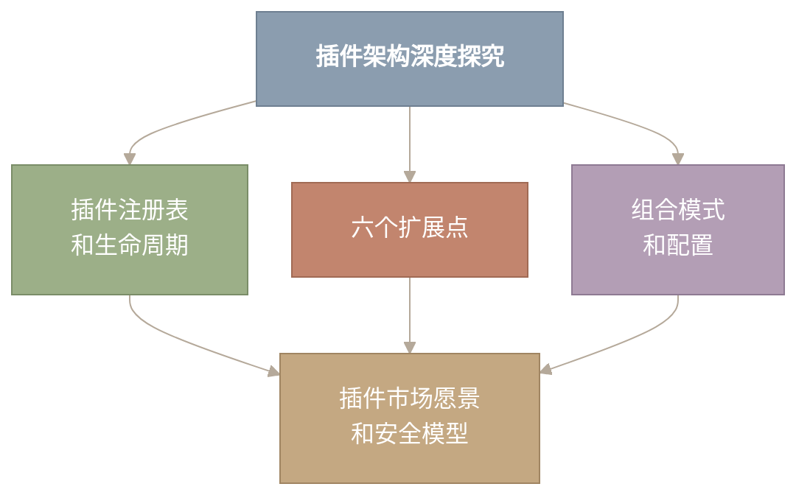
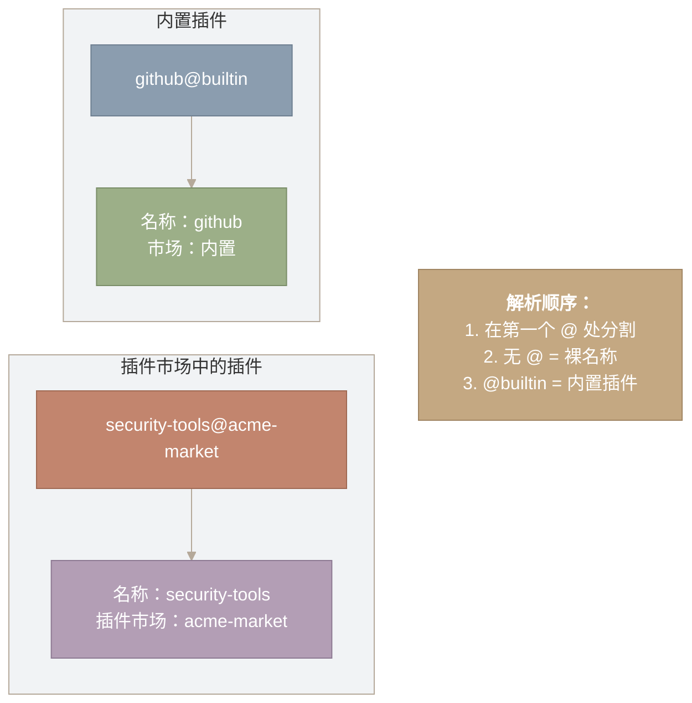
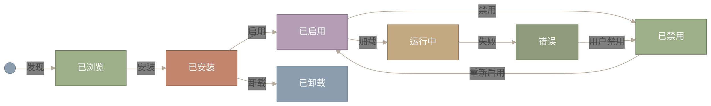
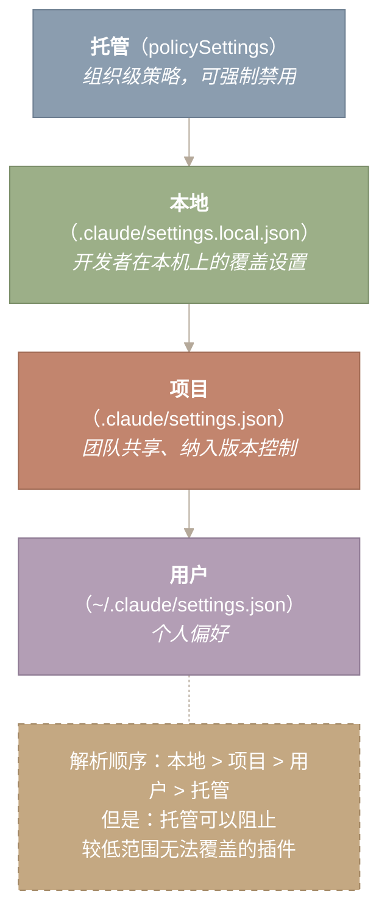
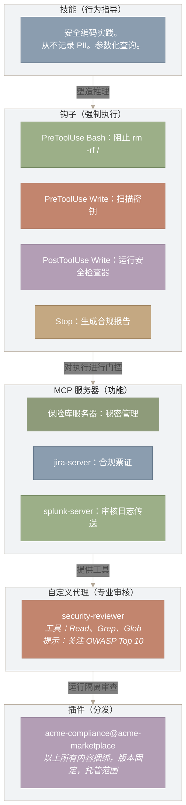
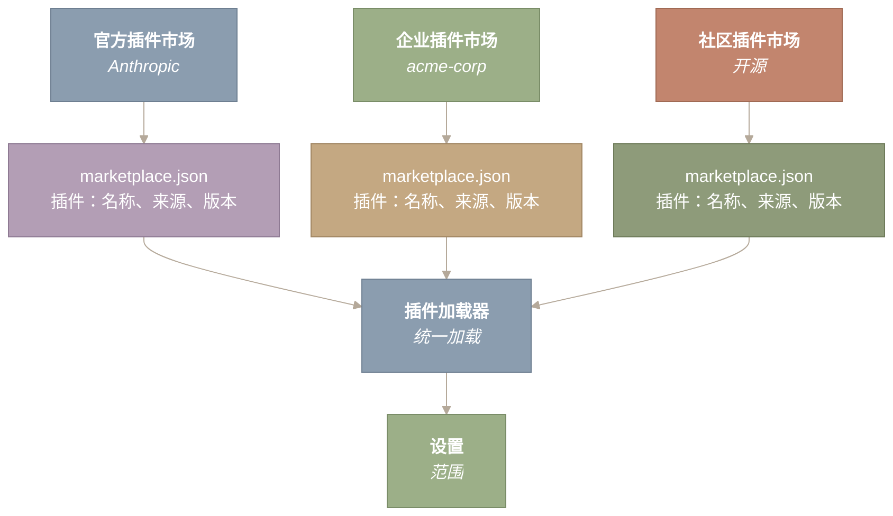
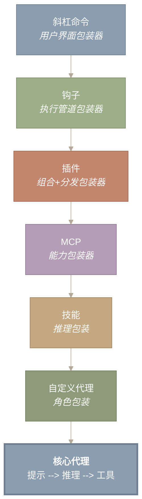
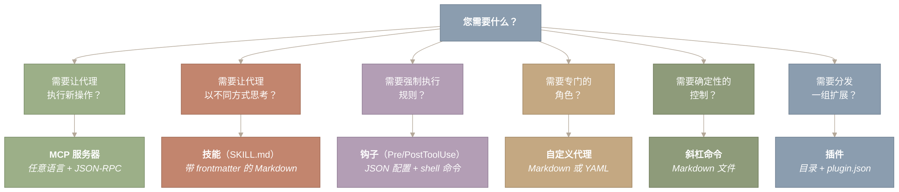

# Claude Code 插件架构

> **原文网址：** https://y-agent.github.io/inside-claude-code/13-plugin-architecture.html  
> **原文标题：** Plugin Architecture — Six Extension Points and the Art of Composable Extensibility  
> **翻译日期：** 2026-07-26

Claude Code 有六种扩展机制：钩子、MCP 服务器、技能、自定义代理、插件和斜杠命令。每个解决不同类别的可扩展性问题，在不同的层上运行，并遵循不同的设计模式。插件系统是将其他五个捆绑到可分发包中的统一层。

为什么是六个？因为一个二进制文件必须为调试 React 应用程序的独立开发人员、为 200 名工程师强制执行 SOC 2 合规性的企业团队、无人值守运行的 CI/CD 管道以及嵌入 Claude 作为编码助手的 IDE 集成提供服务。每个受众都需要不同的定制。没有任何一个 API 可以优雅地处理这四种情况。最终形成了六种可组合、各有侧重的机制。



*图 1：本文介绍了插件架构。连接到中心节点的四个主要主题：插件注册表和生命周期（从发现到卸载）、六个扩展点（钩子、MCP、技能、自定义代理、插件、斜杠命令）、组合模式和配置（机制如何组合）以及插件市场愿景及其安全模型。所有四个都融入了插件市场愿景，反映出插件作为统一的分发层。*

**如何阅读此图。** 从顶部的中央“插件架构深度剖析”节点开始。三个分支下降到插件注册表和生命周期、六个扩展点以及组合模式和配置。然后，所有三个分支都汇聚到底部的插件市场愿景和安全模型节点，表明插件市场是注册表、扩展点与组合模式的最终汇聚点。

**本文涵盖的源文件：**

  
| 文件 | 用途 | 规模 |
| --- | --- | --- |
| `src/services/plugins/PluginInstallationManager.ts` | 插件发现、安装和生命周期 | 约 500 LOC |
| `src/services/plugins/pluginOperations.ts` | 插件 CRUD 操作 | 约 300 LOC |
| `src/services/plugins/pluginCliCommands.ts` | 插件 CLI 命令集成 | 约 200 LOC |
| `src/commands/plugin/` | `/plugin` 命令处理程序（安装、列出、删除） | 15 个文件 |
| `src/tools/AgentTool/loadAgentsDir.ts` | 代理发现（与插件共享） | 约 756 LOC |
| `src/skills/loadSkillsDir.ts` | 技能发现（与插件共享） | 约 300 LOC |
| `.claude-plugin/plugin.json` | 插件清单格式 | 配置文件 |

* * *

## 为什么有六个扩展点？

**Claude Code 服务于四个截然不同的受众，每个受众都有不同的可扩展性需求。六种专用机制胜过一种通用 API。**

考虑每个受众的需求：

**独立开发者**想要行为定制。 “当我编写 Python 时，遵循 PEP 8。当我编写 React 时，使用函数式组件。每个文件写入后，运行 prettier。”这些是技能（行为规则）和钩子（自动副作用）。

**企业团队**需要强制执行。 “阻止任何涉及生产数据库的 shell 命令。在提交到 main 之前需要进行代码审查。将每个工具调用记录到我们的审计系统中。”只有钩子才能强制执行不变量 - 退出代码 2 会阻止该操作。技能可以引导，但不能阻止。

**CI/CD 管道**需要能力。“连接到我们的内部 JIRA 实例。查询我们的 Postgres 预发布数据库。将结果发布到 Slack。”这些都是工具能力，而 MCP 是添加它们的协议。无论使用何种语言或运行时，都可以在启动时被发现。

**IDE 集成**需要专门的角色。 “使用只读访问权限运行以安全为中心的审查。生成仅具有 /docs/ 写入权限的 API 文档。可以访问问题跟踪器来对错误进行分类。”自定义代理提供隔离的、特定于角色的配置以及自己的提示和工具限制。

没有一个扩展点可以处理所有四类需求。仅钩子系统可以强制但不能添加功能。仅 MCP 的系统可以添加工具，但不能执行策略。纯技能系统可以指导行为，但不会产生副作用。六种机制，每一种都擅长做一件事，组成一个可以处理所有四种受众的系统。

* * *

## 插件架构 – 统一层

**插件是捆绑包。插件可以提供技能、钩子、MCP 服务器、自定义代理、斜杠命令和输出样式 - 所有这些都在一个可分发包中。**

第 III.4 部分涵盖了作为单独扩展点的钩子和生命周期事件。这篇文章研究了将它们包装到分发和生命周期层中的插件系统。关键见解：插件不会添加第七种扩展机制。它们是其他六种的封装格式。

### 插件身份

每个插件都有一个格式为 `{name}@{marketplace}` 的标识符。内置插件使用`{name}@builtin`。第三方插件引用他们的市场：`security-tools@acme-marketplace`。 `@` 分隔符由 `parsePluginIdentifier()` 解析，该分隔符在第一个 `@` 上拆分并忽略后续的 - 市场名称不应包含 `@`。



*图 2：插件身份格式和解析顺序。两个示例说明了 name@marketplace 约定：github@builtin 解析为 name=‘github’，marketplace=‘builtin’，而 security-tools@acme-market 则拆分为各自的组件。解析规则是：在第一个 @ 符号上拆分，将裸名称（无 @）视为无作用域，并将 @builtin 识别为指示 CLI 二进制文件附带的内置插件。*

**如何阅读此图。** 并排显示两个示例插件标识符：左侧为 `github@builtin`，右侧为 `security-tools@acme-market`。每个都通过箭头分解为其名称和市场组件。下面的解析规则框总结了解析逻辑：在第一个 `@` 上进行拆分，将裸名称（无 `@`）视为无作用域，并将 `@builtin` 识别为 CLI 二进制文件附带的内置插件。

### 插件包含什么

`LoadedPlugin` 类型揭示了插件可以提供的所有内容：

```
type LoadedPlugin = {
  name: string
  manifest: PluginManifest       // Metadata: version, description, author
  path: string                   // Filesystem path to plugin root
  source: string                 // Repository/marketplace source
  commandsPath?: string          // Slash commands (Markdown files)
  commandsPaths?: string[]       // Additional command paths
  agentsPath?: string            // Custom agent definitions
  agentsPaths?: string[]         // Additional agent paths
  skillsPath?: string            // SKILL.md behavioral instructions
  skillsPaths?: string[]         // Additional skill paths
  outputStylesPath?: string      // Custom output formatting
  hooksConfig?: HooksSettings    // Hook definitions (PreToolUse, etc.)
  mcpServers?: Record<string, McpServerConfig>  // MCP server configs
  lspServers?: Record<string, LspServerConfig>  // LSP server configs
  settings?: Record<string, unknown>  // Plugin-specific configuration
}
```

单个插件可以捆绑斜杠命令、代理、技能、钩子、MCP 服务器，甚至 LSP 服务器。插件目录结构反映了这些组件：

```
my-plugin/
+-- .claude-plugin/
|   +-- plugin.json        # Manifest: name, version, author, deps
+-- commands/              # Slash commands (Markdown files)
|   +-- build.md
|   +-- deploy.md
+-- agents/                # Custom agent definitions
|   +-- security-reviewer.md
+-- skills/                # SKILL.md behavioral instructions
|   +-- SKILL.md
+-- hooks/                 # Hook configurations
|   +-- hooks.json
+-- output-styles/         # Custom output formatting
    +-- my-style.md
```

### 插件清单

清单文件 (`.claude-plugin/plugin.json`) 携带由综合 Zod 模式验证的元数据：

```
{
  "name": "security-tools",
  "version": "1.2.3",
  "description": "Security scanning and enforcement tools",
  "author": {
    "name": "Acme Security",
    "email": "security@acme.com",
    "url": "https://acme.com/security"
  },
  "homepage": "https://github.com/acme/security-tools",
  "license": "MIT",
  "keywords": ["security", "scanning", "compliance"],
  "dependencies": ["base-tools@acme-marketplace"]
}
```

依赖项是一等公民。插件可以声明对同一市场中其他插件的依赖关系，系统会在安装时解决它们。 `verifyAndDemote` 函数在加载时检查依赖关系 - 如果依赖关系丢失或禁用，则依赖插件将被降级。

### 插件生命周期

生命周期遵循设置优先的理念。安装插件会在缓存代码之前写入设置 - 设置声明意图，缓存实现它。



*图 3：插件从发现到卸载的生命周期状态机。插件会经历五种状态：已浏览（在市场中发现）、已安装（本地缓存）、已启用（在设置中激活）和运行中（已加载到正在运行的代理中）。加载期间失败会转换为错误状态。禁用的插件无需重新安装即可重新启用。设置优先的理念意味着安装在缓存代码之前写入设置。*

**如何阅读此图。** 从左侧的空心圆圈开始，按照标记的箭头进行状态转换：发现会进入已浏览、安装会进入已安装、启用会进入已启用以及加载会进入活动。加载失败会从运行中状态转换为错误。关键的分支路径是：已安装可以卸载（终止状态），启用可以禁用，禁用可以重新启用回到已启用。当用户干预时，错误状态也会转换为禁用。

更新机制是非就地的：新版本与旧版本一起缓存在版本化目录中。只有在缓存新版本并更新安装记录后，旧版本才会被孤立。这可以确保失败的更新不会让用户失去可用的插件。

### 插件范围

插件在四个范围内运行，形成优先级层次结构：



*图 4：插件范围优先级层次结构显示从最高权限到最低权限的四个级别。托管 (policySettings) 是组织范围内的策略，可以强制禁用且不可由下层覆盖插件。 本地（.claude/settings.local.json） 提供每台计算机的开发人员覆盖。项目 (.claude/settings.json) 拥有团队共享、版本控制的首选项。用户 (~/.claude/settings.json) 是个人默认基线。启用/禁用决策的解析顺序：本地 > 项目 > 用户 > 托管，但托管范围可以阻止较低范围无法覆盖的插件。*

**如何阅读此图。** 从上到下作为从最高权限到最低权限的优先级链来阅读。托管（policySettings）位于顶部，有权强制禁用，且下层无法覆盖插件。在它下面，本地覆盖项目，项目覆盖用户默认值。底部的虚线注释阐明了解析规则：本地>项目>用户>托管用于启用/禁用决策，但托管范围可以阻止任何较低范围都无法覆盖的插件。

这种作用域模型实现了一种强大的模式：企业管理员可以通过托管设置强制禁用插件，并且任何用户或项目设置都不能覆盖该决定。但是开发人员可以使用本地作用域为自己的机器禁用项目强制的插件（对于调试很有用）。函数 `isPluginBlockedByPolicy()` 是策略执行的唯一事实来源——一个具有巨大影响力的三行函数。

* * *

## 自定义代理作为扩展点

**自定义代理是 YAML 或 Markdown 文件，定义具有受限功能的隔离角色 - 针对特定任务的沙盒专业知识。**

第 II.3 部分介绍了能力谱中的代理类型。在这里，我们重点关注自定义代理作为_扩展机制_——它们是如何定义的，它们可以控制什么，以及插件如何分发它们。

### 代理定义

自定义代理是一个 Markdown 文件，包含 frontmatter 元数据和充当系统提示符的正文：

```

---
name: security-reviewer
description: Reviews code for security vulnerabilities
model: opus
tools:
  - Read
  - Grep
  - Glob
  - Bash
permissionMode: default
maxTurns: 50
memory: project

---

You are a security-focused code reviewer. Your job is to find
vulnerabilities in code. Focus on:
- SQL injection and parameterized queries
- XSS and output encoding
- CSRF token validation
- Authentication and authorization flaws
- Data exposure in logs and error messages

Be specific. Cite line numbers. Suggest fixes with code examples.
Never modify code directly -- report findings only.
```

`parseAgentFromMarkdown()` 解析的 frontmatter 字段揭示了完整的控制面：

  
| 字段 | 类型 | 用途 |
| --- | --- | --- |
| `name` | string | 代理标识符（用于`/agent security-reviewer`） |
| `description` | string | 模型何时应委托给该代理 |
| `tools` | string[] | 工具白名单（限制，不扩展） |
| `disallowedTools` | string[] | 工具黑名单（与 `tools` 相反） |
| `model` | string | 模型覆盖（`opus`、`sonnet`、`haiku` 或 `inherit`） |
| `effort` | string/int | 推理努力水平 |
| `permissionMode` | string | 权限严格程度 |
| `maxTurns` | int | 停止前的代理式循环的最大轮数 |
| `mcpServers` | array | 特定于此代理的 MCP 服务器 |
| `hooks` | object | 代理启动时注册会话范围的钩子 |
| `skills` | string[] | 预加载技能 |
| `memory` | string | 持久内存范围（用户、项目、本地） |
| `background` | boolean | 始终作为后台任务运行 |
| `isolation` | string | Git 工作树隔离 |
| `initialPrompt` | string | 添加到首个用户轮次之前 |

`tools`字段是关键的安全机制。仅限于 `[Read, Grep, Glob, Bash]` 的安全审查者无法调用 `Write` 或 `Edit` - 即使模型尝试调用，工具注册表也会拒绝调用。这是能力限制，而不是行为指导。该模型无法围绕缺失的工具进行推理。

### 代理来源

代理来自四个来源，在 `getActiveAgentsFromList()` 中具有明确的优先级：

1. **内置代理**（探索、计划等） – 始终存在
2. **插件代理** – 来自启用的插件
3. **用户代理** (`~/.claude/agents/`) – 个人定义
4. **项目代理** (`.claude/agents/`) – 团队共享定义
5. **托管代理**（政策）——企业授权
6. **标记代理**（仅限会话）——来自功能标记

当名称发生冲突时，较新的来源会覆盖较早的来源。名为“security-reviewer”的项目代理隐藏同名的用户代理。托管代理覆盖其他所有来源——确保企业策略优先。

**观察到的模式**

自定义代理实现 **Actor 模型**。每个代理都是一个隔离的 Actor，拥有自己的状态（对话上下文）、邮箱（提示输入）和行为（系统提示+工具限制）。代理通过消息传递进行通信（`Agent` 工具发送提示，接收结果）。没有共享的可变状态——与使 Erlang 进程安全并发运行的模式相同。

* * *

## 作为用户级扩展的斜杠命令

**代码库中超过 80 个斜杠命令目录提供完全绕过模型的确定性即时响应操作。**

斜杠命令是根本不涉及LLM的扩展点。当您键入 `/compact` 时，Claude Code 不会将您的请求发送到 API。它在本地解析命令，执行处理程序并返回结果。消耗零代币。模型推理零延迟。零幻觉风险。

命令系统跨越`src/commands/`下的80多个子目录，涵盖从`/add-dir`到`/voice`的操作。但命令系统也是一个扩展表面：插件可以通过其 `commands/` 目录中的 Markdown 文件贡献自己的斜杠命令。

### 命令类别

命令根据其控制的内容分为不同的类别：

  
| 类别 | 数数 | 示例 |
| --- | --- | --- |
| 会话管理 | 12 | `/clear`、`/compact`、`/resume`、`/session`、`/status`、`/share` |
| 代理控制 | 8 | `/agent`、`/tasks`、`/branch`、`/teleport`、`/worktree` |
| Git 工作流程 | 7 | `/commit`、`/pr`、`/review`、`/diff`、`/rewind`、`/tag` |
| 配置 | 10 | `/config`、`/permissions`、`/model`、`/theme`、`/effort`、`/sandbox` |
| 模式切换 | 5 | `/plan`、`/code`、`/architect`、`/auto`、`/fast` |
| MCP 和插件 | 6 | `/mcp`、`/plugin`、`/skills`、`/hooks`、`/reload-plugins` |
| 开发者工具 | 8 | `/init`、`/install`、`/onboarding`、`/upgrade`、`/add-dir` |
| 诊断 | 6 | `/doctor`、`/debug`、`/cost`、`/usage`、`/stats` |
| 技能 | 5+ | `/simplify`、`/loop`、`/code-review`、`/feedback` |

### 插件提供的命令

加载插件时，其 `commandsPath` 和 `commandsPaths` 字段指向包含定义新斜杠命令的 Markdown 文件的目录。加载器解析这些文件，提取 frontmatter 元数据（名称、描述、whenToUse），并将它们与内置命令一起注册。当用户调用命令时，命令的正文将成为发送到模型的提示。

这意味着插件可以扩展 `/` 命名空间。安全插件可能会添加 `/security-scan`、`/vulnerability-report` 和 `/compliance-check` 作为新的斜杠命令 - 每个命令都有自己的行为指令、工具限制和触发条件。

* * *

## 六个扩展点 – 完整比较

**每种机制在不同层解决不同的问题。比较表是选择正确的决策框架。**

      
| 维度 | 钩子 | MCP | 技能 | 自定义代理 | 插件 | 斜杠命令 |
| --- | --- | --- | --- | --- | --- | --- |
| **它的作用** | 自动化副作用，强制不变量 | 添加外部工具功能 | 修改代理行为和推理 | 创建孤立的角色 | 捆绑并分发扩展包 | 用户直接控制，绕过模型 |
| **计算机科学类比** | AOP 切面/拦截过滤器 | AI 工具 LSP | 认知插件/模板方法 | fork() 与新的 env / Actor 模型 | 应用商店 / OSGi bundle | CLI 命令/DSL |
| **格式** | JSON 配置 + shell 命令 | 任何语言，JSON-RPC | Markdown (SKILL.md) | Markdown 或 YAML | 目录+plugin.json | TypeScript 或 Markdown |
| **可以阻止操作吗？** | 是（退出代码 2） | 不 | 不 | 否（限制，不作为门控） | 通过钩子组件 | N/A（绕过模型） |
| **添加工具？** | 不 | 是（动态注册） | 不 | 否（限制现有） | 通过MCP组件 | 不 |
| **修改提示？** | 注入提醒 | 服务器指令（破坏缓存） | 是（主要机制） | 是（拥有自己的系统提示） | 通过技能组件 | 不 |
| **运行时** | 执行期间（同步） | 工具调用（异步、跨进程） | 在提示组装时（编译时） | 生成时（异步、隔离） | 始终加载（生命周期管理） | 用户调用时（立即） |
| **范围** | 每个项目或每个用户 | 跨代理、通用协议 | Claude Code 专用 | Claude Code 专用 | 4 范围层次结构 | 用户界面层 |
| **安全模型** | shell进程，继承perms | 独立进程，stdio/SSE/HTTP | 提示注入风险 | 工具限制（最小权限） | 插件市场信任 + 策略 | 确定性，无模型 |

该表揭示了根本性的架构事实：每个扩展点在设计空间中都占据着独特的位置。在所有维度上没有两个重叠。这并非偶然——它是识别不同类别的可扩展性并为每个类别建立有针对性的机制的结果。

“可以阻止操作吗？”这一行 是操作上最重要的。在所有六个扩展点中，只有钩子可以阻止工具调用。如果您需要强制执行一个不变量——“永远不删除生产数据”、“在提交之前始终运行 linter”——钩子是唯一的机制。技能可以建议，MCP 可以提供替代方案，自定义代理可以限制工具，但只有返回退出代码 2 的 `PreToolUse` 钩子才能从物理上阻止操作发生。

* * *

## 扩展组合模式

**六大机制组合起来威力巨大。现实世界的工作流程结合了多个扩展点，每个扩展点都贡献了其他扩展点无法提供的功能。**

### 模式 1：企业合规

考虑一家具有 SOC 2 合规性要求的企业。该组合将五种机制组合在一起：



*图 5：SOC 2 场景中跨五个扩展层的企业合规性组成。技能注入安全编码行为指导（从不记录 PII、参数化查询）。 钩子通过 PreToolUse/PostToolUse 拦截器（阻止 rm -rf、扫描机密、运行安全 linter）强制执行不变量。 MCP 服务器连接到基础设施（Vault 机密管理、JIRA 合规性票证、Splunk 审核日志记录）。自定义安全审查代理通过只读工具访问运行以 OWASP 为中心的分析。插件层将所有内容捆绑到版本固定、托管范围的可分发包中。*

**如何阅读此图。** 从上到下五个水平层堆叠，每个层代表 SOC 2 合规场景中的不同扩展机制。从顶部的技能（行为指导）开始，然后向下移动到钩子（通过 PreToolUse/PostToolUse 强制执行）、MCP 服务器（Vault 和 Splunk 等外部功能）、自定义代理（独立的安全审查器），最后是将所有内容捆绑到可分发包中的插件层。层与层之间的箭头标有关系：技能塑造推理、钩子对执行进行门控、MCP 提供工具、代理运行隔离审查。

每一层都贡献了其他层无法贡献的东西。技能决定了模型如何思考安全性。钩子_强制_模型无法绕过的安全规则。 MCP_连接_到外部安全基础设施。自定义代理提供具有受限功能的_隔离审查_。该插件将所有内容捆绑到一个可分发的版本管理包中，企业可以通过托管设置进行部署。

### 模式 2：CI/CD 工作流程

CI/CD 工作流程的组成不同：

- **技能**：“永远不要在周五部署。在架构更改之前运行迁移。遵循团队的部署清单。”
- **Hook (PreToolUse)**：在部署命令之前检查星期几；在架构更改之前验证迁移文件是否存在。
- **Hook (PostToolUse)**：每次文件写入后运行 `prettier --write`；将部署状态发布到 Slack。
- **MCP 服务器**：包装 CI/CD API（`get_build_status`、`trigger_deploy`、`rollback`）。
- **自定义代理**：具有只读访问权限的部署审核者，用于验证部署计划。
- **斜杠命令**：`/deploy-status` 用于即时构建信息，无需模型参与。

### 三个时间窗口

该组合之所以有效，是因为每种机制在不同的时间窗口中运行：


*图 6：代理生命周期中的三个扩展时间窗口。预推理：技能注入指令，MCP 将服务器指令注入到组装的提示中。执行期间：通过 PreToolUse 进行钩子拦截（具有通过退出代码 2 阻止操作的独特能力），然后工具执行。执行后：通过 PostToolUse 钩子观察，并将提醒注入模型下一轮的对话中。时间上的分离是这六种机制组合起来不会发生冲突的原因。*

**如何阅读此图。** 从左到右阅读三个时间阶段。预推理（左）是技能和 MCP 在模型推理之前将指令注入到提示中的地方。在执行期间（中）是钩子拦截工具调用的地方 - 值得注意的是，只有这个阶段可以通过退出代码 2 阻止操作。执行后（右）是钩子观察结果并将提醒注入模型下一轮对话的地方。时间上的分离解释了为什么六种扩展机制组合起来不会发生冲突。

技能和 MCP 指令在预推理窗口中运行——它们在模型决定做什么之前塑造模型的理解。钩子在执行期间窗口中运行——它们在模型决定之后但执行之前（或之后）拦截操作。钩子提醒在执行后窗口中运行 - 它们将结果反馈到对话中，以便模型可以调整其下一步操作。

这种时间上的分离就是这六种机制组合起来不会发生冲突的原因。它们不会竞争相同的插入点；它们各自拥有代理决策-执行-反馈循环的不同阶段。

* * *

## 配置界面

**`settings.json` 是统一配置层。每个扩展点都从同一分层设置系统读取其配置。**

### 配置层次结构

所有六个扩展点均通过具有四级优先级的单一设置基础架构进行配置：

  
| 等级 | 文件 | 目的 |
| --- | --- | --- |
| 1（最高） | `managed-settings.json`（策略设置） | 组织范围内、管理员控制、无法覆盖 |
| 2 | `.claude/settings.local.json`（本地设置） | 每台机器覆盖，不受版本控制 |
| 3 | `.claude/settings.json`（项目设置） | 团队共享、版本控制 |
| 4（最低） | `~/.claude/settings.json`（用户设置） | 用户范围的默认值和首选项 |

每个扩展点都从此层次结构中读取：

- **钩子**：在 `settings.hooks` 中配置 – 跨范围合并，策略钩子不能被覆盖
- **MCP 服务器**：在 `settings.mcpServers` 中配置 – 每个范围的服务器定义
- **插件**：在每个范围的 `settings.enabledPlugins` – `{pluginId: true/false}` 中配置
- **自定义代理**：从每个范围级别的 `agents/` 子目录加载
- **技能**：从 `skills/` 子目录加载以及插件提供的技能
- **斜杠命令**：内置以及插件提供的命令

设置合并不是简单的串联。策略设置可以_阻止_较低范围的设置。设置 `enabledPlugins["dangerous-tool@marketplace"] = false` 的策略会阻止任何用户或项目设置启用该插件。 `isPluginBlockedByPolicy()` 函数（只有三行）是执行门：

```
export function isPluginBlockedByPolicy(pluginId: string): boolean {
  const policyEnabled = getSettingsForSource('policySettings')?.enabledPlugins
  return policyEnabled?.[pluginId] === false
}
```

三行代码，但它们实现了插件的整个企业策略执行。

* * *

## 插件市场愿景

**插件市场系统将 Claude Code 从具有扩展功能的工具转变为具有生态系统的平台。**

### 市场架构

插件市场是一个包含 `marketplace.json` 文件的 Git 存储库，该文件列出了可用插件及其元数据和源位置。 Claude Code 支持多个并行插件市场。



*图 7：支持多个并行插件市场的市场架构。显示了三种市场类型：官方（人类控制，8 个保留名称）、企业（特定于组织，例如 acme-corp）和社区（开源）。每个市场都是一个 Git 存储库，其中包含一个 Marketplace.json，其中列出了插件名称、源位置和版本。所有三个都输入到统一的插件加载器中，该加载器解析插件定义并将其合并到四级作用域设置层次结构中。*

**如何阅读此图。** 三种市场类型位于顶部：官方（人类）、企业（特定于组织）和社区（开源）。每个都连接到自己的包含插件列表的 `marketplace.json` 文件。所有三个插件市场 JSON 文件都会输入到中心的统一插件加载器中，该加载器会解析插件定义并将其合并到底部的范围设置系统中。关键的见解是多个市场共存并通过单个加载程序统一。

为 Anthropic 保留了八个官方插件市场名称：`claude-code-marketplace`、`claude-code-plugins`、`claude-plugins-official`、`anthropic-marketplace`、`anthropic-plugins`、`agent-skills`、`life-sciences` 和 `knowledge-work-plugins`。这些名称受到仿冒模式匹配的保护，并根据 `anthropics` GitHub 组织进行验证。

### 内置插件

内置插件随 CLI 二进制文件一起提供，并使用 `@builtin` 市场命名空间。它们与市场插件的不同之处在于它们不需要网络获取、不需要 Git 克隆、不需要缓存管理。 `BuiltinPluginDefinition` 类型显示了他们可以提供的内容：

```
type BuiltinPluginDefinition = {
  name: string
  description: string
  version?: string
  skills?: BundledSkillDefinition[]   // Behavioral instructions
  hooks?: HooksSettings               // Lifecycle hooks
  mcpServers?: Record<string, McpServerConfig>  // Tool servers
  isAvailable?: () => boolean         // System capability check
  defaultEnabled?: boolean            // Default state before user sets preference
}
```

内置插件出现在 `/plugin` UI 的“内置”部分下。用户可以启用或禁用它们，并且首选项将保留到用户设置中。 `isAvailable` 功能允许有条件的可用性 - 包装特定于系统的功能的插件可以在不受支持的平台上隐藏自身。

### 自动更新和版本控制

官方插件市场默认自动更新（`NO_AUTO_UPDATE_OFFICIAL_MARKETPLACES` 集中的市场除外）。插件版本由 `calculatePluginVersion()` 计算，它从多个来源合成版本字符串：清单版本字段、Git 提交 SHA 和市场声明的版本。

更新机制是原子的。 updatePluginOp() 将新版本下载到临时目录，计算其版本哈希，将其复制到版本化缓存目录，更新安装记录，然后将旧版本标记为孤立版本。如果任何步骤失败，旧版本将保持不变。这与容器编排系统用于滚动部署的策略相同。

* * *

## 安全考虑

**每个扩展点都有不同的安全模型。了解每个威胁面对于安全可扩展性至关重要。**

     
| 扩展点 | 执行方式 | 隔离方式 | 主要威胁 | 缓解措施 | 信任级别 |
| --- | --- | --- | --- | --- | --- |
| **钩子** | Shell 进程 | 继承代理权限 | 如果输入未经验证，则进行 shell 注入 | 政策设置；固定退出代码语义 | 高（同一进程） |
| **MCP 服务器** | 单独的进程 | 进程级，自己的内存 | 恶意服务器窃取数据 | 工具注释；权限系统门调用 | 中（进程边界） |
| **技能** | 文本注入到提示中 | 无 – 直接模型上下文 | 提示注入覆盖关键指令 | 仅使用可信来源；审查内容 | 低（无执行边界） |
| **自定义代理** | 隔离的代理上下文 | 单独对话，受限工具 | 工具访问范围过于广泛 | 通过工具白名单获得最低权限；最大轮数 | 中（工具限制） |
| **插件** | 组合：钩子 + MCP + 技能 | 继承组件级别 | 恶意捆绑包 | 市场信任、政策、同形异义词检测 | 不等（取决于组件） |
| **斜杠命令** | 直接函数调用，无模型 | 与 CLI 同一进程 | 极低——行为确定 | 静态代码，而不是动态内容 | 高（确定性） |

安全模型形成从最低隔离（技能，将文本直接注入提示中）到最高隔离（MCP 服务器，在单独进程中运行）的梯度。这种梯度并非偶然——它反映了能力与安全性之间固有的权衡。技能对模型行为有最直接的影响（它们实际上成为系统提示的一部分），但执行隔离性最小。 MCP 服务器具有最强的隔离性（单独的进程、定义的协议），但仅通过工具可用性和服务器指令间接影响模型。

### 插件特定的安全性

插件继承了其组件的安全特性，但添加了市场信任作为附加层。防御是分层的：

1. **名称假冒保护**：`BLOCKED_OFFICIAL_NAME_PATTERN` 捕获使用“claude-official-plugins”等名称注册市场的尝试。非 ASCII 同形异义词检测可捕获基于 Unicode 的模仿。
    
2. **来源组织验证**：保留的市场名称（八个官方名称）只能由来自 `anthropics` GitHub 组织的存储库使用。 `validateOfficialNameSource()` 强制执行此操作。
    
3. **策略拦截**：企业管理员可以通过`policySettings`强制禁用特定插件。在安装、启用和加载时检查 `isPluginBlockedByPolicy()` 功能。
    
4. **依赖项验证**：`verifyAndDemote()` 检查所有声明的依赖项是否存在并启用。依赖关系不满足的插件将被降级为禁用。
    

**警告：权衡**

技能的安全边界最弱，因为它们的机制是提示注入——它们将文本注入系统提示中。恶意技能可能会超越安全指令、改变行为准则或注入有害模式。缓解措施是源级别的信任（市场验证、策略控制）而不是执行级别的信任（文本注入没有执行边界）。这是一个经过深思熟虑的权衡：技能需要直接访问提示才能发挥作用，而沙箱提示内容会消除它们的效用。

* * *

## 设计模式与计算机科学关联

**Claude Code 的扩展架构实例化了六种经典设计模式，每种模式应用于不同的层。**

### 装饰器模式（系统级）

整个扩展架构就是系统层面应用的Decorator模式。核心代理有固定的行为：接收提示、原因、调用工具、返回响应。每个扩展点都围绕这个核心包装了额外的行为：



*图 8：系统规模的装饰器模式，显示为围绕中央核心的同心包装器。最里面的节点是核心代理（提示—推理—工具循环，用粗边框突出显示）。六个独立的包装层围绕着它：自定义代理（角色包装）、技能（推理包装）、MCP（能力包装）、插件（组合和分发包装）、Hooks（执行管道包装）和 Slash Commands（用户界面包装）。每层都是独立可移除的——无论哪个包装器处于活动状态，核心代理都会执行相同的循环。*

**如何阅读此图。** 从顶部的斜杠命令（最外层包装器）开始，然后沿箭头向内依次经过钩子、插件、MCP、技能和自定义代理，抵达底部的核心代理节点（以粗边框突出显示）。每个节点都是一个装饰器层，包裹着它下面的节点。无论哪个包装器层处于活动状态，核心代理都会执行相同的提示—推理—工具循环 - 任何层都可以独立删除，而不会影响其他层。

每个包装层都是独立的。您可以删除技能而不影响钩子。您可以添加 MCP 服务器，而无需更改自定义代理。核心代理代码_不知道_特定扩展——无论哪个包装器处于活动状态，它都会执行相同的循环。

### 开闭原则

扩展架构是开放/封闭原则的教科书实现：对扩展开放，对修改封闭。添加新的钩子不需要修改工具执行代码。添加新的 MCP 服务器不需要修改工具注册表代码。添加新技能不需要修改提示组装代码。每个扩展点都有一个不触及核心的注册接口（设置配置、文件系统约定）。

### 策略模式（工具和代理）

工具注册表使用策略模式：每个工具都是执行特定操作的策略，模型选择调用哪个策略。 MCP 通过在运行时动态注册新策略来扩展此功能。自定义代理将相同的模式应用于代理本身 - 每种代理类型都是处理一类任务的策略，编排器会选择合适的代理。

### 拦截过滤器模式（钩子）

钩子采用企业 Java 中的拦截过滤器模式。 PreToolUse 和 PostToolUse 形成一个过滤器链，包装每个工具执行。每个过滤器都可以观察、修改或拒绝请求。该链是可配置的（通过设置）和可扩展的（添加新的钩子而不修改现有的钩子）。 Spring 的 `HandlerInterceptor.preHandle()` / `postHandle()` 是直接类似物。

### Actor 模型（自定义代理）

每个自定义代理都独立运行，具有自己的对话上下文、工具权限和系统提示。通信通过消息传递（`Agent` 工具）进行。代理之间没有共享可变状态。这就是 Actor 模型——Erlang 的进程、Akka 的 Actor 和 Go 的 goroutine-with-channels 使用相同的并发原语。

* * *

## 构建您自己的扩展 – 决策树

**选择正确的扩展点取决于您需要完成的任务。一旦您了解每种机制可以做什么和不能做什么，决策树就很简单了。**



*图 9：用于选择正确机制的扩展点决策树。核心问题“你需要什么？”分为六个需求，每个需求都映射到一个扩展点及其实现格式：新功能映射到 MCP 服务器（任何语言 + JSON-RPC）、行为变更映射到技能（带有 Markdown frontmatter 的 SKILL.md）、规则强制执行映射到钩子（JSON 配置 + shell 命令）、对自定义代理的特殊角色（Markdown 或 YAML）、对 Slash Command（Markdown 文件）的确定性控制以及对插件的分发（目录 + plugin.json）。一对一映射确保扩展点选择不会出现歧义。*

**如何阅读此图。** 从中心问题“您需要什么？”开始在顶部。六个分支下降到六种不同的需求（做一些新的事情、以不同的方式思考、强制规则、专业角色、确定性控制、分发组合），并且每个分支恰好映射到底部的一个扩展点（分别是 MCP 服务器、技能、钩子、自定义代理、斜杠命令、插件）。一对一映射的要点是：对于给定的需求使用哪种机制没有任何歧义。

### 最小示例

**Hook** – 阻止引用生产的 Bash 命令：

```
{
  "hooks": {
    "PreToolUse": [{
      "matcher": { "tool": "Bash" },
      "hooks": [{
        "type": "command",
        "command": "echo $TOOL_INPUT | grep -q 'production' && exit 2 || exit 0"
      }]
    }]
  }
}
```

**技能** – Python 编码指南：

```

---
name: python-style
description: Enforce Python coding standards

---
When writing Python code:
- Use type hints on all function signatures
- Follow PEP 8 naming conventions
- Prefer f-strings over .format()
- Use pathlib instead of os.path
```

**自定义代理** – 文档编写者：

```

---
name: doc-writer
description: Writes API documentation
tools:
  - Read
  - Grep
  - Write
model: sonnet
maxTurns: 30

---
You are a technical writer. Generate clear, accurate API
documentation. Read the source code, identify public APIs,
and write docs in JSDoc/docstring format.
```

**插件** – 捆绑所有三个：

```
my-team-plugin/
+-- .claude-plugin/
|   +-- plugin.json          # {"name": "my-team-tools", ...}
+-- agents/
|   +-- doc-writer.md        # Custom agent
+-- skills/
|   +-- SKILL.md             # Python guidelines
+-- hooks/
    +-- hooks.json           # Production guard hook
```

* * *

## 总结

**可扩展性是一个分层架构，而不是单个 API。** Claude Code 的六个扩展点在不同的层运行——提示组装（技能）、工具注册表（MCP）、执行管道（钩子）、角色隔离（自定义代理）、分发（插件）和用户界面（斜杠命令）。这种分层意味着扩展可以自然地组合：技能形成推理，钩子强制执行决策，MCP 服务器提供功能，自定义代理运行审查，插件负责打包，斜杠命令为用户提供直接控制。没有单一 API 设计可以实现这种组合。

**专用扩展点更容易正确使用，也更难误用。** 与接收完整的代理状态的通用回调相比，只能拦截工具执行并返回退出代码的钩子更难误用。约束本身就是价值。如果您的钩子可以阻止操作（退出码 2）但无法修改提示，那么您就确切地知道它能做什么和不能做什么。如果你的技能可以注入提示文本但不能阻止操作，那么你就知道它的力量和局限性。专用机制具有自描述性。

**专用机制的组合比一个通用 API 更强大。** 处理一切（功能、执行、行为、角色、分发）的通用插件 API 会很复杂、容易出错且难以推理。六种专用机制组合后能力更强，因为每个机制都足够简单，可以完全理解。复杂性在于组合，而不在于任何单独的机制。

**钩子是唯一的执行机制。** 这是扩展架构中最重要的事实：技能负责建议，MCP 提供能力，自定义代理施加限制，斜杠命令提供控制；但只有钩子才能说“不”——退出代码 2 会阻止操作。如果您需要保证某些事情绝不会发生，钩子是唯一的选择。

**插件是打包格式，而不是第七种机制。**插件系统不会添加新的功能。它将其他五个捆绑到具有生命周期管理、版本控制、依赖关系解析和市场分发功能的可分发包中。理解这种区别可以防止将插件视为“超级扩展”而不是“扩展包”的混淆。

**配置是组合粘合剂。** 四级作用域设置层次结构（托管 > 本地 > 项目 > 用户）确定哪些扩展处于活动状态、它们的配置方式以及谁可以覆盖谁。企业策略的实施是通过配置范围优先级进行的，而不是通过特殊情况的代码。三行 `isPluginBlockedByPolicy()` 强制企业合规性，因为设置系统已经处理优先级。

* * *

_关于钩子和生命周期事件的基础处理，请参见[第三部分 III.4：钩子与生命周期](https://y-agent.github.io/inside-claude-code/11-hooks-lifecycle.html)。有关多代理协调和自定义代理类型，请参阅[第二部分 II.3：多代理编排](https://y-agent.github.io/inside-claude-code/07-multi-agent-orchestration.html)。有关斜杠命令和终端 UI，请参阅[第五部分 V.1：CLI、命令与终端 UI](https://y-agent.github.io/inside-claude-code/08-cli-commands-ui.html)。有关将钩子结果反馈给模型的系统提醒，请参阅[第三部分 III.2：上下文压缩](https://y-agent.github.io/inside-claude-code/04-context-compaction.html)。_
