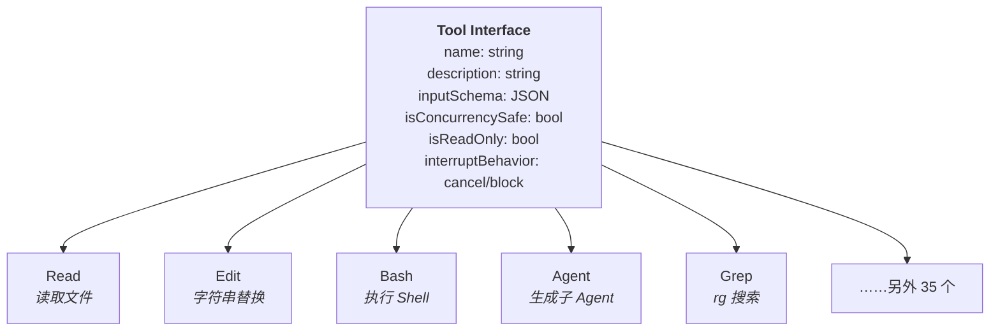
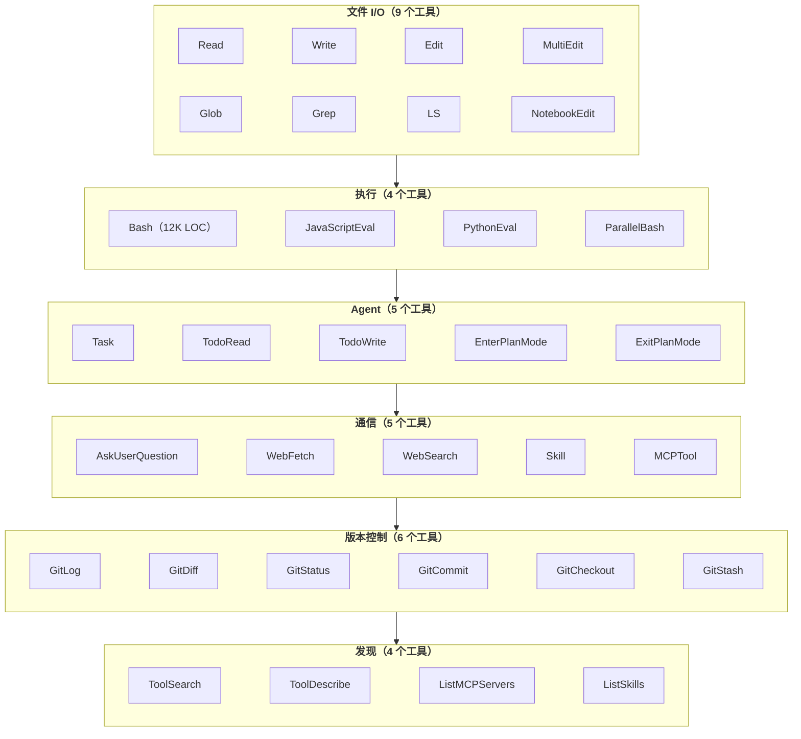
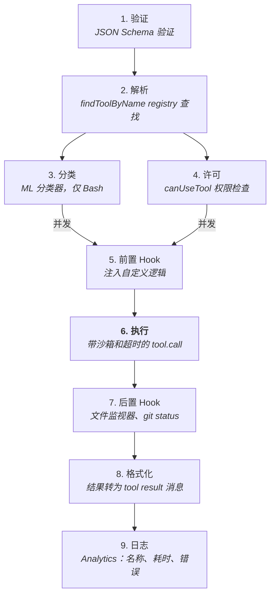
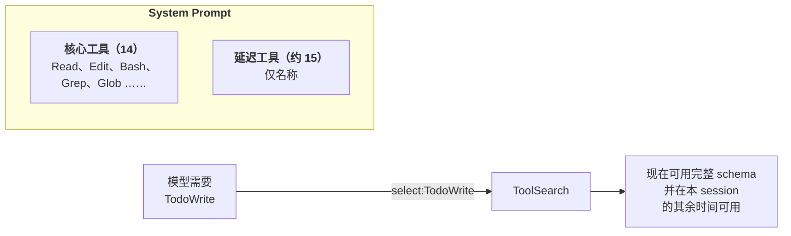
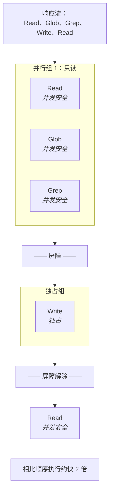

# 工具系统与 Registry

- 原文网址：https://y-agent.github.io/inside-claude-code/05-tool-system.html
- 原文标题：Tool System & Registry
- 原文副标题：Strategy Pattern at Scale
- 原文系列位置：IV.1 — Tool System & Registry
- 翻译日期：2026-07-27

> 本文是 Inside Claude Code 系列文章的完整简体中文翻译。代码、标识符、工具名称、源码路径、类型和指标保持原样；相对链接已改为绝对链接。

## 为什么工具是差异化能力

没有工具，语言模型只能读取文本并生成文本——它无法打开文件、运行测试，也无法检查目录是否存在。工具将聊天机器人转变为软件工程师：每个工具都把模型的推理（“我应该检查这个文件是否存在”）连接到现实世界中的实际效果（返回 `true` 或 `false` 的文件系统调用）。

Claude Code 搭载大约 40 个工具。这些工具围绕三个设计问题，组成了一个经过精心分层的系统：如何以最低的上下文成本向 LLM Agent 提供最大能力；如何在不让系统失去实用性的情况下强制执行安全措施；以及如何在不牺牲一致性的情况下支持扩展。

> **本文涵盖：**
>
> 1. 为什么工具是聊天机器人和 Agent 之间的**核心差异**；
> 2. 统一工具契约（Strategy 模式）；
> 3. 横跨 6 个类别的约 40 个工具；
> 4. 工具执行流水线（从请求到结果的 9 个步骤）；
> 5. 延迟加载——工具 schema 的虚拟内存；
> 6. 流式并发执行。

**本文涉及的源文件：**

| 文件 | 用途 | 大小 |
|---|---|---:|
| `src/Tool.ts` | 工具基础类型、接口定义和 registry | 约 400 LOC |
| `src/tools.ts` | 工具注册入口 | 约 50 LOC |
| `src/tools/BashTool/` | Shell 命令执行（安全、沙箱、TTY） | 18 个文件，约 12,400 LOC |
| `src/tools/AgentTool/` | 子 Agent 生成和编排 | 14 个文件，约 6,000 LOC |
| `src/tools/FileReadTool/` | 文件和附件读取（多模态） | 约 7 个文件 |
| `src/tools/FileEditTool/` | 带验证的字符串替换编辑 | 约 8 个文件 |
| `src/tools/FileWriteTool/` | 文件创建 | 约 5 个文件 |
| `src/tools/GlobTool/` | Glob 模式匹配 | 约 5 个文件 |
| `src/tools/GrepTool/` | 基于 ripgrep 的内容搜索 | 约 5 个文件 |
| `src/tools/ToolSearchTool/` | 延迟工具发现（元工具） | 约 3 个文件 |
| `src/services/tools/` | 工具分发、权限和执行编排 | 约 6 个文件 |
| `src/utils/computerUse/` | macOS computer-use MCP server（截图、输入、锁） | 15 个文件，约 1,800 LOC |

## 统一契约：每个工具都说同一种语言

**Claude Code 中的每个工具——从读取文件到生成子 Agent——都实现相同的接口。** 这是大规模应用的 Strategy 模式：约 40 个可互换的实现，隐藏在统一契约之后。



**图 1：** 统一工具接口包含六个属性（`name`、`description`、`inputSchema`、`isConcurrencySafe`、`isReadOnly`、`interruptBehavior`），所有约 40 个工具都实现该接口。接口向下分发到具体实现：Read、Edit、Bash、Agent、Grep 以及另外 35 个工具。每个具体工具都是同一契约之后可互换的 Strategy，因此可以统一进行权限检查、沙箱强制和 Hook 注入，而不需要为每个工具编写单独的分发逻辑。

**如何阅读此图。** 从顶部的“Tool Interface”开始，它定义了每个工具必须实现的六个属性。箭头向下分发到六个具体工具实现（Read、Edit、Bash、Agent、Grep 和另外 35 个）。关键结论是：所有工具都是这一统一契约之后可互换的策略；编排器只与接口交互，从不依赖某个具体实现。

统一性的力量在于：负责分发工具调用的编排器，不需要知道每个工具具体做什么，只需要知道接口。这免费带来了四种能力：

1. **工具描述生成。** 系统提示包含每个工具的 `description` 和 `inputSchema`，模型看到的是一个能力菜单。
2. **权限检查。** 每次工具调用都会在执行前经过 `canUseTool()`，与工具类型无关。
3. **沙箱强制。** 每个接触文件系统的工具都会经过同一层沙箱。
4. **Hook 注入。** 每个工具都会触发前置和后置工具 Hook，从而支持日志、策略强制和自动化。

### 识别出的模式：Strategy

这是 Gang of Four 设计模式中的 **Strategy 模式**。工具 registry 是 context，每个工具是一个具体策略，分发机制根据模型的 `tool_use` block 在运行时选择策略。Command 模式与之相似——每个工具都封装了带参数的动作。

`isConcurrencySafe` 字段值得特别注意。Read、Glob 和 Grep 等工具被标记为并发安全且只读，可以同时执行多个实例。Write、Edit 和 Bash 等工具不是并发安全的，必须独占执行，以防止文件系统竞态。这个标志是一种能力声明：工具声明自己能处理什么，编排器据此采取行动。

`interruptBehavior` 字段决定用户在执行过程中按下 Escape 时会发生什么。`cancel` 工具会立即中止；`block` 工具会先完成，再传播中断。这对于 Git commit 等操作很重要，因为部分执行可能让仓库处于不一致状态。

## 工具分类：六类工具，六种设计洞察

**工具分为六类，每一类都体现了一种设计理念。** 按能力而不是按字母分组，可以看出 AI Agent 要真正有效需要什么。



**图 2：** 约 40 个工具组织成六个能力类别。文件 I/O（9 个工具）处理读取、写入、编辑和 Notebook 操作；执行（4 个工具）以 12K LOC 的 BashTool 为中心，它是主要安全边界；Agent（5 个工具）支持递归生成子 Agent 和 Plan 模式；通信（5 个工具）包括 Web 访问和 Skill 调用；版本控制（6 个工具）封装 Git 操作；发现（4 个工具）提供按需加载其他工具的 ToolSearch 等元工具。

**如何阅读此图。** 六个子图框代表能力类别，从上到下连接。每个类别内部，具体工具并排列出。按从上（最常使用的文件 I/O）到下（元工具 Discovery）的顺序阅读。垂直顺序大致体现了依赖关系：较低的类别建立在较高类别提供的能力之上——例如 Discovery 工具会加载和管理上面类别中定义的工具。

### 文件 I/O（4 个工具）：Unix 哲学

每个操作使用一个工具。`Read` 读取文件（包括图像、PDF、Notebook）；`Write` 创建或覆盖文件；`Edit` 应用 `str_replace` 补丁；`NotebookEdit` 操作 Jupyter 单元格。这样的分离是有意的：`Edit` 只发送差异，节省 token；`Write` 发送整个文件，这是创建文件所必需的。系统提示会引导模型在修改文件时使用 Edit。

### Discovery（3 个工具）：多种搜索策略

`Glob` 按模式查找文件；`Grep`（封装 ripgrep）搜索内容；`LSP` 提供语义理解——跳转到定义、查找引用和诊断。每个工具处理不同范围：结构层（文件名）、文本层（内容模式）和语义层（符号关系）。三者结合，为 Agent 提供完整的搜索工具箱。

### Execution（1 个工具，但它非常庞大）：安全边界

BashTool 在 18 个文件中共有 12,411 行代码。它的体量反映了自身责任：这是模型意图转变为现实世界动作的地点。BashTool 包含权限匹配、基于 ML 的安全分类器、沙箱强制、用于检测伪装成 Shell 命令的文件编辑的 sed 命令解析、破坏性命令警告和后台执行支持。其他工具的影响范围都通过设计加以限制；Bash 没有限制——用户 Shell 能做的事情，它都可能做到。

### Agent（2 个工具）：递归架构

Agent 工具会生成子 Agent——拥有独立上下文、工具和工作目录的隔离 Claude 实例。`SendMessage` 支持 Agent 间通信。这相当于 AI Agent 的 `fork()`：相同二进制程序，不同上下文。子 Agent 支持并行解决问题，但也会引入协调复杂性（系列 VI.1 将讨论这一点）。

### Web（2 个工具）：本地与云端混合

`WebFetch` 获取网页并转换为 Markdown；`WebSearch` 执行服务端搜索。这些工具运行在 Anthropic 的基础设施上，而不是用户机器上，因此不需要本地权限检查。该架构把本地能力（文件系统、Shell）和云端能力（搜索、Web 访问）结合起来，让每个工具在最合适的位置运行。

### Meta（5+ 个工具）：管理工具的工具

ToolSearch 是元工具——它会加载其他工具。`TaskGet` / `TaskList` 监控后台任务；`TodoWrite` 维护持久化任务列表；Skill 调用已注册的工作流。这些工具赋予 Agent 自我管理能力：发现新工具、跟踪自身进度，以及调用更高层级的工作流。

### 10 个最重要的工具及其设计洞察

| 工具 | 类别 | 核心设计洞察 |
|---|---|---|
| **Bash** | 执行 | 安全边界；无约束的能力需要最大程度的安全措施，因此有 12K LOC |
| **Edit** | 文件 I/O | 带唯一性约束的 `str_replace`；节省 token、可审计、精确 |
| **Read** | 文件 I/O | 多模态（文件、图像、PDF、Notebook）；Agent 的主要“眼睛” |
| **Grep** | 发现 | 封装 ripgrep；schema 对应 CLI flag，让模型的训练经验可以迁移 |
| **Agent** | Agent | 生成子 Agent；递归架构支持并行工作 |
| **ToolSearch** | Meta | 加载其他工具的元工具；支持延迟加载优化 |
| **Write** | 文件 I/O | 要求先 Read（防止盲目覆盖）；整文件语义 |
| **Glob** | 发现 | 按 mtime 排序结果；优先展示最近修改的文件 |
| **LSP** | 发现 | 语义搜索（定义、引用）；处理 Grep 无法处理的需求 |
| **WebFetch** | Web | HTML 转 Markdown；对重复访问提供 15 分钟缓存 |

完整工具目录（约 40 个工具）：

- **核心工具（始终在 system prompt 中）：** `Read`、`Write`、`Edit`、`NotebookEdit`、`Glob`、`Grep`、`LSP`、`Bash`、`Agent`、`SendMessage`、`WebFetch`、`ToolSearch`、`TaskGet`、`TaskList`；
- **延迟工具（通过 ToolSearch 加载）：** `AskUserQuestion`、`CronCreate`、`CronDelete`、`CronList`、`EnterPlanMode`、`ExitPlanMode`、`EnterWorktree`、`ExitWorktree`、`TaskCreate`、`TaskUpdate`、`TaskStop`、`TaskOutput`、`TodoWrite`、`Skill`；
- **服务端工具（运行在 Anthropic 基础设施上）：** `web_search`、`web_fetch`、`code_execution`、`text_editor`；
- **MCP 工具（来自外部服务器）：** 动态注册，命名形式为 `mcp__server__tool`。

## 工具执行流水线：从意图到效果的 9 个步骤

**当模型决定使用工具时，请求会经过一条九步流水线。** 理解这条流水线，是理解 Claude Code 安全性和可扩展性的关键。



**图 3：** 从意图到效果的 9 步工具执行流水线。步骤 1–2 验证输入并按名称解析工具。步骤 3（仅 Bash 使用的 ML 分类器）和步骤 4（`canUseTool` 权限检查）并发运行以隐藏延迟。步骤 5 运行前置工具 Hook，注入自定义逻辑。步骤 6 是唯一具有现实世界副作用的步骤：在沙箱中调用 `tool.call()`。步骤 7–9 运行后置 Hook、将结果格式化为 `tool_result` 消息，并记录分析数据。

**如何阅读此图。** 时间从上向下流过 9 个编号步骤。从步骤 1（验证）开始，沿箭头向下。注意步骤 2 之后的分叉：步骤 3（ML 分类）和步骤 4（许可）并发运行，再汇合到步骤 5（前置 Hook）。步骤 6（执行）是唯一具有现实世界副作用的步骤；之前的一切都是验证和门控，之后的一切都是观察和日志。

三个步骤值得深入关注：

**步骤 3（分类）**是 BashTool 独有的。基于 ML 的分类器会在执行前预测命令是否安全。它与步骤 4（权限检查）并发运行，以降低延迟。如果分类器和权限规则都认为命令安全，执行就可以在不与用户交互的情况下继续。这是应用于安全领域的推测执行：尽早开始安全分析，失败时取消。

**步骤 4（许可）**根据当前权限模式评估工具调用。对于 Bash，这包括针对预批准命令的通配符模式匹配，以及分类器结果。被拒绝的工具会向模型返回错误，模型可以调整并重试。

**步骤 6（执行）**是真实世界效果发生的地方。对于 Bash，这意味着沙箱强制和超时管理；对于 Edit，这意味着查找唯一匹配并应用替换；对于 Agent，这意味着生成完整的子 Agent 生命周期。如果执行抛出异常，错误会被包装为带有 `is_error: true` 的 `tool_result`，模型会看到错误并决定如何继续。

## 延迟加载：工具 Schema 的虚拟内存

**并非所有工具 schema 都会进入 system prompt。** 如果全部加载，每轮都要为模型可能永远不会使用的工具浪费数千 token。因此 Claude Code 把工具分为两层：核心工具（始终加载）和延迟工具（按需加载）。



**图 4：** 将延迟工具加载视为工具 schema 的虚拟内存。system prompt 包含 14 个核心工具（Read、Edit、Bash、Grep、Glob 等）的完整 schema，它们几乎每轮都会使用。约 15 个延迟工具只按名称列出。当模型需要延迟工具（例如 TodoWrite）时，它调用 ToolSearch 元工具，后者返回完整 JSON schema。之后该工具在本 session 的剩余时间内都可调用——这类似于页面缺失时把页面加载进驻留集合。

**如何阅读此图。** 左侧显示 system prompt 中的两组工具：始终加载完整 schema 的核心工具，以及只有名称的延迟工具。当模型需要延迟工具时，沿箭头向右：它调用类似 `select:TodoWrite` 的 ToolSearch 查询，后者返回完整 schema。加载之后，该工具在本 session 剩余时间内可调用；这就是把工具 schema 放入工作集的“页面缺失”。

这就是工具 schema 的虚拟内存。操作系统让每个进程产生拥有全部内存的错觉，但只按需加载页面；Claude Code 让模型产生拥有全部工具的错觉，但只在访问工具时加载 schema。

这种经济性很有吸引力。一个复杂工具 schema 会消耗 300–500 个 token。假设有 15 个延迟工具，每个约 400 token：

```text
不使用延迟加载：15 个工具 × 400 token × 50 轮 = 额外 300,000 token
使用延迟加载：  未需要前为 0 + 每个工具加载时约 400 token
每个 session 节省：最多 300,000 token（如果大多数延迟工具未被使用）
```

**ToolSearch** 元工具使这一切成为可能。它支持多种查询形式：`"select:TodoWrite"` 进行精确名称匹配；使用关键词进行模糊匹配；还支持带前缀要求的搜索，例如 `"+slack send"`。找到匹配项后，系统返回完整 JSON schema，该工具就可以在剩余对话中调用。

> **权衡：** 延迟加载节省 token，但增加了一次往返。模型必须先识别自己需要延迟工具，调用 ToolSearch，等待 schema，然后才能调用实际工具。这会为首次使用某个延迟工具增加一轮延迟。核心工具几乎每轮都会使用，因此保持 eager 加载，让其 schema 成本通过多次使用摊薄。

## 流式执行：安全时并发

**`StreamingToolExecutor` 会在完整 API 响应到达之前就开始执行工具。** 当响应包含多个工具调用时，这种并发执行可以显著降低延迟。

并发规则很简单：

```ts
// 如果满足以下条件之一，工具可以开始执行：
// (a) 当前没有其他工具运行，或者
// (b) 新工具与所有正在运行的工具都是并发安全的
canExecuteTool(isConcurrencySafe: boolean): boolean {
  const executing = this.tools.filter(t => t.status === 'executing');
  return executing.length === 0 ||
    (isConcurrencySafe && executing.every(t => t.isConcurrencySafe));
}
```

实际效果如下：



**图 5：** 只读工具并发执行，并在写工具之前设置屏障。响应流包含五个工具调用：Read、Glob、Grep、Write、Read。前三个工具都可并发安全地执行，因此在绿色共享访问组中并行运行。虚线屏障把它们与 Write 隔开；Write 在赭色独占组中运行。屏障解除后，最后一个 Read 恢复执行。与完全顺序执行相比，这种读者—写者模型大约带来 2 倍加速。

**如何阅读此图。** 时间从上向下流动。顶部响应流包含五个工具调用。前三个（Read、Glob、Grep）都支持并发，因此在绿色“并行组 1”中并行运行。虚线屏障把它们与需要独占访问的 Write 隔开，Write 在赭色框中单独运行。Write 完成后屏障解除，最后一个 Read 执行。关键结论是读者—写者模式：只读工具可以自由重叠，但任意写工具都会强制形成顺序屏障。

还有两个行为用于处理边界情况：

**Bash sibling abort。** 当 Bash 命令出错时，执行器会中止同一响应中的兄弟子进程，但不会中止父 query。错误会报告给模型，由模型决定如何继续。单个命令失败不会级联成结束整个对话的失败。

**用户中断处理。** 用户按下 Escape 时，系统检查每个工具的 `interruptBehavior`。`cancel` 工具立即中止；`block` 工具先完成。这可以防止用户意外破坏多步文件操作。

### 识别出的模式：带优先级队列的读者—写者锁

执行模型是一个**带优先级队列的读者—写者锁**。只读工具是读者，任意数量的读者都可以并发执行；写工具是写者，必须独占访问。并发组与独占组之间的屏障确保正确性。这与数据库事务隔离使用的并发模型相同。

## Schema 设计：教会模型正确使用工具

**输入和输出 schema 不只是类型定义，也是面向 LLM 用户的 UX 层。** 每个 schema 都经过设计，让正确使用变得容易，让危险使用变得困难。

Edit 工具的 schema 展示了这一原则：

```ts
// 输入：最小、精确、默认安全
interface FileEditInput {
  file_path: string;      // 必须是绝对路径
  old_string: string;     // 必须在文件中唯一  <-- 关键约束
  new_string: string;     // 必须与 old_string 不同
  replace_all?: boolean;  // 默认 false
}
```

对 `old_string` 的唯一性约束消除了一整类意外编辑。如果目标文本出现在多个位置，编辑就会失败，模型必须提供更多上下文来消除歧义。这是一种有意设置的摩擦，迫使模型保持精确。

Grep 的 schema 采取了不同方式——它对应模型训练时接触过的 CLI flag：

```ts
interface GrepInput {
  pattern: string;        // 正则（ripgrep 语法）
  '-A'?: number;          // 匹配之后的行数（-A flag）
  '-B'?: number;          // 匹配之前的行数（-B flag）
  '-i'?: boolean;         // 忽略大小写（-i flag）
  output_mode?: 'content' | 'files_with_matches' | 'count';
  head_limit?: number;    // 默认 250（防止结果泛滥）
}
```

`'-A'` 和 `'-B'` 作为 JSON schema 字段名并不常见，但这是有意的。模型接受过 ripgrep 文档和示例的训练。使用熟悉的 flag 名称，减少了“我知道要做什么”和“应该设置哪个参数”之间的认知转换。

> **关键洞察：** 工具 schema 是人类工程师（设计者）与 LLM（用户）之间的 API。最佳 schema 会利用 LLM 的训练数据：熟悉的名称、合理的默认值，以及防止常见错误的约束。相较于整文件编辑，`str_replace` 不只是更加节省 token；它也更可审计、更精确、更难被误用。

## 工具结果截断：保护上下文预算

**单次工具调用就可能淹没上下文窗口。** 读取一个 2,000 行文件会产生约 16K token；在 monorepo 上运行 Grep 可能返回 30K 甚至更多 token。如果不加限制，一个过大的结果会占用 200K token 上下文窗口的六分之一，挤压推理空间并增加 API 成本。工具系统在多个层级应用截断来防止这一点。

**每个工具的输出上限。** 一些工具会在通用截断层生效之前，先执行自己的限制：

- Grep 的 `head_limit` 默认是 250 行。模型可以覆盖该值（传递 `head_limit: 0` 表示不限），但默认值可以防止意外输出过多；
- Read 默认从文件开头读取 2,000 行。对于更长的文件，模型必须指定 `offset` 和 `limit` 读取特定范围；
- Bash 同时捕获 stdout 和 stderr，但分别对两个流应用字节上限。

**系统级截断。** 工具返回原始结果后，执行流水线（上面 9 步流水线中的步骤 7）会根据 token 阈值检查结果大小。如果超过阈值，系统截断结果，并追加结构化通知：

```text
[Result truncated — original output was ~30,000 tokens, showing first 10,000.
 Use more specific parameters (e.g., line ranges, file filters, head_limit) to
 narrow the result.]
```

该通知不只是信息提示，它还是**给模型的 prompt**，要求模型使用更有针对性的查询重试。模型读到截断通知后，知道输出不完整，通常会发起更精确的请求：读取指定行范围，而不是整个文件；为 Grep 增加 `glob` 过滤；或在 Bash 输出后接 `head`。

**反馈循环。** 截断形成自然的优化循环：宽查询 → 结果被截断 → 窄查询重试 → 得到完整结果。这和人类开发者的工作方式一致：在大型代码库上运行 `grep`，看到结果太多，再增加 flag 缩小搜索范围，迭代到输出变得可管理为止。截断系统教会模型遵守同样的纪律。

## 工具描述 Prompt：模型看到什么

每个工具都携带一个描述字符串。对于 eager 工具，该字符串注入 system prompt；对于延迟工具，则由 `ToolSearchTool` 返回。这些描述不是简短标签，而是会塑造模型使用方式的详细行为契约。所有工具的描述文本合计超过 15,000 个单词。

### BashTool 的描述

**BashTool 拥有最长的描述，约 3,700 个单词**，比大多数博客文章都长。描述覆盖七类关注点：

| 部分 | 目的 | 关键指令 |
|---|---|---|
| 工具偏好指导 | 重定向到专用工具 | “使用 Glob（不要用 find 或 ls）、Grep（不要用 grep 或 rg）、Read（不要用 cat/head/tail）” |
| 执行指令 | 超时、后台、并行命令 | “不要使用换行分隔命令” |
| Git 安全协议 | 提交流程、阻止破坏性操作 | 6 条 NEVER 规则；“重要：始终创建新 commit，不要 amend” |
| PR 创建流程 | 分支、push、通过 `gh` 创建 PR | 3 步流程，支持并行批处理 |
| 沙箱规则 | 文件系统和网络限制 | “不要尝试设置 `dangerouslyDisableSandbox: true`，除非……” |
| Sleep 指导 | 避免不必要轮询 | “不要在 sleep 循环中重试失败命令——诊断根本原因” |
| 常见操作 | GitHub API 模式 | 使用 `gh api` 处理 PR 评论、Issue |

开头部分尤其值得注意——它主动劝阻模型使用自己：

> “重要：避免使用这个工具运行 `find`、`grep`、`cat`、`head`、`tail`、`sed`、`awk` 或 `echo` 命令，除非有明确指示，或者你已经确认专用工具无法完成任务。”

这种自我贬低是有意的：BashTool 是能力最强的工具（它能做 Shell 能做的一切），但也最危险、最难审查。通过把模型重定向到专用工具，描述会引导模型执行更安全、更容易让用户审阅、结果也更节省 token 的操作。

### 其他工具的描述

| 工具 | 描述长度 | 值得注意的指令 |
|---|---:|---|
| `Agent` | 约 1,500 词 | “不要在执行过程中查看 fork 输出文件”；“不要与 fork 竞速或预测其结果” |
| `Read` | 约 300 词 | “必须使用绝对路径”；支持读取图像、PDF、Jupyter Notebook |
| `Edit` | 约 200 词 | “编辑前必须至少使用一次 Read 工具”；“如果 old_string 不唯一，edit 必须失败” |
| `Write` | 约 100 词 | “必须先读取现有文件”；“除非明确要求，否则绝不创建文档文件” |
| `Grep` | 约 150 词 | “搜索任务始终使用 Grep；绝不把 `grep` 或 `rg` 作为 Bash 命令调用” |
| `Glob` | 约 50 词 | 简要描述模式匹配和排序 |
| `Skill` | 约 150 词 | “阻塞性要求：在生成任何其他响应前，先调用相关 Skill 工具” |
| `ToolSearch` | 约 100 词 | 查询形式：`select:Read,Edit`、关键词搜索、`+slack send` |

## 总结

**工具是聊天机器人与 Agent 之间的核心差异。** 没有工具，LLM 就像装在罐子里的大脑。工具系统不是附属功能，而是让 Agent 能够行动的核心能力。每个工具都是推理与动作之间的桥梁。

**Strategy 模式支持统一编排。** 由于每个工具都实现相同接口，系统可以免费获得权限检查、沙箱、Hook 注入和并发执行能力。编排所有工具时，不需要理解每个工具的内部实现；这就是统一契约的力量。

**延迟加载是工具 schema 的虚拟内存。** 核心工具是工作集，始终驻留；延迟工具被换出，只知道名称，按需加载 schema。这把操作系统原则直接转译成了 LLM 经济学，每个 session 最多节省 300K token。

**Schema 设计就是面向 LLM 的 UX 设计。** Edit 的唯一性约束防止意外编辑；Grep 对应 flag 的参数名利用模型训练数据；BashTool 的强制描述字段要求模型在执行前明确意图。每个 schema 选择都会塑造行为。

**分离变化速率不同的关注点。** 9 步流水线把安全策略、工具实现和分析数据分成独立阶段。每个阶段都可以独立演进，而不需要触碰其他阶段。这是应用于 Agent 架构的流水线模式。

工具系统正是架构与 Agent 能力相遇的地方。模型的智能决定方向；工具提供实现方向的手段。下一篇文章将研究这个等式的另一半：教会模型如何有效使用这些工具的 prompt 片段。

下一篇：[IV.2 — 安全、权限与沙箱](https://y-agent.github.io/inside-claude-code/06-safety-sandbox.html)，介绍 Claude Code 如何防御一个能够运行任意 Shell 命令的 AI Agent 所固有的风险。

## 附录：完整工具清单

Claude Code 搭载 40 个工具，组织成十个功能类别。标记 † 的延迟工具通过 `ToolSearchTool` 按需加载，以保持初始 system prompt 紧凑。每个工具都在 `src/tools/` 下的独立目录中实现。

| 类别 | 工具 | Model Name | 实现 | 加载方式 |
|---|---|---|---|---|
| **文件 I/O** | FileReadTool | `Read` | `src/tools/FileReadTool/` | Eager |
|  | FileEditTool | `Edit` | `src/tools/FileEditTool/` | Eager |
|  | FileWriteTool | `Write` | `src/tools/FileWriteTool/` | Eager |
|  | GlobTool | `Glob` | `src/tools/GlobTool/` | Eager |
|  | GrepTool | `Grep` | `src/tools/GrepTool/` | Eager |
|  | NotebookEditTool | `NotebookEdit` | `src/tools/NotebookEditTool/` | Deferred † |
| **执行** | BashTool | `Bash` | `src/tools/BashTool/`（18 个文件） | Eager |
|  | PowerShellTool | `PowerShell` | `src/tools/PowerShellTool/`（16 个文件） | Eager（Windows） |
|  | REPLTool | `REPL` | `src/tools/REPLTool/` | Deferred † |
| **Agent** | AgentTool | `Agent` | `src/tools/AgentTool/`（14 个文件） | Eager |
|  | SendMessageTool | `SendMessage` | `src/tools/SendMessageTool/` | Eager |
|  | TeamCreateTool | `TeamCreate` | `src/tools/TeamCreateTool/` | Deferred † |
|  | TeamDeleteTool | `TeamDelete` | `src/tools/TeamDeleteTool/` | Deferred † |
| **任务** | TaskCreateTool | `TaskCreate` | `src/tools/TaskCreateTool/` | Deferred † |
|  | TaskGetTool | `TaskGet` | `src/tools/TaskGetTool/` | Deferred † |
|  | TaskListTool | `TaskList` | `src/tools/TaskListTool/` | Deferred † |
|  | TaskUpdateTool | `TaskUpdate` | `src/tools/TaskUpdateTool/` | Deferred † |
|  | TaskStopTool | `TaskStop` | `src/tools/TaskStopTool/` | Deferred † |
|  | TaskOutputTool | `TaskOutput` | `src/tools/TaskOutputTool/` | Deferred † |
|  | TodoWriteTool | `TodoWrite` | `src/tools/TodoWriteTool/` | Deferred † |
| **规划** | EnterPlanModeTool | `EnterPlanMode` | `src/tools/EnterPlanModeTool/` | Deferred † |
|  | ExitPlanModeTool | `ExitPlanMode` | `src/tools/ExitPlanModeTool/` | Deferred † |
|  | EnterWorktreeTool | `EnterWorktree` | `src/tools/EnterWorktreeTool/` | Deferred † |
|  | ExitWorktreeTool | `ExitWorktree` | `src/tools/ExitWorktreeTool/` | Deferred † |
| **Web 与搜索** | WebFetchTool | `WebFetch` | `src/tools/WebFetchTool/` | Deferred † |
|  | WebSearchTool | `WebSearch` | `src/tools/WebSearchTool/` | Deferred † |
|  | ToolSearchTool | `ToolSearch` | `src/tools/ToolSearchTool/` | Eager |
| **MCP** | MCPTool | `mcp__*` | `src/tools/MCPTool/` | Dynamic |
|  | ListMcpResourcesTool | `ListMcpResources` | `src/tools/ListMcpResourcesTool/` | Deferred † |
|  | ReadMcpResourceTool | `ReadMcpResource` | `src/tools/ReadMcpResourceTool/` | Deferred † |
|  | McpAuthTool | `McpAuth` | `src/tools/McpAuthTool/` | Deferred † |
| **代码智能** | LSPTool | `LSP` | `src/tools/LSPTool/` | Deferred † |
| **交互** | AskUserQuestionTool | `AskUserQuestion` | `src/tools/AskUserQuestionTool/` | Deferred † |
|  | SkillTool | `Skill` | `src/tools/SkillTool/` | Eager |
|  | BriefTool | `Brief` | `src/tools/BriefTool/` | Deferred † |
|  | ConfigTool | `Config` | `src/tools/ConfigTool/` | Deferred † |
| **调度** | ScheduleCronTool | `ScheduleCron` | `src/tools/ScheduleCronTool/` | Deferred † |
|  | SleepTool | `Sleep` | `src/tools/SleepTool/` | Deferred † |
| **内部** | RemoteTriggerTool | `RemoteTrigger` | `src/tools/RemoteTriggerTool/` | Internal |
|  | SyntheticOutputTool | `SyntheticOutput` | `src/tools/SyntheticOutputTool/` | Internal |

在这 40 个工具中，大约 10 个会 eager 加载（始终存在于 system prompt 中），约 25 个会延迟加载（模型需要时通过 `ToolSearchTool` 加载）。MCP 工具会根据已配置的 MCP server 在运行时动态注册。内部工具在正常运行中不会暴露给模型。

## 附录：Computer Use

Claude Code 包含一个受功能门控的 computer-use 子系统，提供原生 macOS 屏幕控制能力——截图、鼠标、键盘和剪贴板——并以名为 `computer-use` 的 MCP server 提供。这是**仅限 macOS** 的能力（15 个文件，约 1,800 LOC），由两个原生模块支持：`@ant/computer-use-swift`（截图、应用管理、显示器检测、TCC 权限检查）和 `@ant/computer-use-input`（用于鼠标、键盘、剪贴板的 Rust/enigo 绑定）。

### 架构

该子系统采用三层设计：

| 层 | 组件 | 用途 |
|---|---|---|
| Native | `@ant/computer-use-swift` | macOS 屏幕捕获和应用管理的 Swift 绑定 |
| Native | `@ant/computer-use-input` | 鼠标、键盘和剪贴板的 Rust/enigo 绑定 |
| CLI Wrapper | `src/utils/computerUse/` | 将 `ToolUseContext` 桥接到 MCP session dispatcher |

执行器（`executor.ts`，659 行）实现了 `ComputerExecutor` 接口，将所有操作路由到原生模块。关键操作包括带显示器筛选的截图捕获、以 60fps ease-out cubic 曲线实现的动画鼠标移动、键盘输入和应用管理。系统会自动检测终端模拟器（iTerm、Terminal、Ghostty、Kitty、Warp、VS Code），并让它们免于隐藏和截图捕获。

### 功能门控

三层门控控制访问：

1. **构建时：** `feature('CHICAGO_MCP')`——如果为 false，整个子系统会被编译移除；
2. **运行时（GrowthBook）：** `tengu_malort_pedway` gate，限制给 Max/Pro 订阅者（或 `USER_TYPE === 'ant'`）；
3. **平台：** 当 `process.platform !== 'darwin'` 时抛出异常。

子门控控制具体行为：`pixelValidation`、`clipboardPasteMultiline`、`mouseAnimation`、`hideBeforeAction`、`autoTargetDisplay`、`clipboardGuard`。

### 安全

基于原子文件的 session lock（`computerUseLock.ts`）确保同一时间只有一个 Claude Code 实例控制屏幕，并支持过期 PID 恢复和 7 天超时。第一次获取锁时，会通过 CGEventTap 注册全局 Escape 热键（`escHotkey.ts`）：用户按 Escape 会中止 turn，而模型合成的 Escape 会在 100ms 衰减窗口内透传，这是为了防御 prompt injection。turn 结束时，清理逻辑（`cleanup.ts`）会自动取消隐藏被隐藏的应用、注销热键并释放锁。

**源文件：** `src/utils/computerUse/executor.ts`（执行器工厂）、`src/utils/computerUse/gates.ts`（功能门控）、`src/utils/computerUse/wrapper.tsx`（session 适配器）、`src/utils/computerUse/setup.ts`（MCP 配置）、`src/utils/computerUse/computerUseLock.ts`（session 锁）、`src/utils/computerUse/escHotkey.ts`（中止热键）、`src/utils/computerUse/cleanup.ts`（turn 结束清理）。

系列：Inside Claude Code | Part III.2 of 10
