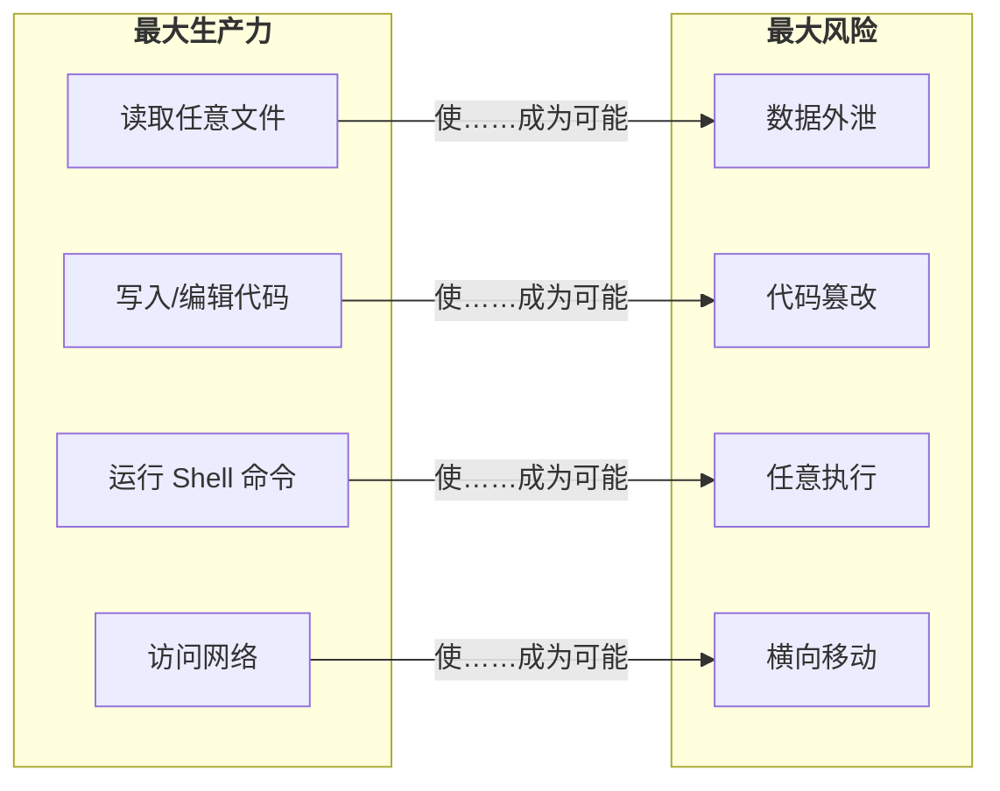
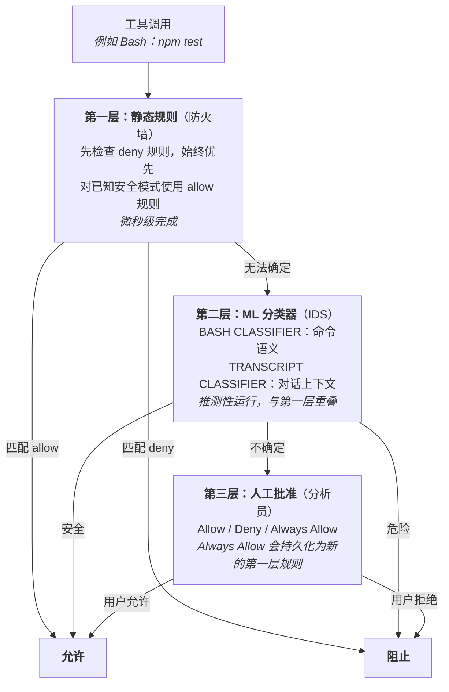
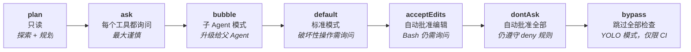
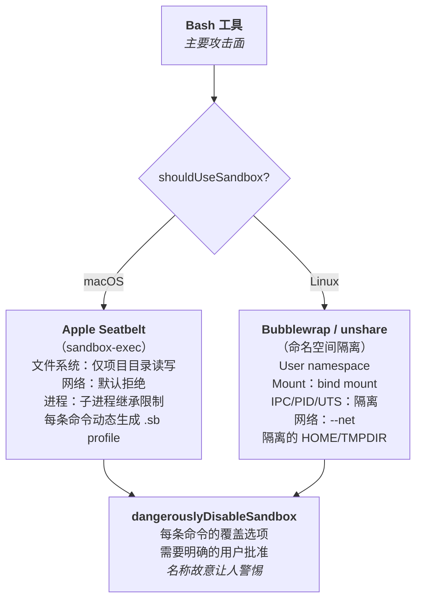
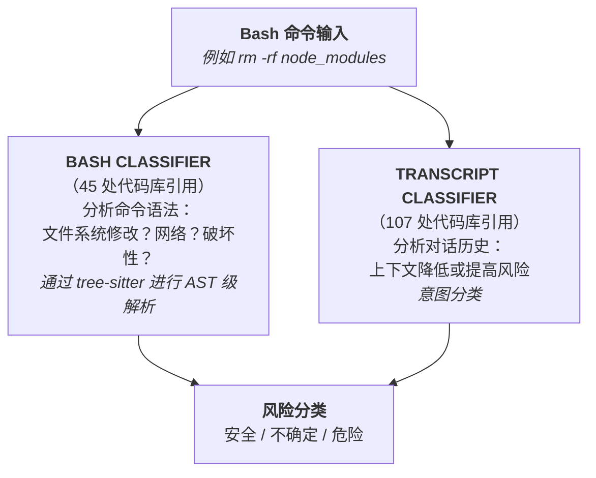
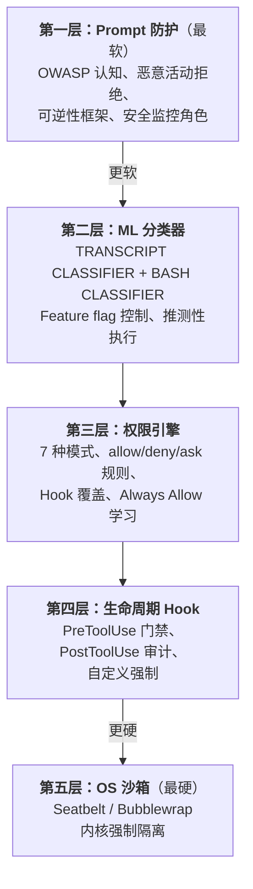

# 安全与沙箱

- 原文网址：https://y-agent.github.io/inside-claude-code/06-safety-sandbox.html
- 原文标题：Safety & Sandboxing
- 原文副标题：Defense in Depth for AI Agents
- 原文系列位置：IV.2 — Safety & Sandbox
- 翻译日期：2026-07-27

> 本文是 Inside Claude Code 系列文章的完整简体中文翻译。代码、标识符、配置字段、源码路径、函数名和指标保持原样；相对链接已改为绝对链接。

把 Shell 交给 AI Agent，你就创造了一个强大的东西——也创造了一个危险的东西。一次幻觉式的 `rm -rf /`，就可能横亘在高效编码会话与灾难之间。Claude Code 的安全架构借鉴了网络安全中的纵深防御策略：三层权限检查、两个 ML 分类器和操作系统级沙箱组成同心屏障，每一层都负责捕获上一层遗漏的问题。这是强制访问控制（MAC）——一个来自操作系统的概念——在 AI Agent 领域的重新诠释。

本文梳理权限架构，解释驱动每项设计选择的安全与 UX 权衡，并将沙箱与容器、seccomp profile 等操作系统级隔离原语联系起来。

> **本文涵盖：**
>
> - 信任问题——为什么 Shell 访问需要分层防御；
> - 三层权限架构——配置规则、ML 分类器和人工批准；
> - 操作系统级沙箱——Seatbelt（macOS）/ Bubblewrap（Linux）；
> - 安全与 UX 光谱——从只读到 YOLO 的七种模式；
> - 命令风险分类——tree-sitter AST 与 ML 分类器。

**本文涉及的源文件：**

| 文件 | 用途 | 大小 |
|---|---|---:|
| `src/utils/permissions/permissions.ts` | 核心权限引擎（allow/deny/ask 评估） | 约 500 LOC |
| `src/utils/permissions/bashClassifier.ts` | 基于 ML 的命令风险分类 | 约 400 LOC |
| `src/utils/permissions/dangerousPatterns.ts` | 危险命令模式匹配 | 约 300 LOC |
| `src/utils/permissions/permissionsLoader.ts` | 从设置加载权限规则 | 约 200 LOC |
| `src/utils/permissions/yoloClassifier.ts` | 受信任命令的自动批准分类器 | 约 200 LOC |
| `src/tools/BashTool/bashSecurity.ts` | Bash 专用安全检查 | 约 300 LOC |
| `src/tools/BashTool/bashPermissions.ts` | Bash 权限评估 | 约 200 LOC |
| `src/tools/BashTool/destructiveCommandWarning.ts` | 破坏性命令警告 | 约 150 LOC |
| `src/utils/settings/settings.ts` | 设置管理（allow/deny/ask 规则） | 约 500 LOC |

## 信任问题：为什么 Shell 访问改变了一切

**拥有 `exec()` 的 AI Agent 与聊天机器人存在根本差异。** 一旦授予 Shell 访问能力，LLM 的每一种失败模式都可能变成系统安全事件。

想想编码 Agent 为完成工作需要什么。它必须读取文件、写入新文件、运行构建命令、安装依赖，并访问网络。这些能力也是远程攻击者想要的能力。差异只在于意图——但当你的“用户”是一个偶尔会产生幻觉的语言模型时，意图很难验证。

这不是假设性的担忧。Prompt injection（恶意内容藏在文件或网页中，诱骗模型运行非预期命令）是已知的攻击向量。一份包含隐藏指令的 `README.md`，可能诱导 Agent 外泄环境变量，或以隐蔽方式修改源代码。



**图 1：** Agent 生产力与安全风险之间的根本张力。Agent 所需的每项能力——读取文件、写入代码、执行 Shell、访问网络——都直接对应一个攻击向量（数据外泄、代码篡改、任意执行、横向移动）。设计安全 Agent 时，必须同时管理这四条通道。

**如何阅读此图。** 左框列出 Agent 为提高生产力所需的能力，右框列出这些能力会启用的攻击向量。每条标注“使……成为可能”的水平箭头都连接一项能力及其对应风险，例如“读取任意文件”会使“数据外泄”成为可能。结论是：每种生产力能力同时也是攻击面，安全架构必须同时管理四条通道。

一种天真的解决方案是询问用户每个动作。这样安全，但速度太慢，没人会使用。另一个极端是自动批准一切，这距离灾难只差一次糟糕的幻觉。Claude Code 的答案是**纵深防御**：多个相互独立的层，每层拥有不同优势，因此任何单层故障都不会造成灾难性后果。

## 三层权限架构：防火墙、入侵检测系统和分析员

**每次工具调用都会经过一棵确定性的决策树，其中包含三层：静态规则、ML 分类器和人工批准。**

与网络安全的类比是精确的。每一层在不同速度下处理不同类型的威胁：



**图 2：** 每次工具调用都会经过的三层权限决策树。第一层（静态规则）以“deny 规则始终优先”的语义，在微秒级解析已知模式。第二层（ML 分类器）通过与第一层重叠的推测性执行处理新命令。第三层（人工批准）决定真正不确定的情况；其中“Always Allow”会反馈到第一层，形成学习循环。

**如何阅读此图。** 从顶部的“工具调用”开始，沿箭头向下经过三层。每层都可以直接解决决策（箭头通向两侧的允许或阻止），也可以通过“无法确定”或“不确定”交给下一层。第一层最快；第二层处理新命令；第三层是最终裁决者，它的“Always Allow”选项会把学到的模式作为新静态规则反馈到第一层。

决策流程遵循严格的优先级顺序。首先评估 deny 规则，而且不能被覆盖——它们代表无条件的策略边界。接下来是 Hook 覆盖（`PreToolUse` Hook 可以返回 Allow、Deny 或 Ask）。然后是 ask 规则，即使在宽松模式中也会强制弹出用户提示。最后，allow 规则和当前权限模式会处理剩余情况。

规则格式使用支持通配符的 `ToolName(argument_pattern)` 语法：

```json
{
  "permissions": {
    "allow": ["Bash(npm test:*)", "Bash(git:*)", "Read"],
    "deny": ["Bash(rm -rf:*)"],
    "ask": ["Bash(git push:*)"]
  }
}
```

用户在权限提示中选择“Always Allow”后，工具和参数模式会作为新的第一层 allow 规则持久化到 `settings.json`。这形成了一个学习循环：刚接触陌生代码库的新用户会频繁看到提示，但几次会话之后，常见模式就会自动批准。系统可以适应用户的工作流，同时不会为真正新颖的命令牺牲安全性。

## 安全与 UX 光谱：七种权限模式

**Claude Code 提供七种权限模式，每种都代表安全性与生产力权衡上的一个位置。**

这不是偶然的——“正确的安全级别”完全取决于上下文。审查陌生的开源项目，与在每次 CI 任务后都会销毁的 Docker 容器中运行测试，需要不同的约束。



**图 3：** 七种权限模式从限制最严到限制最少排列。plan 模式只读；ask 模式对每个工具都询问；bubble 模式把权限问题升级给父 Agent；default 模式只对破坏性操作询问；acceptEdits 自动批准文件写入；dontAsk 自动批准所有操作但仍遵守 deny 规则；bypass 完全跳过检查。七种模式共用同一个 `PermissionPolicy` 引擎，只改变默认策略。

**如何阅读此图。** 七个框从左到右排列，左侧最严格（plan：只读），右侧最宽松（bypass：跳过全部检查）。沿箭头查看信任程度逐步增加的过程。每个框都写出模式名，并以斜体概括策略。关键洞察是：七种模式共用一个 `PermissionPolicy` 引擎，改变的只是默认策略，而不是底层安全逻辑。

关键洞察在于：这些模式共享一个底层权限引擎——一个带可配置 mode 的 `PermissionPolicy` 对象。引擎以相同方式评估每个请求；只有默认策略不同。这意味着安全逻辑只需测试一次，却可以以七种配置部署，降低宽松模式引入限制模式中不存在的 Bug 的可能性。

> **权衡：** `acceptEdits` 模式体现了一个有原则的边界。文件编辑可以通过 `git checkout` 恢复，因此自动批准是合理风险；Shell 命令可能无法恢复（例如数据库迁移、已部署的二进制文件），所以仍需批准。动作的可逆性决定其默认权限级别。

### 识别出的模式：Policy

这是 **Policy 模式**——一组拥有统一接口、可以互换的策略。七种模式是七个策略实例，都实现同一个 `authorize()` 方法。

## 操作系统级沙箱：坚固的混凝土墙

**即使所有软件检查都失败，操作系统沙箱仍会限制已执行命令实际能够做什么。**

权限系统在应用层运行。如果 Prompt injection 利用了解析器 Bug 或竞态条件，被执行的命令就会以用户的全部权限运行——除非操作系统阻止它。这就是 Claude Code 将操作系统级沙箱作为最后一道防线的原因。

Bash 工具是主要攻击面。它是唯一能够执行任意代码、生成进程并不受约束地访问网络的工具。文件工具（Read、Write、Edit）通过 Claude Code 自己的 I/O 层运行，内置路径验证；而 Bash 是通向操作系统的直接通道。



**图 4：** 操作系统级沙箱架构，展示平台专用的隔离机制。在 macOS 上，Apple Seatbelt 为每条命令动态生成 `.sb` profile，限制文件系统、网络和进程能力。在 Linux 上，Bubblewrap/unshare 创建隔离的 user、mount、IPC、PID、UTS 和 network namespace。两个平台都支持通过故意令人警惕的 `dangerouslyDisableSandbox` 标志逐条命令绕过沙箱，但需要明确的用户批准。

**如何阅读此图。** 从顶部的“Bash 工具”开始，沿箭头到平台判断菱形。流程分支到 macOS（带动态 `.sb` profile 的 Apple Seatbelt）或 Linux（带 namespace 隔离的 Bubblewrap/unshare）。两个分支最终都汇聚到下方的 `dangerouslyDisableSandbox`，这是需要明确用户批准的逐命令逃生口。无论使用哪个平台，沙箱架构都遵循同一模式：检测操作系统，应用平台原生隔离，并提供受控的覆盖路径。

在 macOS 上，Claude Code 利用 Apple 的 Seatbelt 框架——这是与 App Store 应用相同的沙箱技术。每条 Bash 命令都会获得一个动态生成的沙箱 profile，限制对项目目录和 `TMPDIR` 的文件系统访问，默认拒绝网络访问，并控制进程生成。profile 会适应当前工作目录，因此沙箱可以贴合项目，而不是套用一份一刀切的策略。

在 Linux 上，沙箱通过 `unshare` 使用 namespace 隔离——这也是 Docker 容器所依赖的原语。实现会创建隔离的 user、mount、IPC、PID、UTS 和 network namespace。沙箱进程看起来像是以 root 身份运行，但实际上在宿主机上没有 root 权限。

### 基于证据的绕过检测

有时沙箱对于合法命令来说过于严格。Claude Code 实现了基于证据的检测：当命令因为路径位于允许目录之外而失败，并出现类似“Operation not permitted”或“Access denied”的特征时，系统会推断失败由沙箱引起，并提供使用 `dangerouslyDisableSandbox: true` 重试的选项——但只有在用户明确批准后才会执行。

逐条命令的粒度非常重要。为某一次 `npm install` 禁用沙箱，不会影响下一次 `rm -rf`。每条命令都会独立评估。

## 命令风险分类：ML 层

**两个机器学习分类器会增强静态规则，同时分析命令语义和对话上下文。**

静态规则很擅长处理已知模式，但真实世界的 Agent 使用会不断产生新命令。开发者要求 Claude Code“设置项目”时，产生的命令可能从未出现在 allow list 中。这正是 ML 分类器发挥作用的地方。



**图 5：** 命令风险评估的双分类器架构。BASH CLASSIFIER（代码库中有 45 处引用）通过 tree-sitter AST 分析解析命令语法，沿文件系统修改、网络访问和破坏性等维度分类。TRANSCRIPT CLASSIFIER（107 处引用）分析完整对话历史，在上下文中评估意图。两个分类器都与静态规则并行进行推测性运行；如果静态规则已经解决决策，则不会增加延迟。

**如何阅读此图。** 顶部的 Bash 命令输入同时流向两个并行分类器：Bash Classifier 通过 tree-sitter AST 分析命令语法；Transcript Classifier 分析完整对话历史中的意图。两条路径在底部汇聚为一个风险分类输出，可能的标签是安全、不确定或危险。双路径设计意味着系统既评估命令做什么，也评估模型为什么运行它。

`BASH_CLASSIFIER` 关注命令语义。给定 Shell 命令字符串，它会沿安全维度分类：是否修改文件系统？是否访问网络？是否具有破坏性？是否可逆？分类器使用 tree-sitter——一个增量解析库——构建命令的抽象语法树（AST），从而进行超越简单字符串匹配的分析。它能够区分 `rm -rf node_modules`（删除可重新生成的目录）和 `rm -rf /`（摧毁整个文件系统）。

`TRANSCRIPT_CLASSIFIER` 采取更宽的视角。它分析完整对话历史，在上下文中对意图和风险分类。同一条命令——`rm -rf node_modules`——会根据对话内容获得不同风险分数：如果对话是“清理并重新安装依赖”，与对话中出现一连串疑似 Prompt injection 的操作，风险分数就不同。

关键的性能优化是推测性执行。两个分类器与静态规则评估并行启动。如果静态规则已经解决决策，分类器结果会被丢弃，不增加任何延迟。如果静态规则无法确定，且分类器已经完成，分类器结果就会参与决策。如果分类器还在运行，系统会退回交互式提示。这种重叠意味着 ML 层不会拖慢常见路径。

两个分类器都由 feature flag 控制，因此无需更新客户端，就可以在服务端启用、禁用或调整它们。这对安全基础设施至关重要——如果某个分类器开始产生过多误报，Anthropic 可以在几分钟内调节它。

> **关键洞察：** 静态规则和 ML 分类器是互补的，而不是竞争关系。规则以零成本处理已知模式；分类器以一定成本处理新模式。推测性执行确保只有在静态规则无法解决决策时，才需要付出 ML 成本。这与 CPU 中的分支预测是同一种优化：对常见情况进行推测，错误时恢复。

## Prompt 层防护：最外层防线

**最后一层不在代码层运行，而是在 Prompt 层运行；它会在调用任何工具之前塑造模型行为。**

Claude Code 的 system prompt 包含多个安全片段。`system-prompt-censoring-assistance-with-malicious-activities` 片段建立了拒绝协助恶意软件、漏洞利用或社会工程活动的基线。编码指南嵌入了对 OWASP Top 10 的认知，引导模型避免在生成代码中引入 SQL 注入、XSS 和路径遍历。

一套关于可逆性和影响范围的框架会指导模型优先选择可逆动作，而不是不可逆动作；优先选择小范围变更，而不是大范围变更；优先读取后写入，而不是盲目覆盖。对于 auto 模式（无人值守操作），额外片段会注入一个安全监控者角色，持续评估 Prompt injection 尝试。

这些 Prompt 层防护是最外层、也是最不可靠的一层——Prompt 约束可能被精巧的对抗性输入绕过。这正是系统不能只依赖它们的原因。它们是第一道防线，覆盖范围最广，负责捕获最常见的问题，而更深层的防线会处理漏网之鱼。

> **权衡：** Prompt 层安全成本低（除了 token 之外没有运行时成本），覆盖广（涵盖模型的所有行为），但较软（可以被对抗性输入绕过）。操作系统级沙箱成本高（有进程开销），覆盖窄（只约束 Bash），但较硬（由内核强制执行）。完整系统需要两者兼备。

## 完整安全栈：组合起来

**五层防线组成同心屏障，每层拥有不同优势，确保任何单层故障都不会造成灾难性后果。**



**图 6：** 完整的五层安全栈，按强制程度从软到硬排列。第一层（Prompt 防护）通过 OWASP 认知和可逆性启发式塑造模型行为。第二层（ML 分类器）进行可由 feature flag 控制的推测性风险评估。第三层（权限引擎）使用七种可配置模式和 allow/deny/ask 规则。第四层（生命周期 Hook）支持自定义 PreToolUse 门禁和 PostToolUse 审计。第五层（OS 沙箱）提供由 Seatbelt 或 Bubblewrap 实现的内核强制隔离。攻击必须穿透全部五层同心防线才会造成伤害。

**如何阅读此图。** 从顶部的第一层（Prompt 防护）开始——它是最软、覆盖最广的防御——沿箭头向下经过越来越硬的强制，直到底部的第五层（OS 沙箱）——它是最硬、范围最窄的防御。每一层都会捕获上一层遗漏的威胁。攻击必须穿透全部五层才能造成伤害，这就是纵深防御的本质。

## 总结

**AI Agent 的安全是架构问题，而不是一个功能。** Claude Code 的五层防御不是事后拼接的安全功能清单，而是贯穿每次工具调用的结构性要素，从覆盖范围最广的 Prompt 层指南，到范围最窄但由内核强制的沙箱。每层都独立有价值，但真正的力量来自组合。

**安全与 UX 的权衡是一条光谱，而不是二元选择。** 七种权限模式允许用户根据上下文选择适当的摩擦程度。同一个引擎驱动全部七种模式，只有默认策略不同。这是将 Policy 模式应用于安全的结果：安全逻辑只测试一次，却可以用七种配置部署。

**静态规则和 ML 分类器是互补的，而不是竞争的。** 规则零成本处理已知情况；分类器以一定成本处理新情况。推测性执行确保 ML 层只在需要时增加延迟。这类似 CPU 使用分支预测：对常见情况推测，错误时恢复。

**OS 沙箱是最后的防线。** 当所有软件检查都被绕过——无论是通过 Bug、盲点还是社会工程——沙箱都会限制物理上可能发生的事情。它是安全人员背后的混凝土墙。基于证据的绕过检测确保沙箱不会让工具变得不可用，而故意令人警惕的 `dangerouslyDisableSandbox` 名称则防止人们随意滥用。

**系统会从用户身上学习。** 权限提示中的每一次“Always Allow”都会成为一条新的静态规则，降低未来的摩擦。刚接触陌生代码库的新用户会频繁看到提示；几次会话之后，同一个用户很少再被打断。权限系统可以适应工作流，而不要求用户显式配置。

系列下一篇：[IV.3：Hooks 与生命周期](https://y-agent.github.io/inside-claude-code/11-hooks-lifecycle.html) 和 [VI.1：模型上下文协议](https://y-agent.github.io/inside-claude-code/10-model-context-protocol.html)——介绍 Claude Code 的扩展点，以及让单个二进制程序服务多样化工作流的设计模式。
