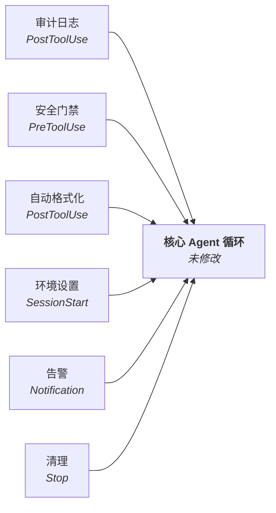
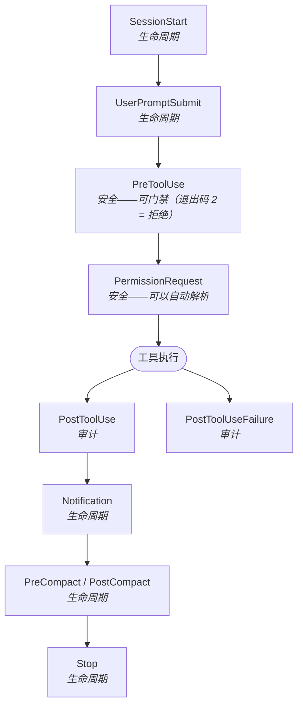
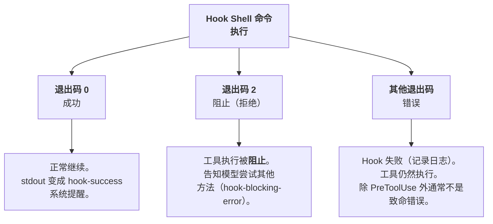
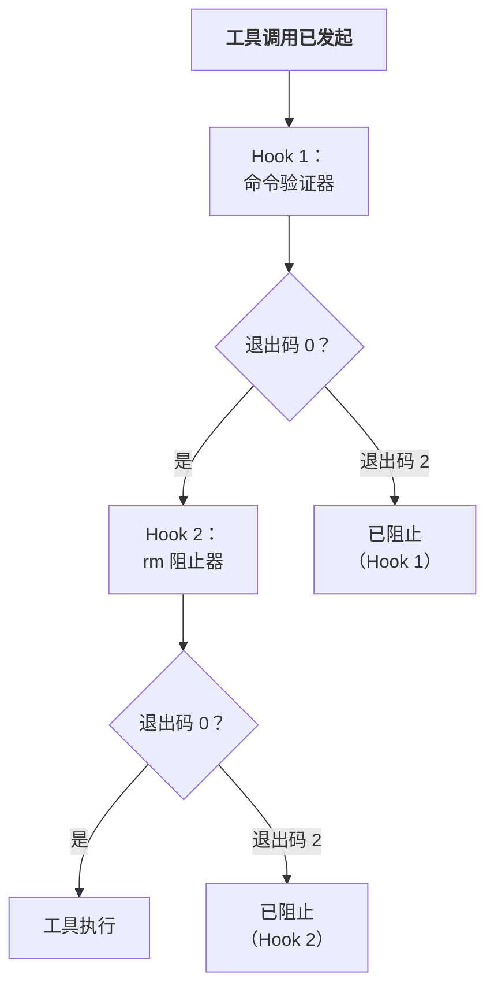
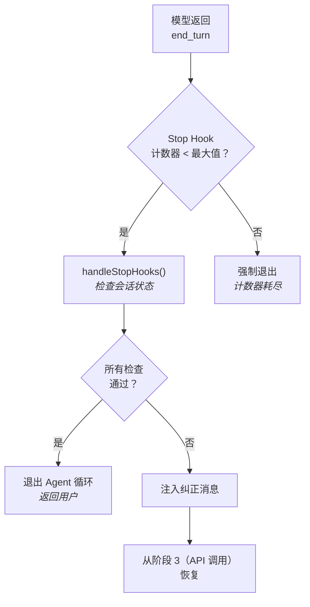
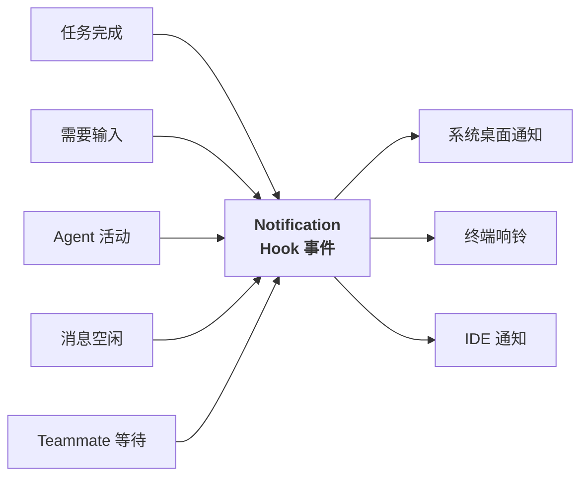

# Hooks 与生命周期事件

- 原文网址：https://y-agent.github.io/inside-claude-code/11-hooks-lifecycle.html
- 原文标题：Hooks & Lifecycle Events – Inside Claude Code
- 原文副标题：Core hook events for safety, auditing, and behavior modification
- 原文系列位置：III.4 — Hooks & Lifecycle
- 翻译日期：2026-07-27

> 本文是 Inside Claude Code 系列文章的完整简体中文翻译。代码、标识符、源码路径、配置字段、退出码和事件名称保持原样；相对链接已改为绝对链接。

## 引言：为什么生命周期 Hook 很重要

如何在不 fork 代码库的情况下，为 AI Agent 强制执行不变量？企业需要阻止向生产数据库写入数据；团队需要在每次写入文件后自动格式化；个人开发者需要记录每一条 Shell 命令。这些都是横切关注点——它们跨越每个子系统，需要能够组合、配置，并且独立于 Agent 核心代码存在。

Claude Code 的 Hook 解决了这个问题。你不需要修改工具执行代码来增加格式化、日志记录或门禁逻辑，而是配置在生命周期事件触发时运行的 Hook。每个 Hook 都是一个 Shell 命令——可以使用任意语言、任意工具——它通过环境变量接收上下文，并可以观察、修改或阻止某个动作。这种设计把 Claude Code 从一个行为固定的二进制程序，变成一条可配置的执行流水线；每个重要事件都可以被拦截。



**图 1：** 将 Hook 作为面向切面的编程应用于 AI Agent。六类横切关注点——审计日志（PostToolUse）、安全门禁（PreToolUse）、自动格式化（PostToolUse）、环境设置（SessionStart）、告警（Notification）和清理（Stop）——连接到核心 Agent 循环，但不修改其中任何代码。无论配置多少 Hook，Claude Code 的工具执行逻辑都保持不变；这既保留了可测试性，又支持任意定制。

**如何阅读此图。** 中央节点是保持不变的核心 Agent 循环。六类横切关注点向内辐射，每一类都标注了它连接的生命周期事件：审计日志和自动格式化使用 PostToolUse，安全门禁使用 PreToolUse，环境设置使用 SessionStart，告警使用 Notification，清理使用 Stop。箭头指向核心，表示 Hook 会观察或拦截 Agent，但不会改变 Agent 的内部逻辑。

### 发现的模式

PreToolUse/PostToolUse 这一对事件，正是企业 Java 中的 Intercepting Filter（拦截过滤器）模式：由一串过滤器在核心处理器之前和之后处理请求。在 Spring 中，它对应 `HandlerInterceptor.preHandle()` / `postHandle()`；在 Express.js 中，它对应 middleware。模式相同，只是应用领域不同。

**本文涉及的源文件：**

| 文件 | 用途 | 大小 |
|---|---|---:|
| `src/utils/hooks/hookEvents.ts` | Hook 事件类型定义（27 个生命周期事件） | 约 200 LOC |
| `src/utils/hooks/hookHelpers.ts` | Hook 执行辅助函数（启动、超时、结果解析） | 约 300 LOC |
| `src/utils/hooks/hooksConfigManager.ts` | Hook 配置加载和 matcher 分发 | 约 400 LOC |
| `src/utils/hooks/sessionHooks.ts` | 会话级 Hook 编排 | 约 250 LOC |
| `src/utils/hooks/postSamplingHooks.ts` | 采样后 Hook 集成（Stop Hook） | 约 200 LOC |
| `src/utils/hooks/execAgentHook.ts` | Agent 启动的 Hook 执行 | 约 150 LOC |
| `src/services/notifier.ts` | 通知投递（桌面、终端响铃、IDE） | 约 300 LOC |

## 核心 Hook 事件

Claude Code 暴露了超过 25 个生命周期事件（完整列表见[附录](#附录完整的-hook-事件列表)）。其中最重要、也是实际配置 Hook 时最常用的 10 个事件，会在 Agent 执行过程的特定位置触发。它们分为三类：能够阻止执行的**安全关键事件**、只观察而不阻止执行的**审计事件**，以及管理会话边界的**生命周期事件**。



**图 2：** 一次典型 Agent turn 中 10 个核心生命周期事件的时间线。安全关键事件（PreToolUse、PermissionRequest）位于工具执行之前，可以通过退出码 2 阻止执行。审计事件（PostToolUse、PostToolUseFailure）位于执行之后，观察结果但不改变结果。生命周期事件（SessionStart、UserPromptSubmit、PreCompact、PostCompact、Notification、Stop）标记会话边界和上下文管理里程碑。只有安全关键事件可以改变执行路径。

**如何阅读此图。** 从顶部的 SessionStart 开始，沿箭头向下跟踪一次 Agent turn 的时间线。安全关键事件（PreToolUse、PermissionRequest）出现在中央的“工具执行”节点之前，它们是唯一能够改变执行路径的事件。工具执行后，流程分叉：成功进入 PostToolUse，失败进入 PostToolUseFailure。剩余的生命周期事件（Notification、PreCompact/PostCompact、Stop）在会话逐渐结束时发生。

下表是这 10 个核心事件的参考：

| 事件 | 类别 | 能否阻止？ | 触发时机 | 可用上下文 |
|---|---|---|---|---|
| SessionStart | 生命周期 | 否 | 会话开始 | 会话 ID、工作目录 |
| UserPromptSubmit | 生命周期 | 否 | 用户提交 prompt | prompt 文本、会话状态 |
| PreToolUse | 安全 | **可以（退出码 2）** | 任意工具执行前 | 工具名称、输入参数 |
| PermissionRequest | 安全 | **可以（自动解析）** | 触发权限检查 | 工具、权限级别、参数 |
| PostToolUse | 审计 | 否 | 工具成功后 | 工具名称、输入、输出 |
| PostToolUseFailure | 审计 | 否 | 工具失败后 | 工具名称、输入、错误 |
| PreCompact | 生命周期 | 否 | 上下文压缩前 | token 数量、消息数量 |
| PostCompact | 生命周期 | 否 | 上下文压缩后 | 新 token 数量、移除数量 |
| Notification | 生命周期 | 否 | Agent 发送通知时 | 通知文本、类型 |
| Stop | 生命周期 | 否 | 会话结束 | 会话 ID、turn 数量 |

关键区别在于：只有 **PreToolUse** 和 **PermissionRequest** 能够改变执行路径。PreToolUse Hook 返回退出码 2 时，会完全阻止工具执行——模型会被告知该动作被拒绝，并且必须尝试其他方法。PermissionRequest Hook 可以自动解析权限检查，从而绕过用户提示。所有其他事件都是观察性的：Hook 会运行，但它的结果不会改变接下来发生的事情。

### 系统提示如何告诉模型 Hook 的存在

系统提示包含一个 Hook 部分，把 Hook 描述为由用户控制的拦截器：

> “用户可以在设置中配置 Hook——这些 Shell 命令会响应工具调用等事件而执行。将 Hook 的反馈（包括 `<user-prompt-submit-hook>`）视为来自用户的反馈。如果你被 Hook 阻止，请判断是否可以相应地调整操作；如果不能，请让用户检查 Hook 配置。”

这种表述非常重要：模型会把 Hook 输出当作用户反馈，而不是系统噪声。当 PreToolUse Hook 以“`src/generated/` 中的文件是自动生成的——不要编辑”为理由阻止一次 `Write` 调用时，模型会像处理用户亲自输入的这条指令一样处理它。这正是 Hook 能成为有效行为约束的原因——它们以用户的权威发言。

## Hook 配置：`settings.json` 格式

Hook 使用基于 matcher 的分发系统配置在 `settings.json` 中。每个 Hook 定义指定一个事件、一个可选的 matcher（用于筛选哪些调用会触发它），以及一个或多个要执行的 Shell 命令。

```json
{
  "hooks": {
    "PreToolUse": [
      {
        "matcher": { "tool": "Bash" },
        "hooks": [
          {
            "type": "command",
            "command": "python3 /path/to/validate_bash.py"
          }
        ]
      }
    ],
    "PostToolUse": [
      {
        "matcher": { "tool": "Write" },
        "hooks": [
          {
            "type": "command",
            "command": "prettier --write $FILE_PATH"
          }
        ]
      }
    ],
    "SessionStart": [
      {
        "hooks": [
          {
            "type": "command",
            "command": "echo 'Session started' >> /tmp/claude-audit.log"
          }
        ]
      }
    ]
  }
}
```

Matcher 在三个维度上进行筛选：

- **工具名称**（`"tool": "Bash"`）——匹配特定工具；
- **命令模式**（`"command": "rm *"`）——匹配包含某种模式的 Shell 命令；
- **文件模式**（`"file": "*.py"`）——匹配针对特定路径的文件操作。

如果不指定 matcher，Hook 会在该事件的每次调用中触发。同一事件上的多个 Hook 按顺序执行——如果某个 PreToolUse Hook 失败，会在后续 Hook 运行前阻止执行。这种顺序执行保证了确定性行为：Hook 以流水线方式组合，而不是以并发处理器方式组合。

配置可以位于三个位置，遵循与 Claude Code 其他设置相同的级联语义：

1. **项目级**（`.claude/settings.json`）——应用于特定仓库；
2. **用户级**（`~/.claude/settings.json`）——应用于某个用户的所有项目；
3. **企业级**（托管策略）——应用于整个组织。

对于相同的事件和 matcher，项目级 Hook 会覆盖用户级 Hook。这意味着团队可以在仓库中定义标准 Hook，同时个人开发者也可以添加不会产生冲突的个人 Hook。

## 执行模型：Shell 命令与退出码语义

Hook 以子进程中的 Shell 命令执行。Hook 通过**环境变量**接收上下文——工具名称、输入参数、文件路径和会话 metadata 等，都可以通过 `$TOOL_NAME`、`$TOOL_INPUT`、`$FILE_PATH` 以及类似变量获取。Hook 的 stdout 会被捕获，并可以反馈给模型。

退出码决定执行结果：



**图 3：** Hook 退出码语义展示了一次 Hook 调用可能产生的三种结果。退出码 0 表示批准，工具正常继续，同时 stdout 会作为系统提醒捕获。退出码 2 表示有意拒绝，工具被阻止，模型会收到解释原因的 `hook-blocking-error` 消息。其他退出码表示 Hook 脚本自身出错；错误会被记录，但不一定阻止执行。使用退出码 2 而不是 1 来表示阻止，是为了避免脚本以退出码 1 崩溃时产生误判。

**如何阅读此图。** 从顶部的 Hook Shell 命令执行开始。三个分支分别代表三类退出码。左侧分支（退出码 0）进入正常操作，stdout 被捕获为系统提醒。中间分支（退出码 2）阻止工具执行，并告诉模型尝试其他方法。右侧分支（其他退出码）表示 Hook 脚本自身出错；错误会被记录，但不一定停止执行。关键区别是：只有退出码 2 会被视为有意拒绝。

- **退出码 0——成功。** Hook 成功运行并批准操作，或者完成观察而没有提出异议。对于 PreToolUse，它表示“继续”；对于 PostToolUse，它表示“已记录观察结果”。
- **退出码 2——阻止。** 拒绝该动作。它只对 PreToolUse 和 PermissionRequest 有阻止意义。工具不会执行，模型会收到说明动作被阻止的 `hook-blocking-error` 系统提醒。
- **任何其他退出码——错误。** Hook 自身失败（崩溃、超时、配置错误）。对于 PreToolUse，具体行为取决于失败模式：硬失败可能阻止工具，软失败可能只记录日志并继续。

选择退出码 2 而不是退出码 1 来表示阻止，是有意为之的。退出码 1 是 Unix 中“出现问题”的通用信号；退出码 2 通常表示“Shell 内置命令使用错误”，是 Hook 脚本意外产生的概率较低的代码。这可以减少误判：一个未捕获异常的 Python 脚本通常以退出码 1 退出（表示错误，而非有意阻止），而脚本只有在明确决定拒绝动作时才返回退出码 2。

## 反馈循环：系统提醒

让 Hook 对模型有用，而不只是对人类有用的关键细节是：Hook 的结果会通过系统提醒反馈回对话。如果没有反馈，Hook 对模型就是不可见的。模型不会知道自己的 Write 后面运行了 prettier，也不会知道自己的 Bash 命令被安全 Hook 阻止了。

四种提醒类型用于传达发生了什么：

| 提醒类型 | 含义 | 模型行为 |
|---|---|---|
| `hook-success` | Hook 运行并批准了操作 | 正常继续 |
| `hook-blocking-error` | Hook 拒绝了操作 | 尝试其他方法 |
| `hook-stopped-continuation` | Hook 停止了会话 | 停止并报告 |
| `hook-additional-context` | Hook 提供了额外信息 | 将信息纳入推理 |

`hook-additional-context` 类型尤其强大。PostToolUse Hook 可以对模型刚写入的文件运行 linter，并将 linter 输出注入额外上下文。模型随后会在下一轮看到 lint 错误并修复它们——这就形成了一个不需要人工干预的紧密自动反馈循环。这与 CI/CD 流水线在每次提交时运行检查的模式相同，只不过反馈循环发生在单个 Agent 会话内部，而不是跨越多次 Git push。

## 使用场景：Lint、日志和自定义权限门禁

抽象架构可以通过使用场景具体体现。下面的例子展示三种主要模式：**强制执行**（阻止不安全操作）、**自动化**（运行副作用操作）和**审计**（记录发生了什么）。

### 强制执行：阻止向生产数据库写入

```json
{
  "hooks": {
    "PreToolUse": [{
      "matcher": { "tool": "Bash", "command": "*production*" },
      "hooks": [{
        "type": "command",
        "command": "echo 'BLOCKED: production commands are not allowed' && exit 2"
      }]
    }]
  }
}
```

任何包含 `production` 的 Bash 命令都会在执行前被阻止。模型收到阻止消息，并被告知尝试其他方法。这是最简单的策略强制形式：匹配命令字符串，然后硬拒绝。

### 自动化：写入后自动格式化

```json
{
  "hooks": {
    "PostToolUse": [{
      "matcher": { "tool": "Write", "file": "*.ts" },
      "hooks": [{
        "type": "command",
        "command": "prettier --write $FILE_PATH && eslint --fix $FILE_PATH"
      }]
    }]
  }
}
```

每次写入 TypeScript 文件后，都会运行 Prettier 格式化和 ESLint 自动修复。模型不需要知道这些工具，也不需要记住运行它们。无论模型生成了什么内容，Hook 都能保证格式一致。这是应用在工具层面的 Decorator 模式：不改变 Write 工具的接口，就透明地增强它的行为。

### 审计：记录所有工具调用

```json
{
  "hooks": {
    "PostToolUse": [{
      "hooks": [{
        "type": "command",
        "command": "echo \"$(date -u) | $TOOL_NAME | $SESSION_ID\" >> /var/log/claude-audit.log"
      }]
    }]
  }
}
```

每次工具调用都会以时间戳、工具名称和会话 ID 记录日志。不指定 matcher 意味着 Hook 会对每个工具触发。这会建立 Agent 行为的完整审计轨迹，对于企业合规和调试都十分重要。

### 组合：同一事件上的多个 Hook

Hook 可以自然组合。单个 PreToolUse 事件可以有多个带不同 matcher 的 Hook 条目，它们会按顺序执行：

```json
{
  "hooks": {
    "PreToolUse": [
      {
        "matcher": { "tool": "Bash" },
        "hooks": [{ "type": "command", "command": "python3 validate_commands.py" }]
      },
      {
        "matcher": { "tool": "Bash", "command": "rm *" },
        "hooks": [{ "type": "command", "command": "echo 'BLOCKED: rm not allowed' && exit 2" }]
      }
    ]
  }
}
```

第一个 Hook 通过 Python 脚本验证所有 Bash 命令。第二个 Hook 专门阻止任何 `rm` 命令。如果第一个 Hook 通过，第二个 Hook 仍然会运行；如果任意一个 Hook 返回退出码 2，工具就会被阻止。这种顺序组合类似 Web 框架中的 middleware stack：每一层都可以放行、修改或拒绝请求。



**图 4：** PreToolUse 事件中 Hook 组合形成的顺序流水线。两个拥有不同 matcher 的 Hook 按顺序执行：Hook 1（命令验证器）先运行；如果通过（退出码 0），Hook 2（rm 阻止器）继续运行。如果任意一个 Hook 返回退出码 2，执行立即停止，工具被阻止。这种顺序组合保证了确定性行为，类似 Web 框架中的 middleware stack，每一层都可以放行、修改或拒绝请求。

**如何阅读此图。** 从顶部发起工具调用开始。流程先经过 Hook 1（命令验证器），然后进入判断节点：如果退出码为 0，继续到 Hook 2（rm 阻止器）；如果退出码为 2，工具立即被阻止。Hook 2 也采用同样模式：退出码 0 进入工具执行，退出码 2 阻止工具。关键是它具有顺序执行和短路特性：任意 Hook 返回退出码 2，都会在后续 Hook 运行前停止流水线。

## Stop Hook：Agent 循环的收敛守卫

**Stop Hook 是 Hook 架构中的特殊情况：当模型发出 `end_turn` 信号时，它会触发，但发生在 Agent 循环真正退出之前。** 它的任务是捕捉过早终止——也就是模型认为自己完成了任务，但仍有工作未完成的情况。

该机制位于 Agent 循环的 `CHECK STOP REASON` 状态（参见[端到端工作流](https://y-agent.github.io/inside-claude-code/01-end-to-end-workflow.html)）。当模型响应的 `stop_reason` 为 `"end_turn"` 时，循环会在把控制权交还给用户前调用 `handleStopHooks()`。Stop Hook 处理器检查会话状态，并决定模型是否应该继续。



**图 5：** Stop Hook 决策流程。当模型发出 `end_turn` 信号时，Stop Hook 处理器检查会话状态——例如文件编辑之后是否运行了测试、原始任务是否已经处理、模型的最终消息是否构成合理的完成结果。如果任意检查失败，就注入纠正消息，并从 API 调用阶段恢复循环。计数器限制 Stop Hook 在单个会话中触发的次数，防止收敛守卫自身发散。

**如何阅读此图。** 从模型返回 `end_turn` 开始。第一个判断节点检查 Stop Hook 计数器是否超限；如果超限，循环强制退出，防止无限循环。如果计数器尚未达到上限，调用 `handleStopHooks()` 检查会话状态。如果所有检查通过，Agent 正常退出。如果任意检查失败（例如编辑了文件但没有运行测试），就注入纠正消息，循环从 API 调用阶段恢复。这形成了一个有界的自我修正循环。

### Stop Hook 检查什么

`handleStopHooks()` 函数会检查对话历史，寻找表明工作未完成的模式：

- **编辑后未测试。** 如果模型修改了源文件（通过 Edit 或 Write），却从未调用 Bash 运行测试，Stop Hook 会注入纠正消息：

  > “你修改了源文件，但没有运行测试套件。请验证你的改动。”

  这是最常见的 Stop Hook 触发原因。

- **构建未验证。** 如果模型修改了配置文件（`package.json`、`tsconfig.json`、`Makefile`），却从未运行构建命令，Hook 会指出这个缺口。

- **任务未完成信号。** `stopHookResult.preventContinuation` 标志允许 Hook 明确阻止循环退出，并返回原因字符串（例如 `"stop_hook_prevented"`）；该原因会被记录下来用于调试。

### 计数器守卫

Stop Hook 自身也可能导致发散：模型运行测试，测试失败；模型修改代码，发出 `end_turn`；Stop Hook 再次触发；循环重复。为防止这种情况，计数器会跟踪当前会话中 Stop Hook 的触发次数。达到上限后，无论 Hook 的结果如何，循环都会退出。

这是一种元终止守卫：对“终止条件”本身再施加一个终止条件。

## 通知系统：跨渠道告警

**Notification 生命周期事件是核心 Hook 事件之一，但它背后连接着一个完整的通知子系统，其中包含五种触发类型、可配置的投递渠道和空闲检测逻辑。**

通知解决了一个特定的用户体验问题：当 Claude Code 在后台运行时——例如子 Agent 正在编译项目，或 Teammate 正在等待输入——用户如何知道有事情需要处理？答案是一条可配置的通知流水线：它通过 Notification Hook 事件触发，并通过用户偏好的渠道发送告警。



**图 6：** 通知流程展示五种触发类型（任务完成、需要输入、Agent 活动、消息空闲、Teammate 等待）如何汇聚到 Notification Hook 事件，再分发到三个可配置的投递渠道（系统桌面、终端响铃、IDE 通知）。`preferredNotifChannel` 设置控制路由；值为 `auto` 时，根据执行上下文选择最佳渠道。由于通知通过 Hook 分发，用户可以拦截通知，并将其自定义路由到 Slack、电子邮件或其他服务。

**如何阅读此图。** 左侧五种触发类型全部汇聚到中央的 Notification Hook 事件中心，随后从中心分发到右侧三个投递渠道。它是一个漏斗结构：多个输入信号先通过一个 Hook 事件标准化，然后投递到用户偏好的输出渠道。

### 五种 Notification 触发器

每种触发类型对应一种需要用户注意的场景：

| 触发器 | 设置 | 默认值 | 触发时机 |
|---|---|---:|---|
| 任务完成 | `taskCompleteNotifEnabled` | `true` | 后台子 Agent 完成执行 |
| 需要输入 | `inputNeededNotifEnabled` | `true` | Agent 需要用户输入（权限提示、问题） |
| Agent 活动 | `agentPushNotifEnabled` | `true` | Teammate 空闲摘要、团队协调事件 |
| 消息空闲 | `messageIdleNotifThresholdMs` | `60000`（1 分钟） | 在配置的阈值内没有用户交互 |
| Teammate 等待 | （通过 Agent push） | `true` | 持久 Teammate 进入空闲并等待新任务 |

空闲通知在运行层面最值得关注。`messageIdleNotifThresholdMs` 设置（默认 60 秒）会在 Agent 完成响应时启动计时器。如果用户在阈值时间内没有响应，就会触发通知。这处理了一个常见场景：用户切换到另一个窗口，忘记 Claude Code 正在等待，几分钟过去了；通知会把用户拉回来。

### 投递渠道

`preferredNotifChannel` 设置（默认值：`"auto"`）控制通知如何到达用户：

- **系统桌面**——原生操作系统通知（macOS Notification Center、Linux `notify-send`）；
- **终端响铃**——发送 `\a` 字符，触发终端模拟器的响铃行为（通常表现为 Dock 徽标或标题闪烁）；
- **IDE 通知**——通过 VS Code 或 JetBrains 扩展的通知 API 发送；
- **Auto**——系统根据上下文选择最佳渠道：在扩展中运行时使用 IDE 通知，在独立终端中运行时使用系统桌面通知。

### Hook 集成

由于通知通过 Notification Hook 事件分发，用户可以拦截并定制通知。为 Notification 事件配置的 Hook 会通过环境变量接收通知文本和类型。这样可以实现：

- **自定义路由**——将通知转发到 Slack、电子邮件或 Webhook；
- **过滤**——抑制某些触发类型的通知；
- **丰富内容**——为通知消息增加项目上下文或链接。

```json
{
  "hooks": {
    "Notification": [{
      "hooks": [{
        "type": "command",
        "command": "curl -X POST $SLACK_WEBHOOK -d '{\"text\": \"Claude Code: $NOTIFICATION_TEXT\"}'"
      }]
    }]
  }
}
```

这与其他 Hook 事件使用的是同一种扩展模型——带环境变量上下文的 Shell 命令——只是应用在告警层，而不是执行层。

**通知系统提醒。** 通知触发时，系统会以 `<system-reminder>` 标签的形式向对话注入提醒。五种触发类型会生成通知：任务完成、需要输入、Agent 活动、消息空闲（默认 60 秒后）和 Teammate 等待。可用的投递渠道有三个：系统桌面通知、终端响铃和 IDE 通知。`preferredNotifChannel` 设置（默认值：`"auto"`）选择渠道；每个事件的设置（`taskCompleteNotifEnabled`、`inputNeededNotifEnabled`、`agentPushNotifEnabled`）提供细粒度控制。

## Hook 在整体扩展架构中的位置

在 Claude Code 的扩展机制中，Hook 具有独特位置：MCP 增加新能力（参见[模型上下文协议](https://y-agent.github.io/inside-claude-code/10-model-context-protocol.html)），Skills 修改推理方式（参见[Skills 系统](https://y-agent.github.io/inside-claude-code/12-skills-system.html)），Plugins 组合完整技术栈（参见[Plugin 架构](https://y-agent.github.io/inside-claude-code/13-plugin-architecture.html)），而 Hook 是整个系统中唯一的强制执行机制。

| 机制 | 作用 | 能否阻止？ |
|---|---|---|
| MCP | 增加外部工具能力 | 否 |
| Skills | 通过 prompt 注入修改 Agent 行为 | 否 |
| Custom Agent | 创建拥有受限工具的隔离角色 | 否 |
| Slash Commands | 直接赋予用户控制权 | 否 |
| **Hooks** | **拦截执行流水线** | **可以（退出码 2）** |

这种独特性正是 Hook 对企业部署至关重要的原因。Skill 可以建议 Agent 避免某些动作；MCP 可以提供更安全的替代方案；但只有 Hook 能够强制执行不变量。如果策略规定“永远不要删除生产数据”，Skill 可以要求模型遵守，但 Hook 才能保证这一点。指导和强制之间的差别，就是建议和法律之间的差别。

Hook 也能无缝作用于 MCP 工具。配置一个匹配 `mcp__github__*` 的 Hook，就可以拦截每一个 GitHub MCP 工具调用，并像处理内置工具一样应用审计日志和策略强制。这是因为 MCP 工具在工具 registry 中是一等公民；对于 Hook 来说，`Bash` 和 `mcp__github__create_issue` 没有区别。

## 总结

Claude Code 的 Hook 系统揭示了几条适用于任何需要用户可配置行为修改系统的设计原则。

**Hook 是 Shell 命令，而不是 Plugin。** 这是有意选择的简单方案。任意语言都可以用作 Hook 处理器；一行 Bash 脚本和复杂的 Python 验证器同样可行。代价是能力与可移植性之间的权衡——Shell 命令普遍可用，但缺少 Plugin SDK 的类型安全和可组合性。对于必须集成任意开发者工作流的 AI Agent 来说，Shell 命令的普适性胜过类型化 API 的优雅。

**退出码语义必须明确无歧义。** 选择退出码 2 表示“阻止”，而不是退出码 1，可以避免脚本崩溃造成误判。在一个误判意味着 Agent 无法使用工具的系统中，这种区别很重要。退出码方案中的每个约定，都在降低 Hook 意外阻止合法操作的风险。

**向模型反馈是不可妥协的要求。** 只在后台运行的 Hook 系统——阻止工具却不解释原因、运行格式化器却不告知模型——会让模型困惑，不知道自己的动作为何成功或失败。系统提醒闭合了反馈回路：模型知道发生了什么、为什么发生，以及下一步应该做什么。这把面向人类的策略机制，转变成了面向模型的协作协议。

**唯一的强制点必须是最重要的点。** 在 Claude Code 的六种扩展机制中，Hook 是唯一能够阻止动作的机制。将强制执行集中到一个定义清晰的系统中，是有意的设计：审计当前生效的约束时，只有一个地方需要查看；定义策略时，只有一种格式；推理执行行为时，也只有一个执行模型。将强制逻辑分散到多种机制中，会让系统更难审计，也更容易被绕过。

## 附录：完整的 Hook 事件列表

正文详细介绍的 10 个事件在运行层面最重要，但完整 SDK 定义了 27 个 Hook 事件类型。许多额外事件用于可观测性、协调和配置跟踪。Hook 事件类型定义在：

```text
src/utils/hooks/hookEvents.ts
```

| # | 事件 | 类别 | 能否阻止？ | 实现位置 | 说明 |
|---:|---|---|---|---|---|
| 1 | **PreToolUse** | 安全 | 是（退出码 2） | `src/utils/hooks/hookHelpers.ts` | 每次工具调用前触发 |
| 2 | **PostToolUse** | 审计 | 否 | `src/utils/hooks/hookHelpers.ts` | 工具成功后触发 |
| 3 | **PostToolUseFailure** | 审计 | 否 | `src/utils/hooks/hookHelpers.ts` | 工具出错后触发 |
| 4 | **Notification** | 生命周期 | 否 | `src/services/notifier.ts` | 告警投递（桌面/响铃/IDE） |
| 5 | **UserPromptSubmit** | 生命周期 | 是 | `src/utils/hooks/execPromptHook.ts` | 用户提交 prompt |
| 6 | **SessionStart** | 生命周期 | 否 | `src/utils/hooks/sessionHooks.ts` | 会话开始 |
| 7 | **SessionEnd** | 生命周期 | 否 | `src/utils/hooks/sessionHooks.ts` | 会话结束 |
| 8 | **Stop** | 生命周期 | 否 | `src/utils/hooks/postSamplingHooks.ts` | Agent 停止（`end_turn`） |
| 9 | **StopFailure** | 生命周期 | 否 | `src/utils/hooks/postSamplingHooks.ts` | Agent 未能干净地停止 |
| 10 | **SubagentStart** | Agent | 否 | `src/utils/hooks/execAgentHook.ts` | 子 Agent 启动 |
| 11 | **SubagentStop** | Agent | 否 | `src/utils/hooks/execAgentHook.ts` | 子 Agent 完成 |
| 12 | **PreCompact** | 生命周期 | 否 | `src/services/compact/compact.ts` | 上下文压缩前 |
| 13 | **PostCompact** | 生命周期 | 否 | `src/services/compact/compact.ts` | 上下文压缩后 |
| 14 | **PermissionRequest** | 安全 | 是 | `src/hooks/useCanUseTool.tsx` | 可以自动解析权限 |
| 15 | **PermissionDenied** | 安全 | 否 | `src/hooks/useCanUseTool.tsx` | 权限被拒绝 |
| 16 | **Setup** | 生命周期 | 否 | `src/utils/hooks/sessionHooks.ts` | 初始设置阶段 |
| 17 | **TeammateIdle** | Agent | 否 | `src/tools/AgentTool/runAgent.ts` | 持久 Teammate 进入空闲 |
| 18 | **TaskCreated** | Agent | 否 | `src/tools/TaskCreateTool/` | 后台任务创建 |
| 19 | **TaskCompleted** | Agent | 否 | `src/tools/TaskStopTool/` | 后台任务完成 |
| 20 | **Elicitation** | 交互 | 否 | `src/tools/AskUserQuestionTool/` | Agent 提出澄清问题 |
| 21 | **ElicitationResult** | 交互 | 否 | `src/tools/AskUserQuestionTool/` | 用户回应澄清问题 |
| 22 | **ConfigChange** | 配置 | 否 | `src/utils/settings/settings.ts` | 设置被修改 |
| 23 | **WorktreeCreate** | Git | 否 | `src/tools/EnterWorktreeTool/` | Git worktree 创建 |
| 24 | **WorktreeRemove** | Git | 否 | `src/tools/ExitWorktreeTool/` | Git worktree 移除 |
| 25 | **InstructionsLoaded** | 生命周期 | 否 | `src/utils/claudemd.ts` | `CLAUDE.md` / 指令解析完成 |
| 26 | **CwdChanged** | 生命周期 | 否 | `src/utils/hooks/hookHelpers.ts` | 工作目录改变 |
| 27 | **FileChanged** | 文件系统 | 否 | `src/utils/hooks/fileChangedWatcher.ts` | 被监视的文件在磁盘上发生改变 |

大多数 Hook 配置会使用正文介绍的 10 个核心事件。其他事件则可用于高级可观测性、CI/CD 集成和多 Agent 协调工作流。

系列下一篇：[VI.2：Skills 系统](https://y-agent.github.io/inside-claude-code/12-skills-system.html)——介绍 `SKILL.md` 文件如何将领域专业知识注入 system prompt，把通用 Agent 转变为专业 Agent。
