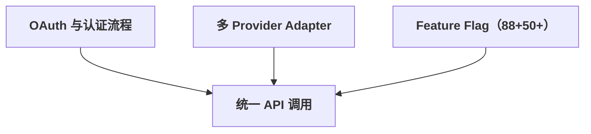
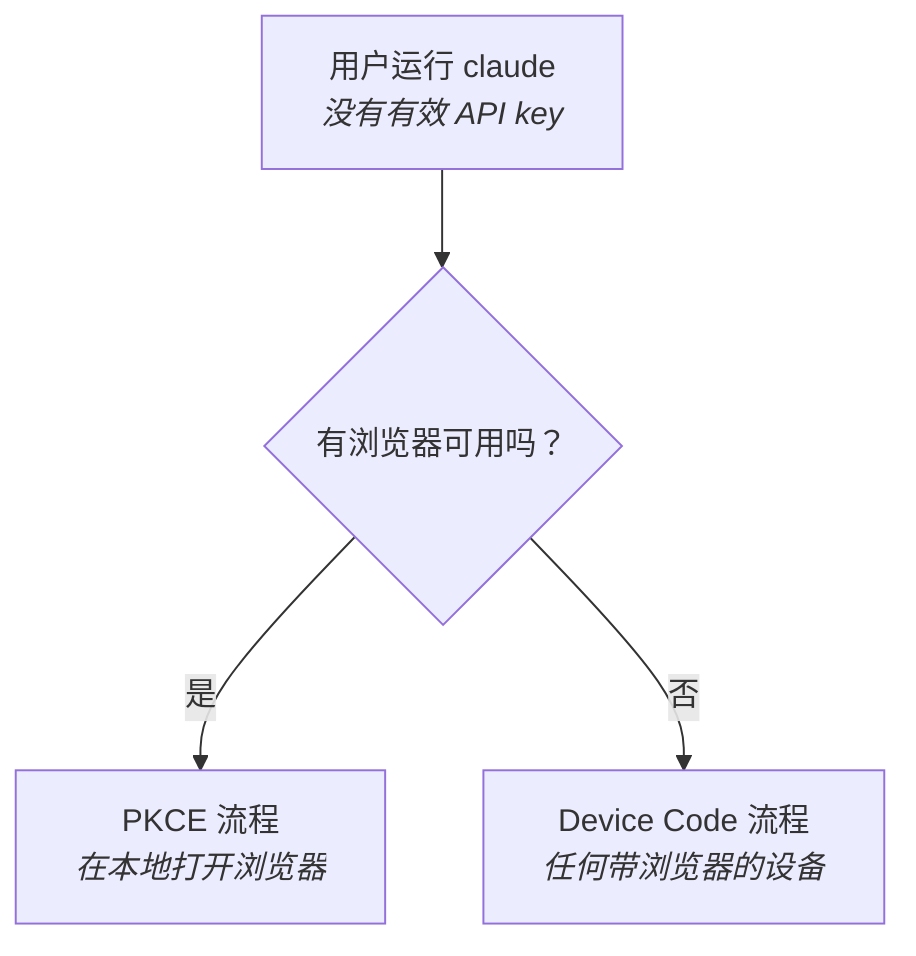
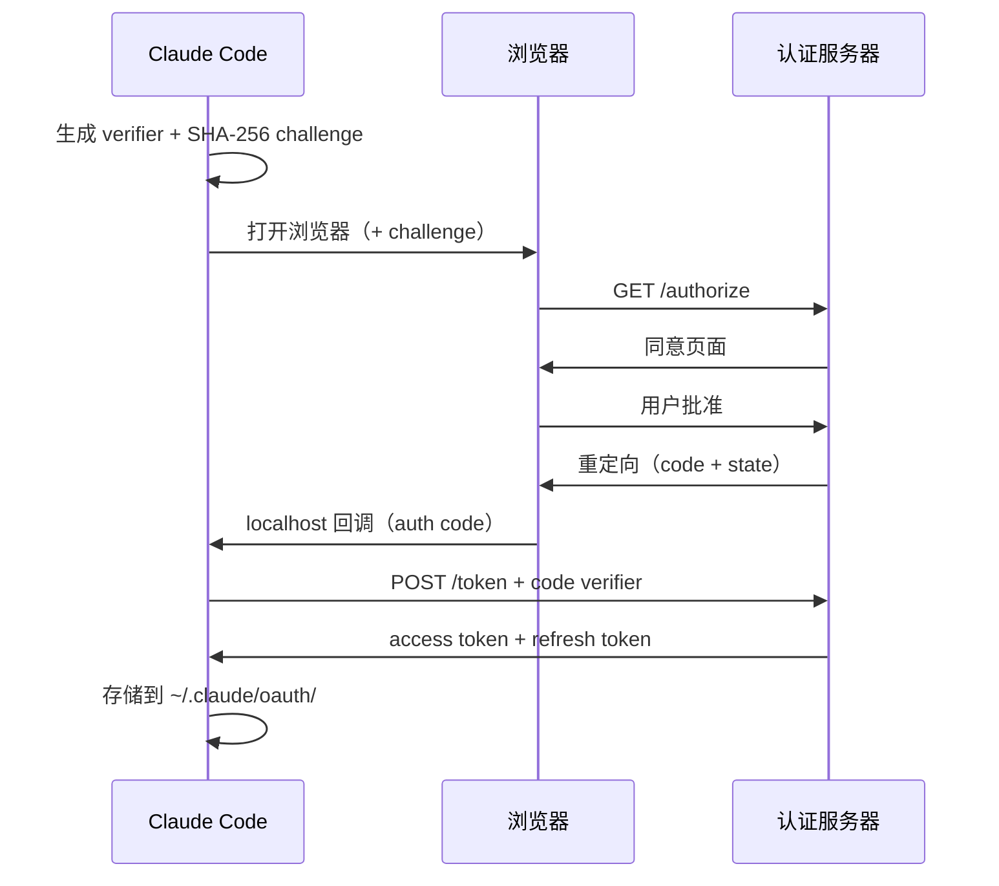
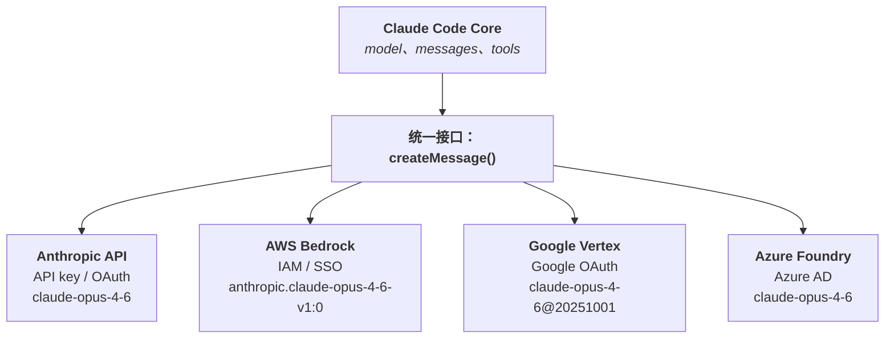
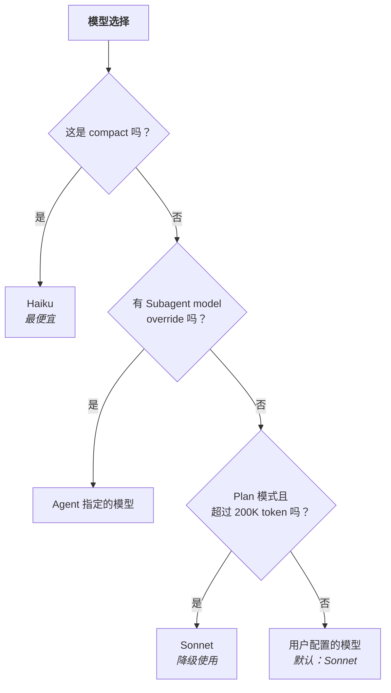
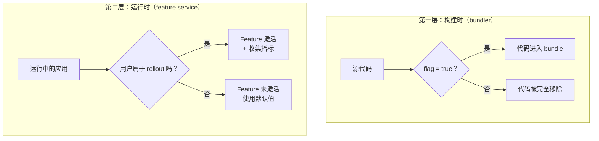
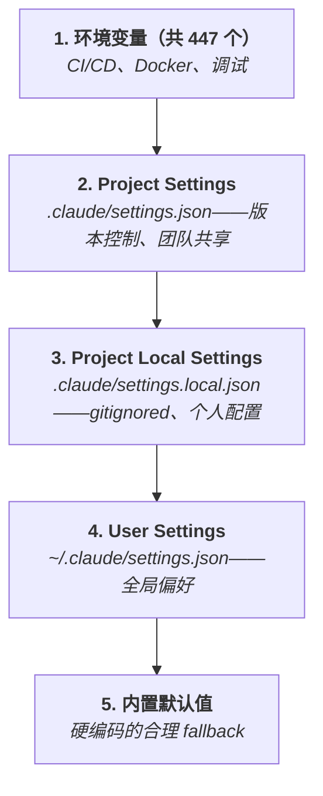

# 认证、Provider 与 Feature Flag

- 原文网址：https://y-agent.github.io/inside-claude-code/09-auth-providers-flags.html
- 原文标题：Auth, Providers & Feature Flags
- 原文副标题：OAuth, Adapters, and Continuous Delivery Infrastructure
- 原文系列位置：V.2 — Auth, Providers & Flags
- 翻译日期：2026-07-27

> 本文是 Inside Claude Code 系列文章的完整简体中文翻译。代码、标识符、环境变量、配置字段、源码路径和指标保持原样；相对链接已改为绝对链接。

如何让没有浏览器的终端应用登录用户？一个代码库如何与四个不同的云 Provider 通信，而每个 Provider 都有自己的认证方案、模型 ID 格式和功能发布节奏？又如何在不破坏生产环境的情况下，把 88 个实验性功能部署到 CLI 工具中？

这三个问题——认证、多 Provider 支持和 Feature Flag——组成了把 Demo 与产品分开的隐形基础设施层。它们都不涉及巧妙的 Prompt 或 Agent loop，但对于让 Claude Code 在企业规模上可靠运行却不可或缺。

本文介绍 Claude Code 基础设施的三个支柱：适配终端环境的 OAuth 流程、应用于 LLM Provider 的 Adapter 模式，以及让 CLI 工具能够持续交付的双层 Feature Flag 系统。



**图 1：** 三个基础设施支柱——认证、多 Provider Adapter 和 Feature Flag——汇聚到统一 API 调用路径。每个支柱解决一个不同的企业需求（身份、可移植性和安全部署），但每次 API 请求都必须让三者协同工作。移除任意一个支柱，Claude Code 都会从生产系统退化为原型。

**如何阅读此图。** 顶部三个框代表三个基础设施支柱，分别解决不同的企业需求。三条箭头汇聚到下方唯一的“统一 API 调用”框，说明每次 API 请求都必须经过这三个系统。

**本文涉及的源文件：**

| 文件 | 用途 | 大小 |
|---|---|---:|
| `src/utils/auth.ts` | 认证工具（Token 管理、keyring） | 约 800 LOC |
| `src/services/oauth/` | OAuth 2.0 PKCE + device code 流程 | 5 个文件 |
| `src/utils/model/model.ts` | 模型选择和路由逻辑 | 约 400 LOC |
| `src/utils/model/providers.ts` | 多 Provider 支持（Anthropic、Bedrock、Vertex、Azure） | 约 300 LOC |
| `src/utils/model/bedrock.ts` | AWS Bedrock 专用 Adapter | 约 200 LOC |
| `src/services/api/getModel.ts` | 运行时模型选择（`getRuntimeMainLoopModel()`） | 约 200 LOC |
| `src/services/analytics/growthbook.ts` | GrowthBook Feature Flag 客户端 | 约 300 LOC |
| `src/services/analytics/` | Telemetry、Datadog 指标、事件日志 | 9 个文件 |
| `src/utils/settings/settings.ts` | 设置管理（user/project/local/managed） | 约 500 LOC |

## 终端应用的 OAuth：没有浏览器时怎么办

**CLI 应用面临一个独特的认证挑战：标准的“跳转浏览器、获取回调”流程假设存在 GUI，而终端应用没有 GUI。**

想想 Web 应用的登录过程：点击“使用 Google 登录”，浏览器打开，用户批准，浏览器重定向回应用。之所以可行，是因为 Web 应用拥有一个授权服务器可以重定向到的 URL。终端应用没有 URL，它只有 `stdin` 和 `stdout`。OAuth 以浏览器为中心的设计与终端的纯文本界面之间的错位，就是 Claude Code 必须解决的核心 UX 挑战。

Claude Code 实现了两种 OAuth 流程，分别面向不同环境。选择不是偏好问题，而取决于当前是否实际存在浏览器。



**图 2：** OAuth 流程选择逻辑。单个二元决策（浏览器是否可用）把用户路由到两条认证路径之一。PKCE 在本地打开浏览器并在 localhost 捕获回调；Device Code 显示一段短代码，用户可以在任何带浏览器的设备中输入。无论是带 GUI 的笔记本还是无头 SSH session，每种开发环境都有可用的认证路径。

**如何阅读此图。** 从顶部开始：用户运行 `claude`，但没有有效 API key。菱形节点只询问一个问题：浏览器是否可用？“是”进入 PKCE 流程（同一台机器打开本地浏览器）；“否”进入 Device Code 流程（用户在任何带浏览器的设备中输入短代码）。

### PKCE：localhost 技巧

PKCE（Proof Key for Code Exchange）是一种让公共客户端安全认证的协议。公共客户端无法安全保存 secret，例如 CLI 工具；PKCE 是笔记本开发者的主要认证流程。

技巧简单但很巧妙：Claude Code 在 `localhost` 启动临时 HTTP server，然后在用户浏览器中打开授权 URL。用户批准后，授权服务器重定向到 `http://localhost:{PORT}/callback`，Claude Code 的临时 server 正在这里监听。CLI 捕获授权码，关闭 server，再用授权码交换 Token。

“proof key”部分增加了关键安全层。在打开浏览器之前，Claude Code 生成随机 `code_verifier`，只把它的 SHA-256 hash（`code_challenge`）发送给授权服务器。交换授权码获取 Token 时，Claude Code 提交原始 verifier，证明请求确实由自己发起。即使攻击者截获授权码，没有 verifier 也无法交换 Token。



**图 3：** PKCE 流程展示 Claude Code、用户浏览器和授权服务器之间的完整握手。关键安全属性是承诺方案结构：批准前发送 SHA-256 challenge，只有在 Token 交换时才揭示原始 verifier，从而防止授权码拦截攻击。Token 存储在 `~/.claude/oauth/`，用于静默重新认证。

**如何阅读此图。** 时间从上向下流动。三个参与者交换消息：Claude Code 先生成 verifier 和 challenge，然后经过浏览器重定向流程。关键安全属性体现在不对称性上：SHA-256 challenge 早期发送，而原始 verifier 只在 Token 交换阶段揭示，因此即使拦截授权码也无法完成攻击。

### Device Code 流程：面向无头环境

PKCE 需要本地浏览器。对于 SSH session、远程服务器、CI pipeline 和 Docker 容器，Claude Code 会退回 Device Code 流程。这种协议原本面向输入能力有限的设备（例如智能电视），与“我 SSH 进了一台没有 GUI 的服务器”这一场景非常匹配。

该流程把两个参与方完全解耦。Claude Code 向服务器请求 device code，然后在终端显示 URL 和短代码：

```text
Visit: https://claude.ai/device
Enter code: ABCD-1234
```

用户在任意带浏览器的设备上打开 URL——手机、另一台笔记本或平板——并输入代码。与此同时，Claude Code 定期轮询 Token endpoint，等待批准。用户在手机上批准后，下一次轮询就会返回 Token。

这与 Netflix 在新电视上登录时使用的模式相同。关键洞察是：执行认证的设备与进行授权的设备不需要是同一台机器。

### 凭据存储

两种流程以相同方式存储凭据：`~/.claude/oauth/credentials.json`，使用原子写入和文件权限检查。Refresh Token 支持 Access Token 过期后的静默重新认证。对于挂载文件不方便的容器化环境，`CLAUDE_CODE_OAUTH_TOKEN_FILE_DESCRIPTOR` 可以通过 file descriptor 传递 Token——这是一种完全不接触文件系统的 Unix 原生模式。

## 多 Provider 支持：Adapter 模式的实际应用

**Claude Code 通过一个内部接口支持四个 API Provider。这是设计模式教材中的 Adapter 模式，只不过应用规模变成了云基础设施。**

动机不只是技术性的，也是竞争性的。企业客户不希望在已经拥有 AWS 或 Google Cloud 合同的情况下，再建立新的 Vendor 关系；这些合同通常包含协商价格、合规认证和现有计费体系。多 Provider 支持让 Claude Code 可以进入客户已经存在的基础设施。



**图 4：** 多 Provider Adapter 架构。单个 `createMessage()` 接口向四个云后端分发。每个后端的认证方案不同（API key、IAM/SSO、Google OAuth、Azure AD），模型标识符格式也不同，但核心引擎完全看不到这些差异。Adapter 层在边界处翻译规范化模型名，并归一化响应格式。

**如何阅读此图。** 顶部的 Claude Code Core 产生通用请求（model、messages、tools）。请求经过唯一抽象点——统一接口 `createMessage()`，再分发到四个 Provider 后端。所有 Provider 专用翻译都发生在 Adapter 边界，核心引擎不需要了解 Provider 差异。

### Provider 选择：优先级链

Provider 选择逻辑是一个简单的优先级链，由 `getAPIProvider()` 实现：

```ts
function getAPIProvider(): 'anthropic' | 'bedrock' | 'vertex' | '3p' {
  if (process.env.CLAUDE_CODE_USE_BEDROCK) return 'bedrock'
  if (process.env.CLAUDE_CODE_USE_VERTEX) return 'vertex'
  if (process.env.ANTHROPIC_BASE_URL) return '3p'
  return 'anthropic'  // default
}
```

顺序很重要。如果同时设置 `CLAUDE_CODE_USE_BEDROCK` 和 `CLAUDE_CODE_USE_VERTEX`（配置错误），Bedrock 优先。`3p`（third-party）Provider 是所有 Anthropic-compatible API 的兜底，包括本地代理、合规网关或替代部署。

### 识别出的模式：Chain of Responsibility

这是 **Chain of Responsibility 模式**。每个 Provider 检查都是链中的一个 handler，第一个匹配的 handler 获得处理权。可以类比 Express middleware 解析路由，或 Java exception handler 沿 catch 链逐层查找处理者。

### 模型 ID 规范化：翻译层

每个 Provider 使用不同的模型标识符格式。内部名称 `claude-opus-4-6` 必须在每次 API 调用前按 Provider 翻译：

| 内部 ID | Anthropic | Bedrock | Vertex |
|---|---|---|---|
| `claude-opus-4-6` | `claude-opus-4-6` | `anthropic.claude-opus-4-6-v1:0` | `claude-opus-4-6@20251001` |
| `claude-sonnet-4-6` | `claude-sonnet-4-6` | `anthropic.claude-sonnet-4-6-v1:0` | `claude-sonnet-4-6@20251001` |

规范化层还处理 fallback chain：Opus fallback 到 Sonnet，Sonnet fallback 到 Haiku。即使精确模型版本尚未在 Bedrock 上提供，在 Anthropic API 上可用的配置仍然可以工作。

`normalizeModelStringForAPI()` 是 Adapter 模式的核心。Claude Code 内部代码从不考虑 Provider 专用格式，而是在各处使用规范模型名，直到边界处才由 Adapter 翻译。

### 智能模型选择

Claude Code 不会为所有操作使用同一个模型。`getRuntimeMainLoopModel()` 实现了成本感知路由：



**图 5：** 成本感知模型路由的决策树。Compact 使用 Haiku（最便宜）；设置了 Subagent override 时遵守 override；超过 200K token 的规划 session 从 Opus 降级为 Sonnet。这一分层策略优化的是整个 session 的成本，而不是单个 turn 的质量，因为并非每个 Agent 操作都需要能力最强的模型。

**如何阅读此图。** 从顶部“模型选择”开始，依次经过三个决策点。每个“是”分支都会直接选择模型：compact 选择 Haiku，Subagent 使用 override，长规划选择 Sonnet；“否”继续下一项检查。全部不满足时使用用户配置模型。

Plan 模式降级是务实的成本决策。长规划 session 会积累数十万 token，如果每个 turn 都支付 Opus 价格，成本会高得难以接受。Sonnet 可以以一小部分成本处理规划推理。Compact 始终使用 Haiku，因为总结对话历史是结构化任务，不需要深度推理。

> **权衡：** 分层模型路由牺牲了部分最优质量，换取成本可预测性。即使用户选择 Opus，compact 仍使用 Haiku，长规划仍可能使用 Sonnet。系统优化的是全局目标（最小化 session 总成本），而不是局部目标（每个 turn 都使用最佳模型）。

## Feature Flag：部署基础设施

**Claude Code 提供 88+ 个构建时 Feature Flag 和 50+ 个运行时 Feature Flag。这不是技术债务，而是让小团队可以每周向数百万用户发布而不破坏生产环境的持续交付基础设施。**

Web 应用普遍使用 Feature Flag，例如 Netflix 让你看到重新设计的首页，而邻居看到旧版本。Claude Code 的特别之处在于：CLI 工具内部也使用了大规模 Feature Flag，并通过双层架构让它们发挥作用。

### 第一层：构建时 Flag——死代码消除

构建时 Flag 在编译阶段由 Bun bundler 评估。它们不只是条件检查，也是 tree-shaking 边界。当 Flag 评估为 `false` 时，bundler 会消除整个代码路径，包括所有 import、字符串字面量和副作用：

```ts
if (feature('VOICE_MODE')) {
  // 当 VOICE_MODE 为 false 时，该代码块和
  // ./voice 模块都会从 bundle 中消除
  const voice = await import('./voice')
  voice.startStreaming()
}
```

这比运行时 Feature Flag 更激进。运行时 Flag 会保留 bundle 中的代码，只在执行时跳过；构建时 Flag 会彻底移除代码，减小 bundle 体积，并确保未发布功能无法从已分发的二进制文件中反向推断。



**图 6：** 构建时和运行时两个层级的 Feature Flag 生命周期。第一层使用 Bun bundler 把禁用功能从二进制中完全 tree-shake 掉，防止反向工程；第二层在代码发布后，根据用户身份和 rollout 百分比评估 Flag，从而支持逐步激活和无需重新部署的即时回滚。

**如何阅读此图。** 左侧第一层发生在构建阶段：源代码经过 bundler Flag 检查，`true` 将代码加入二进制，`false` 通过 tree-shaking 完全移除。右侧第二层发生在运行阶段：应用检查用户是否属于 rollout，“是”则激活 Feature 并收集指标，“否”则使用默认值。

| 构建时 Flag 结果 | 运行时 Flag 结果 |
|---|---|
| 更小的 bundle | 按用户定向 |
| 没有死代码路径 | 渐进 rollout（5% 到 50%） |
| 功能不可见 | A/B 测试 |
| 88+ 个 Flag | 即时回滚，50+ 个 Flag |

在 v2.1.88 snapshot 中，引用最多的 Feature Flag（不同版本的数量会变化）揭示了 Claude Code 的路线图：

| Flag | 约引用次数 | 控制功能 |
|---|---:|---|
| **KAIROS** | 约 154 | 异步后台 Agent 工作 |
| **TRANSCRIPT_CLASSIFIER** | 约 107 | 基于 ML 的 auto-mode 决策 |
| **TEAMMEM** | 约 51 | Team 记忆同步 |
| **VOICE_MODE** | 约 46 | 语音转文本流式输入 |
| **PROACTIVE** | 约 37 | Agent 主动提出操作建议 |
| **COORDINATOR_MODE** | 约 32 | 多 Agent swarm 编排 |

在该 snapshot 中，KAIROS 约有 154 处引用，涉及 Agent loop、UI、session 管理和 SDK。它的深度集成暗示了一个重要的未发布能力：开发者做其他事情时，Agent 可以在后台继续工作。

### 第二层：运行时 Flag——渐进式 rollout

运行时 Flag 在代码发布后控制行为。它们根据用户身份、组织成员关系和 rollout 百分比进行评估：

```ts
getFeatureValue_CACHED_MAY_BE_STALE('tengu_fast_mode', false)
```

这个函数名故意写得很长。`CACHED_MAY_BE_STALE` 警告调用方：返回值可能略微过时。Flag 值从 Feature service 获取并以允许一定陈旧度的方式在本地缓存。这优先保证延迟（每次检查不发起网络请求），而不是严格一致性（rollout 变化可能需要几分钟传播）。

运行时 Flag 提供构建时 Flag 无法提供的能力：渐进 rollout（5% 用户、25% 用户、最终 100%）、A/B 测试、按组织定向，以及无需新部署的即时回滚。

### 两层之间的协同

一个 Feature 可以同时由两层控制。构建时 Flag 确保代码不会发布给永远不该看到它的用户；运行时 Flag 则在已经拥有代码的用户中控制渐进 rollout。这种分层门控让 Anthropic 可以安全实验语音输入、coordinator mode 等重大功能，而不危及核心产品稳定性。

## 成本跟踪：一个接口，四种计费模型

**每个 LLM Provider 的收费方式都不同，但用户需要一个统一、一致的支出视图。成本模型抽象把多样化计费归一化为一个接口。**

每个 Provider 都有自己的输入 token、输出 token 和缓存 token 价格。成本跟踪系统必须透明地处理所有这些差异。每个 API 响应都包含 `input_tokens` 和 `output_tokens` 计数。客户端逐请求跟踪，并按 session 聚合，从而支持终端 UI 的成本显示和 token budget 强制。

从外部看，这个抽象很简单——状态栏中显示一个成本数字——但背后是一层规范化逻辑，将 Provider 专用的 usage 数据映射到统一成本模型。不同 Provider 报告 usage 的方式也可能不同（有些单独报告 thinking token，有些把它们合并到 output 中），所以规范化不仅关乎价格，也关乎“token”到底如何计数。

## 配置层级：五级覆盖

**Claude Code 的配置是一个五级优先级链，在团队约定、个人偏好和部署要求之间取得平衡。**

它遵循与 CSS specificity cascade、DNS 解析和 Git config 相同的优先级模式。每一级都可以覆盖下一级：



**图 7：** 配置优先级链，从最高优先级的环境变量到最低优先级的内置默认值，共五级。其结构类似 CSS specificity：环境变量相当于 `!important` 覆盖；Project Settings 强制团队约定；Local Settings 提供个人逃生口；内置默认值相当于 user-agent stylesheet。任意层级首次定义的值获胜。

**如何阅读此图。** 从上到下阅读优先级链：环境变量是最高优先级，内置默认值是最低优先级。箭头表示 fallback 顺序，系统依次检查各层并使用找到的第一个已定义值。前两级通常由团队和 CI 系统设置；第三级是个人的 gitignored 逃生口；第四级保存全局用户偏好；第五级在没有任何配置时提供硬编码 fallback。

被 gitignore 的 `settings.local.json` 是一个小但重要的设计细节。它承认开发者需要逃生口：个人 MCP server、调试期间放宽权限、测试用的替代 API key，都可以配置在本地，而不会污染团队配置。

`CLAUDE.md` 文件遵循独立的发现机制：从当前工作目录沿目录树向上查找。这支持 monorepo 架构，让指令从仓库根目录经过 workspace 目录逐级级联到单个 package。来自项目外部目录的 include 需要明确的用户批准，这是防止恶意依赖向 Agent system prompt 注入指令的安全措施。

## 重试与错误恢复：并非所有失败都相同

**重试系统会区分可以自行恢复的错误，以及需要完全不同策略的错误。**

这一区分很关键。529（Overloaded）是暂态错误，应等待并使用指数退避重试；413（Prompt Too Long）不会通过简单重试成功，必须修改请求本身。

| 错误类型 | 策略 | 类比 |
|---|---|---|
| **529 Overloaded** | 带 jitter 的指数退避 | 交通堵塞：等待并重试 |
| **Network errors** | 快速重试（通常几秒内恢复） | 电话掉线：重新拨号 |
| **413 Prompt Too Long** | 触发 reactive compaction，再重试 | 行李太满：重新打包 |
| **401/403 Auth error** | 尝试刷新 Token，否则重新认证 | 徽章过期：获取新徽章 |
| **400 Bad Request** | 不重试（请求构造存在 Bug） | 地址写错：重试没有用 |

413 的恢复路径很优雅。当 API 报告 Prompt 太长时，重试 handler 会调用 reactive compaction（见 [Part III.2](https://y-agent.github.io/inside-claude-code/04-context-compaction.html)），总结旧消息以减少 token 数量。随后使用压缩后的历史重建请求并重试。这形成了一个自愈循环：Claude Code 自动管理自己的上下文窗口，而不是失败后让用户手动删减。

流式 fallback 也很值得注意。当流式响应中途失败时，系统可以切换到 `fallbackModel`，而不是重试同一个模型。关键是这个 fallback 不递归：如果 fallback 模型也失败，错误就直接传播给用户。这避免级联重试消耗 API 额度，却没有产生有用结果。

## 总结

Claude Code 的基础设施层揭示了适用于 AI Agent 之外更广泛领域的原则：

- **CLI 工具的 OAuth 已经是一个有两条互补流程的已解决问题。** 浏览器可用时使用 PKCE（localhost server 技巧）；其他环境使用 Device Code（解耦认证设备与授权设备）。两者覆盖从笔记本到 SSH session、CI 容器的所有开发环境。
- **多 Provider 支持是云规模的 Adapter 模式。** 使用一个规范内部表示，在边界处进行翻译。字符编码规范化和数据库抽象层使用的相同原则，也适用于 LLM API Provider。关键洞察是：不仅 API 要规范化，指标、模型 ID 和错误码也要规范化。
- **双层 Feature Flag 把安全与灵活性结合起来。** 构建时 Flag 从二进制中移除未发布代码，保证安全；运行时 Flag 支持渐进 rollout 和即时回滚，保证灵活。单独任何一层都不够，两者结合才能让团队每周向数百万用户发布而不破坏生产环境。
- **成本感知模型路由本质上是资源调度。** 用 Haiku 做 compact、用 Sonnet 做长规划、用 Opus 做复杂推理，与把 CPU 密集任务调度到快速核心、把 I/O 密集任务调度到高效核心，是同一个资源分配问题。
- **配置层级应同时尊重团队与个人。** 五级优先级链让团队通过版本控制的 Project Settings 施加约束，同时让个人通过 gitignored Local Settings 获得逃生口。环境变量则充当自动化场景的最终覆盖层。

正是这些不可见的基础设施，让可见的 Agent 体验成为可能。Claude Code 生成的每个 token 都经过认证，被路由到正确 Provider，受到活跃 Feature Flag 的影响，并通过五级优先级链完成配置。当一切正常工作时——而这几乎总是如此——没人会想到这些系统。这正是基础设施层能获得的最高评价。

下一篇：[Part VI.1：Model Context Protocol](https://y-agent.github.io/inside-claude-code/10-model-context-protocol.html)——介绍 Claude Code 如何通过通用协议连接外部工具和服务，将 Agent 能力扩展到内置工具集之外。
