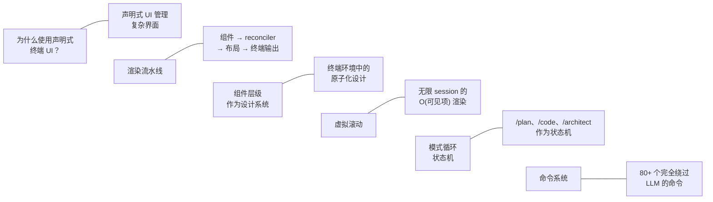
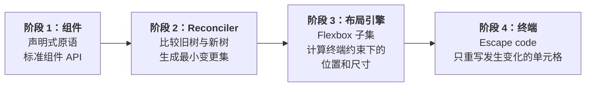
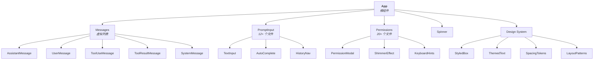
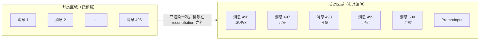
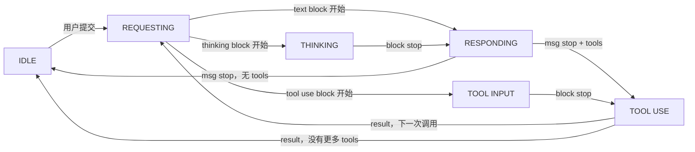
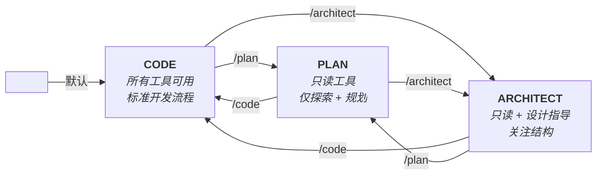
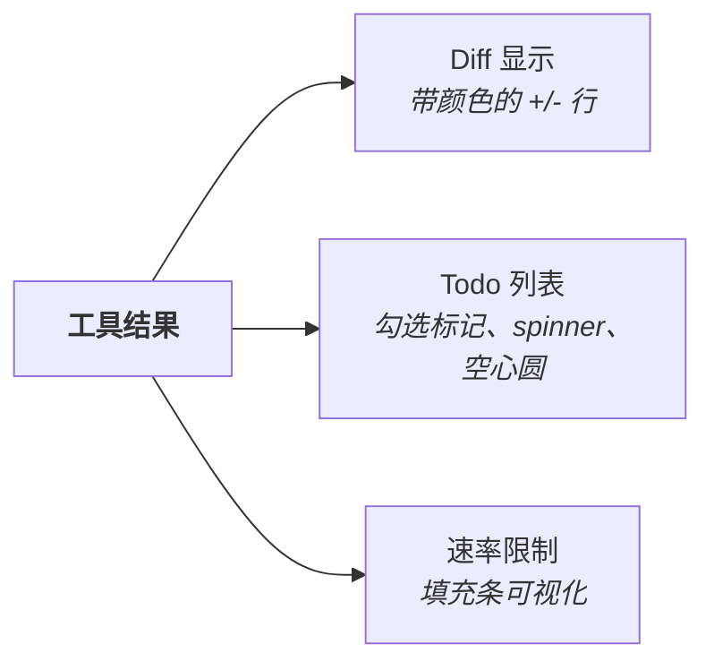

# CLI、命令与终端 UI

- 原文网址：https://y-agent.github.io/inside-claude-code/08-cli-commands-ui.html
- 原文标题：CLI, Commands & Terminal UI
- 原文副标题：A React App in Your Terminal
- 原文系列位置：V.1 — CLI, Commands & UI
- 翻译日期：2026-07-27

> 本文是 Inside Claude Code 系列文章的完整简体中文翻译。代码、标识符、路径、命令名和指标保持原样；相对链接已改为绝对链接。

打开终端，输入 `claude`，你看到的其实是一个 React 应用。它不是 `readline` 的薄封装，也不是 blessed/curses UI，而是一棵完整的 React 组件树——389 个文件、1,623 种组件模式、81,546 行 UI 代码——通过 ANSI escape code 渲染到 TTY。Claude Code 的终端 UI 使用与现代 Web 应用相同的声明式组件模型：JSX、hooks、状态管理和 reconciliation。唯一不同是渲染目标：它是一格格字符，而不是一格格像素。

这一架构选择影响深远。终端 UI 获得了 Web 应用的开发体验——组件组合、局部状态、memoization 和声明式更新——同时运行在计算领域最通用的显示环境中。本文讨论 React 为什么适合终端、虚拟滚动如何让长对话保持高性能，以及模式循环如何把 Agent 变成状态机。

**图 1：** 本文讨论的六个主题：声明式终端 UI 为什么适合管理复杂的并发状态；从组件到 escape code 的四阶段渲染流水线；横跨 389 个文件的原子化设计组件层级；长 session 的 O(可见项) 虚拟滚动；作为状态机的模式循环（`/plan`、`/code`、`/architect`）；以及完全绕过 LLM 的 80 多个斜杠命令。

**如何阅读此图。** 每一行都将左侧主题与右侧的一句话摘要配对，六行按本文章节顺序从上到下排列。左列是章节名称，右列是核心洞察。行与行之间的隐形连接（`~`）表示这些主题彼此独立，但由终端 UI 架构这一共同主题统一起来。

**本文涉及的源文件：**

| 文件 | 用途 | 大小 |
|---|---|---:|
| `src/components/App.tsx` | 根应用组件 | 约 300 LOC |
| `src/components/Messages.tsx` | 虚拟消息列表渲染器 | 约 400 LOC |
| `src/components/PromptInput/` | 多行输入系统 | 12+ 个文件 |
| `src/components/permissions/` | 权限对话框和 UI | 20+ 个文件 |
| `src/components/messages/` | 消息类型渲染器（文本、工具、错误、compact） | 35+ 个文件 |
| `src/components/Spinner/` | 动画 braille 点 spinner | 约 10 个文件 |
| `src/components/design-system/` | 共享 UI 原语（Button、Box、Text） | 约 15 个文件 |
| `src/commands/` | 86+ 个斜杠命令处理器 | 103 个目录 |
| `src/hooks/useGlobalKeybindings.tsx` | 键盘快捷键绑定 | 约 500 LOC |
| `src/ink/` | Ink 框架扩展（Box、Text、VirtualList） | 50 个文件 |
| `src/services/PromptSuggestion/` | Prompt 预测和推测执行 | 2 个文件 |
| `src/services/tips/` | Spinner 中轮换显示的教育提示 | 3 个文件 |
| `src/buddy/` | Companion 宠物系统（精灵图、动画、稀有度） | 6 个文件 |
| `src/projectOnboardingState.ts` | 两步项目 onboarding 流程 | 约 100 LOC |
| `src/utils/claudeInChrome/` | 通过 native messaging 实现浏览器自动化 | 3 个文件 |
| `src/utils/secureStorage/` | 平台专用凭据存储 | 5 个文件 |
| `src/utils/nativeInstaller/` | 二进制分发和原子更新 | 2 个文件，约 2,000 LOC |

## 为什么在终端使用 React？——声明式与命令式 UI

**在终端应用中选择 React，不是审美选择，而是为了管理命令式方法难以承受的复杂度。**

想想 Claude Code 的界面必须同时处理什么：消息逐 token 流入；权限提示以模态对话框覆盖在对话之上；工具输出形式差异巨大——diff、文件树、todo 列表、表格、带语法高亮的代码块；五种不同的 UI 状态（requesting、thinking、responding、tool-input、tool-use）根据异步流事件发生转换；长对话积累数百条消息，而且必须高效滚动。

传统终端方法——调用 `process.stdout.write()`、手动定位光标、手工管理 ANSI code——会在这种复杂度下崩溃。每个流事件都需要命令式逻辑判断哪些单元格要更新、发出哪些 escape code，以及如何处理重叠关注点之间的交互（例如流式响应期间突然出现权限提示）。

React Ink 应用了 React 的核心洞察：_reconciler 并不绑定 DOM_。React 的 reconciler 管理元素树、比较更新并调用生命周期方法。reconciliation 之后发生什么——写入浏览器 DOM、发送原生视图命令，还是发出终端 escape code——是可插拔的。React Ink 插入了一个终端后端。

**图 2：** 四阶段声明式渲染流水线。阶段 1 使用标准 React JSX 原语（Box、Text、Static、Spacer）声明组件；阶段 2 由 reconciler 比较前后两棵树并生成最小变更集；阶段 3 由 Yoga 布局引擎在终端宽高约束内计算 Flexbox 位置和尺寸；阶段 4 通过 ANSI escape code 只重写发生变化的终端单元格，尽量减少 stdout 写入。

**如何阅读此图。** 从左到右依次经过四个阶段。阶段 1 是开发者编写声明式 JSX 的地方；阶段 2 比较旧组件树和新组件树；阶段 3 使用 Yoga Flexbox 计算位置；阶段 4 发出 ANSI escape code，只重写变化的单元格。关键洞察是：只有最后阶段与终端相关，前面三个阶段与 React 在浏览器中的工作方式相同。

Ink 的原语组件映射到终端概念：`<Box>` 是 Flex 容器（终端里的 `
`），`<Text>` 是带样式文本（终端里的 ``），`<Static>` 只渲染一次并排除在未来 reconciliation 之外，`<Spacer>` 是 Flexbox spacer。Yoga 是 Facebook 的跨平台布局引擎，实现了 CSS Flexbox 子集；它在给定终端宽高约束后计算位置。因此 `<Box>` 支持 `flexDirection`、`alignItems` 和 `justifyContent`，因为它们直接对应 Yoga 布局属性。

> **权衡：** React Ink 获得了声明式组件和高效 reconciliation，但牺牲了一部分终端渲染速度——stdout 写入是同步的，比 DOM 更新慢。每次不必要的重新渲染都会表现为闪烁或卡顿。这一约束推动了后文的性能优化。

## 组件层级：终端中的原子化设计

**Claude Code 的 389 个 UI 文件形成了一个设计系统，清楚分离结构容器、内容渲染器和交互元素。**

该层级遵循原子化设计方法中熟悉的模式：原子（如 `<Text>`、`<Box>` 等原语）组合成分子（带样式的 box、主题文本），再组合成有机体（消息渲染器、权限对话框），最后组成完整应用。

**图 3：** Claude Code UI 组件树的顶层三层。根 `App` 组件分派到五个子系统：`Messages`（渲染五种消息类型的虚拟列表，包括 `AssistantMessage`、`ToolUseMessage` 和 `ToolResultMessage`）、`PromptInput`（支持多行编辑、自动补全和历史导航）、`Permissions`（带 shimmer effect 和键盘提示的模态对话框）、`Spinner`，以及提供 `StyledBox`、`ThemedText`、`SpacingTokens` 和 `LayoutPatterns` 的共享 Design System。

**如何阅读此图。** 从顶部的根 `App` 节点开始，沿箭头向下经过三层。第一层显示五个主要子系统；第二层把每个子系统拆成组成组件。例如，`Messages` 分出五种消息类型，而 `PromptInput` 包含 `TextInput`、`AutoComplete` 和 `HistoryNav`。这棵树对应代码库中的实际 React 组件层级。

`Messages` 是架构上最重要的组件。它实现了虚拟消息列表——终端版本的 Web UI 虚拟滚动（可以类比 `react-window` 或 `react-virtualized`）。它不渲染长对话中的每条消息，而只渲染当前终端视口内的消息以及一个小缓冲区。视口外的消息会卸载；用户滚动时，新消息挂载。渲染时间保持为 O(可见项)，而不是 O(总数)；当对话积累数百条消息时，这一点极其重要。

`PromptInput` 也不是简单的 `readline` 包装器。它支持多行编辑、Tab 补全、历史导航、带模糊匹配的斜杠命令自动补全，以及粘贴检测。输入组件自行管理光标位置、选择状态和 composition event——它与浏览器文本输入拥有同等复杂度，只不过实现于终端中。

## 虚拟滚动：O(可见项) 渲染

**关键性能洞察是：在终端中，你不能渲染 500 条消息后把滚动交给滚动缓冲区；必须自行管理可见内容。**

浏览器可以渲染很长的列表并让浏览器处理滚动，DOM 和 GPU 会处理屏幕外元素。终端没有这种便利。写入 stdout 的每个字符都会发送到终端模拟器，后者必须处理每个字符。每帧渲染 500 条消息会造成灾难性性能问题。

Claude Code 使用 Web UI 虚拟列表库采用的相同技术，但针对终端约束进行了调整：

**图 4：** 虚拟消息列表渲染，将静态区域（消息 1–495，渲染一次后从 React reconciliation 树卸载）与活动区域（小缓冲区、可见的消息 497–500 和 `PromptInput`）分开。只有活动区域参与 reconciliation，因此无论对话总长度如何，渲染时间都保持 O(可见项)。

**如何阅读此图。** 左侧的静态区域表示所有已经渲染一次、随后从 React reconciliation 树卸载的历史消息。右侧的活动区域表示少量实时组件——一条缓冲消息、几条可见消息和 `PromptInput`。两区域之间的箭头表示对话推进时消息从活动区域流入静态区域。只有活动区域会重新渲染，因此性能不受对话长度影响。

| 指标 | 没有虚拟列表 | 使用虚拟列表 |
|---|---|---|
| **渲染时间** | O(total) | O(visible) |
| **处理的消息数** | 500 条消息，缓慢 | 约 5 条，恒定 |

Ink 的 `<Static>` 组件是关键启用机制。一条消息完全渲染、对话继续向前后，它就会被包裹在 `<Static>` 中。这告诉 Ink 内容永远不会改变，因此只写入 stdout 一次，并从未来的 reconciliation pass 中排除。对于包含 200 条消息的对话，只有当前消息和输入区域参与 React reconciliation；其余 199 条被冻结。

这一优化与 memoized context assembly（缓存 `getSystemContext()` 等昂贵计算），以及并行启动副作用（在 React mount 前预取 keychain 凭据和 MDM 数据）结合起来，使 UI 即使面对终端输出固有的缓慢性仍保持响应。

## UI 状态机：五种状态，事件驱动转换

**任意时刻，终端 UI 都处于五种状态之一，每种状态拥有不同的视觉呈现。转换由流式 API 事件驱动，UI 从不轮询。**

这五种状态直接映射 Agent loop 正在发生的事情：

**图 5：** UI 状态机包含六种状态（`IDLE`、`REQUESTING`、`THINKING`、`RESPONDING`、`TOOL INPUT`、`TOOL USE`）及其事件驱动转换。用户提交触发 `REQUESTING`；SSE `content_block_start` 事件根据 block 类型分别进入 `THINKING`、`RESPONDING` 或 `TOOL INPUT`。如果后面还有工具调用，`TOOL USE` 返回 `REQUESTING`；如果 turn 完成，则返回 `IDLE`。UI 从不轮询，所有转换都由 push-based 流事件驱动。

**如何阅读此图。** 从左侧的 `IDLE` 开始，这是用户输入时的静止状态。沿“用户提交”到达 `REQUESTING`，然后观察三路分支：API 响应可能开始 thinking block、text block 或 tool use block，分别进入 `THINKING`、`RESPONDING` 或 `TOOL INPUT`。从 `RESPONDING` 和 `TOOL USE` 观察返回路径：“msg stop，无 tools”或“result，没有更多 tools”回到 `IDLE`；“msg stop + tools”或“result，下一次调用”则经过 `TOOL USE` 和 `REQUESTING`，继续多工具 turn。

- **IDLE：** 等待用户输入，Prompt input 处于活动状态；
- **REQUESTING：** API 请求进行中。braille 点 spinner（`⠋⠙⠹⠸⠼⠴⠦⠧⠇⠏`）表示系统正在活动，避免用户在 1–3 秒网络延迟期间误以为应用冻结；
- **THINKING：** 扩展的 chain-of-thought 推理。使用不同于 spinner 的视觉指示器，传达“模型正在推理，而不是等待网络”。当思考持续 10–30 秒时，这一差异能建立正确预期；
- **RESPONDING：** 文本逐 token 流入，带有打字机效果，Markdown 实时应用格式化。这是视觉上最动态的状态；
- **TOOL-INPUT / TOOL-USE：** 工具 JSON 参数逐步流入，然后工具执行并输出实时结果。对于长时间运行的 Bash 命令，输出也会实时流式显示。

转换由 Anthropic API 的 SSE（Server-Sent Events）驱动。每种事件类型都映射到状态变化：`message_start` 触发 `REQUESTING`；类型为 `thinking` 的 `content_block_start` 触发 `THINKING`；类型为 `text` 的 block 触发 `RESPONDING`；类型为 `tool_use` 的 block 触发 `TOOL-INPUT`。UI 完全是响应式的：它响应 push-based stream，从不轮询。

### 识别出的模式：有限状态机

这是由事件流驱动的**有限状态机（FSM）**。每个状态定义 UI 应渲染的内容，每个事件触发状态转换。FSM 确保 UI 始终处于定义明确的状态，即使事件以非预期顺序到达。可以类比 TCP 的状态机（LISTEN、SYN-SENT、ESTABLISHED 等）：模式相同，领域不同。

## 模式循环：/plan、/code、/architect

**`/plan`、`/code` 和 `/architect` 等斜杠命令会在不同工作模式间切换，每种模式都会改变可用工具和行为规范。**

模式循环是叠加在 UI 状态机之上的另一棵状态机。UI 状态机跟踪 Agent 当前“正在发生什么”（思考、响应、执行）；模式状态机跟踪 Agent 总体“应该如何行动”：

**图 6：** 模式循环状态机包含三个完全连接的状态。`CODE` 是默认模式，提供所有工具和标准开发流程；`PLAN` 限制为只读工具，只用于探索和规划；`ARCHITECT` 提供只读工具和侧重结构的设计指导。每次转换都会以原子方式重新配置可用工具集、system prompt 行为规范和权限级别。

**如何阅读此图。** 左侧入口箭头表示 `CODE` 是默认模式。三个状态——`PLAN`、`CODE` 和 `ARCHITECT`——完全连接：每个状态都可以通过标注的斜杠命令转换到其他状态。每个节点列出该模式提供的能力：`CODE` 拥有全部工具，`PLAN` 限制为只读探索，`ARCHITECT` 在只读约束上增加设计指导。切换模式会在一次操作中以原子方式重新配置工具、Prompt 和权限。

每种模式会同时修改三个方面：可用工具集合（plan 模式限制为只读工具）、system prompt（注入模式专用行为规范）和权限级别（plan 模式最严格）。因此切换模式不仅是改变标签，而是在一个原子操作中重新配置 Agent 的能力、指令和安全状态。

## 命令系统：80 多个绕过 LLM 的快捷操作

**斜杠命令为不需要模型智能的操作提供确定、即时的交互。**

Claude Code 暴露了 80 多个按功能组织的斜杠命令：

| 类别 | 示例 | 用途 |
|---|---|---|
| **Session** | `/clear`、`/compact`、`/status` | 管理对话状态 |
| **Mode** | `/plan`、`/auto`、`/chat`、`/architect` | 切换 Agent 工作模式 |
| **Code ops** | `/commit`、`/pr`、`/review-pr` | 不经过 LLM 的 Git 工作流 |
| **Agent** | `/agent`、`/team`、`/task` | 生成子 Agent、管理任务 |
| **MCP** | `/mcp add`、`/mcp list`、`/mcp remove` | 管理 MCP server 连接 |
| **Schedule** | `/schedule`、`/cron` | 一次性或重复任务 |
| **Debug** | `/stuck`、`/debug` | 跳出循环、检查状态 |
| **Skills** | `/simplify`、`/loop`、`/code-review` | 激活领域专用 Skill |

命令会在输入到达 LLM 之前，由受 argparse 启发的 router 解析。如果输入以 `/` 开头，就会被拦截并路由到命令处理器。未知命令会带着警告落到模型处理。这一设计确保 `/compact` 会立即触发上下文压缩——没有 LLM 往返、没有 token 成本、没有延迟。

一个微妙但重要的细节是：Agent 执行期间可以排队命令。如果你在工具执行过程中输入 `/compact`，它不会中断当前操作，而是进入优先级队列，在 Agent iteration 之间执行。安全关键命令（模式变化、权限修改）优先于信息查询（状态查询），从而避免竞态条件。

## 富输出渲染：超越 console.log

**每种工具输出都有专门的渲染器，把结构化数据转换为终端原生显示。**

Claude Code 不会直接倾倒原始文本。文件编辑渲染为带颜色区分新增/删除行的 unified diff；todo 项渲染为带勾选标记、spinner 和空心圆的可展开树；速率限制显示为填充条；代码块根据语言进行语法高亮。完整 Markdown 渲染支持标题、列表、粗体/斜体、链接和 blockquote，并在保持语义结构的同时重新排版以适应终端宽度。

**图 7：** 不同工具结果类型的专用输出渲染器。文件编辑显示为带颜色的 unified diff，并标明新增/删除行；todo 项显示为带勾选标记、spinner 和空心圆的可展开树；速率限制显示为填充条。每个渲染器都把结构化输入转换成针对内容类型优化的终端原生视觉格式。

**如何阅读此图。** 从左侧的“工具结果”开始，它表示任意工具执行返回的原始结构化数据。沿三条箭头向右，结果分别分支到：文件编辑的 Diff Display、任务跟踪的 Todo List，以及用量条的 Rate Limit。每个渲染器都针对其内容类型优化显示。

## 主题：面向普适访问的五种变体

**五种主题变体确保 Claude Code 可用于深色终端、浅色终端，以及 SSH session、screen reader 等颜色能力有限的环境。**

主题系统不是简单的前景色/背景色切换。每个主题都定义一整套颜色词汇：主要内容、次要内容、强调色、权限提示色、shimmer 动画、语法高亮和交互元素。**ANSI 主题**尤其重要：它退回到 16 种标准 ANSI 颜色，保证在不支持 RGB 的终端中也能工作；否则 `rgb(87,105,247)` 之类的颜色会渲染成乱码。

## 总结

**在终端使用 React 不是新奇实验，而是具有具体收益的工程决策。** 声明式组件、基于 reconciliation 的更新和 Yoga Flexbox 布局，为终端应用提供了与 Web 应用相同的开发体验。389 个 UI 文件和 81,546 行组件代码说明这是一套生产级架构，而不是实验。关键洞察是：React 的核心抽象是 reconciler，而不是 DOM。

**虚拟滚动是长时间运行 Agent session 的必需品。** 没有虚拟滚动，渲染性能会随着对话长度线性下降；有了虚拟滚动，无论积累多少消息，性能都保持恒定。虚拟列表与 Ink 的 `<Static>` 组件结合，把 O(total) 渲染转化为 O(visible)，正是 Web UI 无限滚动高效的原因。

**UI 状态机为 Agent 内部状态提供视觉透明度。** requesting、thinking、responding、tool-input、tool-use 等状态拥有各自的视觉呈现，因此用户始终知道系统正在做什么。状态机由流式 SSE 事件驱动，而不是轮询，所以 UI 能立即响应变化。

**模式循环把配置视为状态机。** 在 `/plan`、`/code` 和 `/architect` 间切换不是翻转一个 flag，而是原子地重新配置工具、Prompt 和权限。这保证模式切换始终一致，避免相关设置独立变化造成的 Bug。

**命令系统是控制 Agent 的 DSL。** 80 多个斜杠命令提供确定、即时的操作并绕过 LLM。这种分离——LLM 负责智能，命令负责控制——意味着可预测操作不会产生 token 成本或模型延迟。

## 附录：完整斜杠命令清单

Claude Code 提供 86 个斜杠命令，按功能区域组织。每个命令都在 `src/commands/` 下拥有自己的目录。

| 类别 | 命令 | 实现 | 说明 |
|---|---|---|---|
| **Session** | `/clear` | `src/commands/clear/` | 清除对话历史 |
|  | `/compact` | `src/commands/compact/` | 触发上下文压缩（API 调用） |
|  | `/exit` | `src/commands/exit/` | 退出 CLI |
|  | `/export` | `src/commands/export/` | 导出对话 |
|  | `/resume` | `src/commands/resume/` | 恢复之前的 session |
|  | `/session` | `src/commands/session/` | Session 管理 |
|  | `/share` | `src/commands/share/` | 分享对话 transcript |
|  | `/summary` | `src/commands/summary/` | 对话摘要 |
| **Planning** | `/plan` | `src/commands/plan/` | 切换 plan 模式；打开 plan 文件 |
|  | `/context` | `src/commands/context/` | 检查上下文窗口 |
|  | `/diff` | `src/commands/diff/` | 查看文件 diff |
|  | `/files` | `src/commands/files/` | 列出已修改文件 |
|  | `/rewind` | `src/commands/rewind/` | 回退对话轮次 |
|  | `/thinkback` | `src/commands/thinkback/` | 查看推理轨迹 |
| **Configuration** | `/config` | `src/commands/config/` | 编辑设置 |
|  | `/env` | `src/commands/env/` | 环境变量 |
|  | `/model` | `src/commands/model/` | 切换模型 |
|  | `/effort` | `src/commands/effort/` | 设置思考深度 |
|  | `/fast` | `src/commands/fast/` | 切换快速模式 |
|  | `/permissions` | `src/commands/permissions/` | 权限规则 |
|  | `/privacy-settings` | `src/commands/privacy-settings/` | 隐私控制 |
|  | `/sandbox-toggle` | `src/commands/sandbox-toggle/` | 切换沙箱 |
|  | `/theme` | `src/commands/theme/` | UI 主题 |
|  | `/vim` | `src/commands/vim/` | Vim 模式 |
| **Git & Code** | `/branch` | `src/commands/branch/` | Git 分支管理 |
|  | `/review` | `src/commands/review/` | 代码审查（API 调用） |
|  | `/pr_comments` | `src/commands/pr_comments/` | 查看 PR 评论 |
|  | `/autofix-pr` | `src/commands/autofix-pr/` | 自动修复 PR 问题（API 调用） |
|  | `/issue` | `src/commands/issue/` | GitHub Issue 集成 |
|  | `/install-github-app` | `src/commands/install-github-app/` | GitHub App 设置（14 个文件） |
| **MCP & Plugins** | `/mcp` | `src/commands/mcp/` | MCP server 管理 |
|  | `/plugin` | `src/commands/plugin/` | Plugin 管理（15 个文件） |
|  | `/reload-plugins` | `src/commands/reload-plugins/` | 重新加载 Plugin |
|  | `/skills` | `src/commands/skills/` | 列出可用 Skill |
| **Agents** | `/agents` | `src/commands/agents/` | Agent 管理 |
|  | `/tasks` | `src/commands/tasks/` | 后台任务管理 |
|  | `/teleport` | `src/commands/teleport/` | 将上下文转移到新 Agent |
| **Account & Auth** | `/login` | `src/commands/login/` | OAuth 登录 |
|  | `/logout` | `src/commands/logout/` | 清除凭据 |
|  | `/usage` | `src/commands/usage/` | Token 用量统计 |
|  | `/cost` | `src/commands/cost/` | Session 成本跟踪 |
| **IDE & Desktop** | `/ide` | `src/commands/ide/` | IDE 集成 |
|  | `/desktop` | `src/commands/desktop/` | 桌面应用集成 |
|  | `/chrome` | `src/commands/chrome/` | Chrome 扩展集成 |
|  | `/voice` | `src/commands/voice/` | 语音模式 |
| **Remote** | `/remote-env` | `src/commands/remote-env/` | 远程环境配置 |
|  | `/remote-setup` | `src/commands/remote-setup/` | 远程 session 设置 |
| **Memory** | `/memory` | `src/commands/memory/` | 记忆管理 |
| **Hooks** | `/hooks` | `src/commands/hooks/` | Hook 配置 |
| **Diagnostics** | `/doctor` | `src/commands/doctor/` | 系统诊断 |
|  | `/stats` | `src/commands/stats/` | Session 统计 |
|  | `/status` | `src/commands/status/` | Agent 状态 |
|  | `/debug-tool-call` | `src/commands/debug-tool-call/` | 调试工具调用 |
|  | `/heapdump` | `src/commands/heapdump/` | 内存诊断 |
| **Misc** | `/help` | `src/commands/help/` | 帮助系统 |
|  | `/feedback` | `src/commands/feedback/` | 提交反馈 |
|  | `/release-notes` | `src/commands/release-notes/` | 查看 release notes |
|  | `/upgrade` | `src/commands/upgrade/` | 升级 CLI 版本 |
|  | `/onboarding` | `src/commands/onboarding/` | 首次运行教程 |
|  | `/rename` | `src/commands/rename/` | 重命名 session |
|  | `/copy` | `src/commands/copy/` | 复制到剪贴板 |
|  | `/add-dir` | `src/commands/add-dir/` | 将目录加入上下文 |
|  | `/good-claude` | `src/commands/good-claude/` | 正向强化 |

大多数命令都是不消耗 API token 的轻量 UI 操作。例外包括 `/compact`（触发摘要 API 调用）、`/review`（把代码发送给模型审查）和 `/autofix-pr`（读取 PR diff 并生成修复）。

## 附录 A：Prompt 建议与推测执行

每次 assistant turn 之后，Claude Code 可以预测用户接下来要输入的内容，并在 Prompt input 中显示为灰色占位符。用户按 Tab 接受后，建议会立即提交。在后台，推测引擎可能已经在隔离的 overlay 文件系统中开始执行预测命令。

### 建议生成

系统使用 fork 出来的 Agent——一个借用父 Agent Prompt cache 的轻量子进程——以及经过精调的 Prompt：

> _预测他们会输入什么——不是你认为他们应该做什么。测试标准：他们是否会想“我正要输入这个”？_

这个 fork 拒绝所有工具（模型只能生成文本，不能执行），并使用低 effort。建议会通过 13 个内容过滤器，拒绝元推理（“没有找到任何内容”）、评价式回复（“看起来不错”）、Claude 口吻短语（“Let me…”），以及不在 2–12 个单词范围内的建议。单词建议只有来自精选集合时才允许，例如 `push`、`commit`、`deploy`、`yes`、`no`。

**功能门控：** `tengu_chomp_inflection` GrowthBook flag；非交互 session 和 swarm teammate 禁用，用户可以通过设置切换。

### 推测执行

显示建议且推测执行启用后，Claude Code 会立即在 `$CLAUDE_TEMP/speculation/{PID}/{id}` 的写时复制（copy-on-write）overlay 文件系统中执行预测命令：

| 工具类别 | 推测行为 |
|---|---|
| 只读（Read、Glob、Grep、LSP） | 允许；如果文件曾在 overlay 中写入，则从 overlay 读取，否则从主 CWD 读取 |
| Write（Edit、Write） | 重定向到 overlay；首次写入时复制原文件 |
| Bash（只读） | 允许 |
| Bash（写入） | 拒绝；设置边界 |
| 其他全部工具 | 拒绝；设置边界 |

推测执行有边界：最多 20 个 turn、最多 100 条消息。推测完成或触及边界（被拒绝的工具调用）后，会记录一个 `CompletionBoundary`，其 type 为 `complete`、`bash`、`edit` 或 `denied_tool`。用户接受建议时，overlay 文件会复制到真实 CWD，推测产生的消息会注入对话历史。

**流水线式建议。** 推测完整完成后，系统会立即使用推测工作作为上下文生成下一个建议，从而形成预测链。用户看到第一个建议时，第二个建议已经准备好，接受第一个后即可使用。

**源文件：** `src/services/PromptSuggestion/promptSuggestion.ts`（建议生命周期、13 个过滤器）、`src/services/PromptSuggestion/speculation.ts`（overlay FS、推测执行、流水线）、`src/hooks/usePromptSuggestion.ts`（带 engagement tracking 的 React hook）。

## 附录 B：产品 UX 子系统

一些产品 UX 子系统与核心 Agent 并行运行，但不属于 Agent loop。

### Tips 系统

在 Claude 思考期间显示于 spinner 中的轮换教育消息系统。registry 包含 60+ 个内置 tip，并附带上下文相关条件（新用户热身、IDE 专用提示、订阅引导）。选择算法使用 LRU：展示最长时间未出现的 tip；每个 tip 还有 3–30 个 session 的冷却窗口。可以通过设置中的 `spinnerTipsOverride.tips[]` 覆盖，或通过 `spinnerTipsEnabled: false` 禁用。部分 tip 仅内部可见（`USER_TYPE === 'ant'`），营销提示由 GrowthBook flag 控制。

**源文件：** `src/services/tips/tipRegistry.ts`、`src/services/tips/tipScheduler.ts`、`src/services/tips/tipHistory.ts`。

### 项目 Onboarding

面向新用户的两步项目级 onboarding 流程：（1）创建应用或 clone repo；（2）使用 `/init` 创建 `CLAUDE.md`。每个项目最多显示 4 次，之后永久隐藏。状态缓存于 `projectConfig.hasCompletedProjectOnboarding`，避免后续渲染重复进行文件系统检查。

**源文件：** `src/projectOnboardingState.ts`。

### Claude-in-Chrome

通过名为 `computer-use` 的 MCP server，使用 native messaging 控制 Chrome/Chromium 浏览器的自动化集成。支持 Chrome、Brave、Arc、Chromium、Edge、Vivaldi 和 Opera。可以通过 `--chrome` CLI flag、`CLAUDE_CODE_ENABLE_CFC` 环境变量启用；如果扩展已安装，也可以自动检测（自动启用由 `tengu_chrome_auto_enable` 控制）。系统为浏览器 native messaging 协议安装 native host manifest，并使用一份 60 行 system prompt 管理浏览器自动化行为。

**源文件：** `src/utils/claudeInChrome/common.ts`（浏览器检测）、`src/utils/claudeInChrome/setup.ts`（MCP server 设置、manifest 安装）、`src/utils/claudeInChrome/prompt.ts`（浏览器自动化指南）。

### Buddy Companion

显示在输入框旁边的 AI 生成宠物伙伴。Companion 基于用户 ID 的 hash 确定性生成——物种、眼睛、帽子、统计值和稀有度都由 hash 派生，而不是随机生成。稀有度分布：common（60%）、uncommon（25%）、rare（10%）、epic（4%）、legendary（1%）。Companion 通过 `/buddy` 命令孵化，支持气泡、空闲动画和 pet-hearts 爆发效果。2026 年 4 月 1–7 日曾运行 teaser 通知窗口。由 `feature('BUDDY')` build flag 控制。

**源文件：** `src/buddy/companion.ts`（确定性骨架生成）、`src/buddy/CompanionSprite.tsx`（精灵渲染和动画）、`src/buddy/prompt.ts`（伙伴人格）、`src/buddy/useBuddyNotification.tsx`（teaser 通知）。

### Secure Storage

凭据存储抽象，按平台使用不同后端：macOS Keychain（`macOsKeychainStorage.ts`）、Linux/Windows 的明文 fallback（`plainTextStorage.ts`），以及先尝试主后端、失败后回退的 `fallbackStorage.ts`。后台 `keychainPrefetch.ts` 会预缓存凭据，避免阻塞启动。Linux `libsecret` 支持尚未实现。

**源文件：** `src/utils/secureStorage/index.ts`（工厂）、`src/utils/secureStorage/macOsKeychainStorage.ts`、`src/utils/secureStorage/plainTextStorage.ts`。

### Native Installer

支持多进程安全安装的生产级二进制分发系统。Installer（`installer.ts`，1,700+ 行）管理 symlink、原子更新（temp-then-rename 模式）、带过期锁恢复的 PID 文件锁，以及版本保留（保留最近两个版本）。下载支持卡住检测（60 秒 timeout）、3 次重试和 checksum 验证。服务端 `maxVersion` kill switch 可以强制降级。平台支持 Linux（musl/glibc 检测）、macOS 和 Windows（直接复制，不使用 symlink）。

**源文件：** `src/utils/nativeInstaller/installer.ts`（安装、锁、清理）、`src/utils/nativeInstaller/download.ts`（二进制下载、checksum）。

系列下一篇：[Part V.2：认证、Provider 与 Feature Flag](https://y-agent.github.io/inside-claude-code/09-auth-providers-flags.html)——介绍终端应用的 OAuth、多 Provider 适配器，以及让 CLI 工具能够持续交付的 88 个 feature flag。
